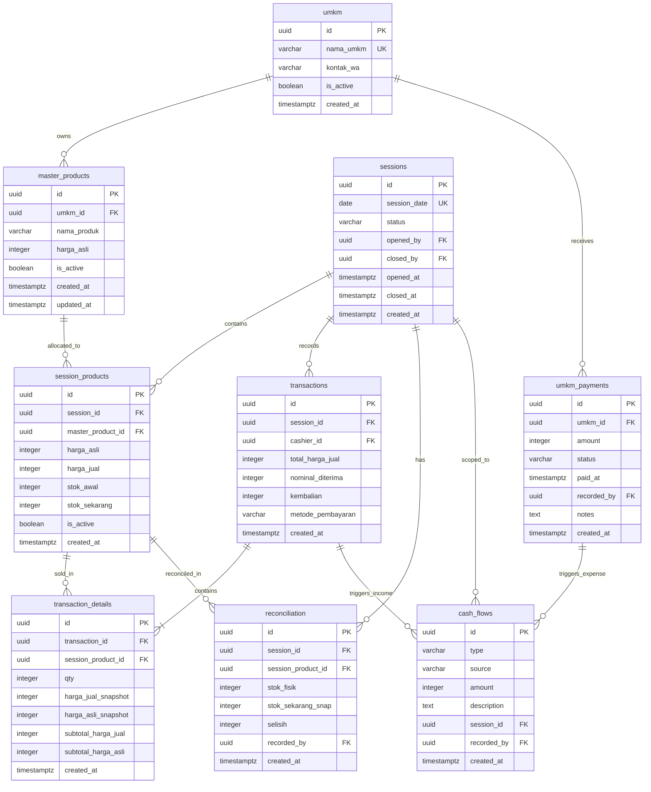

# DB_SCHEMA.md — Database Schema Reference
# OMK Consignment POS — Supabase (PostgreSQL)

> **Document Status:** Ground-Truth v4.0 — Authoritative source for AI Coding Agent  
> **Database:** Supabase (PostgreSQL 15+)  
> **Critical Rule:** Column names and types defined here are the single source of truth. Do not rename, retype, or add columns without updating this file first.

---

## Table of Contents

1. [Schema Overview](#1-schema-overview)
2. [Entity Relationship Diagram](#2-entity-relationship-diagram)
3. [Table Definitions](#3-table-definitions)
   - [3.1 umkm](#31-table-umkm)
   - [3.2 master_products](#32-table-master_products)
   - [3.3 sessions](#33-table-sessions)
   - [3.4 session_products](#34-table-session_products)
   - [3.5 transactions](#35-table-transactions)
   - [3.6 transaction_details](#36-table-transaction_details)
   - [3.7 reconciliation](#37-table-reconciliation)
   - [3.8 cash_flows](#38-table-cash_flows)
   - [3.9 umkm_payments](#39-table-umkm_payments)
4. [Database Functions (RPC) & Triggers](#4-database-functions-rpc--triggers)
   - [4.1 complete_transaction](#41-complete_transaction)
   - [4.2 close_session](#42-close_session)
   - [4.3 reopen_session](#43-reopen_session)
   - [4.4 reset_session](#44-reset_session)
   - [4.5 get_session_financial_summary](#45-get_session_financial_summary)
   - [4.6 get_umkm_product_breakdown](#46-get_umkm_product_breakdown)
   - [4.7 get_product_stock_recommendation](#47-get_product_stock_recommendation)
   - [4.8 get_weekly_trends](#48-get_weekly_trends)
   - [4.9 get_umkm_product_performance](#49-get_umkm_product_performance)
   - [4.10 get_umkm_session_history](#410-get_umkm_session_history)
   - [4.11 Cash Flow RPCs](#411-cash-flow-rpcs)
   - [4.12 UMKM Payment RPCs](#412-umkm-payment-rpcs)
   - [4.13 User Management RPCs](#413-user-management-rpcs)
5. [Views](#5-views)
   - [5.1 products_cashier_view](#51-view-products_cashier_view)
   - [5.2 top_products_sales](#52-view-top_products_sales)
   - [5.3 umkm_profit_contribution](#53-view-umkm_profit_contribution)
   - [5.4 session_history_summary](#54-view-session_history_summary)
6. [Row-Level Security (RLS) Policies](#6-row-level-security-rls-policies)
7. [Indexes](#7-indexes)
8. [Realtime Configuration](#8-realtime-configuration)
9. [Seed Data & Initial Setup](#9-seed-data--initial-setup)
10. [Migration History](#10-migration-history)

---

## 1. Schema Overview

```
Schema: public (default Supabase schema)
Auth: supabase.auth.users (managed by Supabase Auth)

Tables (9 total):
  umkm                — Master directory of UMKM consignment partners
  master_products     — Master product catalog owned by UMKM (base harga_asli)
  sessions            — Sunday sales session lifecycle (one per date)
  session_products    — Products active for a specific session (stok, harga_jual)
  transactions        — Completed cashier checkout transaction headers
  transaction_details — Immutable line items per transaction (price snapshots)
  reconciliation      — End-of-day physical stock count results
  cash_flows          — Ledger of cash flow events (income, expense, manual, auto)
  umkm_payments       — Consignment payout records to UMKMs (pending, paid)

Views (4 total):
  products_cashier_view   — Cashier-safe product view hiding harga_asli
  session_history_summary — Financial aggregation per session (gross, remittance, profit)
  top_products_sales      — Historical bestsellers with sell-through rate across closed sessions
  umkm_profit_contribution— OMK net profit breakdown by UMKM partner
```

**Design Principles:**
1. **Separation of Master Catalog & Session Stock:** Master products (`master_products`) define products and default cost (`harga_asli`). When a sales session opens, items are copied/allocated into `session_products` with session-specific selling prices (`harga_jual`) and stock counters.
2. **Price Immutability:** `transaction_details` stores snapshots of `harga_jual` and `harga_asli` at transaction time. Future changes never distort past accounting.
3. **Atomic Stock Updates:** Decrements happen exclusively within `complete_transaction` RPC under transactional lock (`FOR UPDATE`), never directly from frontend clients.
4. **Automated Cash Flow Sync:** DB triggers automatically log cash flow income on transaction insert and cash flow expense on UMKM payment.
5. **Soft Deletions:** Master tables use `is_active` flags rather than hard deletes to preserve historical references.

---

## 2. Entity Relationship Diagram




---

## 3. Table Definitions

### 3.1 Table: `umkm`

Master partner directory. Stores consignment partners.

```sql
CREATE TABLE public.umkm (
  id          UUID          DEFAULT gen_random_uuid() PRIMARY KEY,
  nama_umkm   VARCHAR(100)  NOT NULL UNIQUE,
  kontak_wa   VARCHAR(20)   NOT NULL,           -- Format: 08xxxxxxxxxx atau 628xxxxxxxxxx
  is_active   BOOLEAN       NOT NULL DEFAULT TRUE,
  created_at  TIMESTAMPTZ   NOT NULL DEFAULT NOW()
);

COMMENT ON TABLE public.umkm IS 'Master table of UMKM consignment partner businesses';
COMMENT ON COLUMN public.umkm.is_active IS 'Soft delete flag. False = partner inactive';
```

**Constraints & Notes:**
| Column | Type | Nullable | Default | Notes |
|---|---|---|---|---|
| `id` | `uuid` | NOT NULL | `gen_random_uuid()` | PK |
| `nama_umkm` | `varchar(100)` | NOT NULL | — | Unique partner name |
| `kontak_wa` | `varchar(20)` | NOT NULL | — | WhatsApp number |
| `is_active` | `boolean` | NOT NULL | `true` | Active status flag |
| `created_at` | `timestamptz` | NOT NULL | `NOW()` | Timestamp |

---

### 3.2 Table: `master_products`

Master product catalog. Each UMKM has multiple master products with their base cost (`harga_asli`).

```sql
CREATE TABLE public.master_products (
  id           UUID          DEFAULT gen_random_uuid() PRIMARY KEY,
  umkm_id      UUID          NOT NULL REFERENCES public.umkm(id) ON DELETE RESTRICT,
  nama_produk  VARCHAR(100)  NOT NULL,
  harga_asli   INTEGER       NOT NULL CHECK (harga_asli > 0),
  is_active    BOOLEAN       NOT NULL DEFAULT TRUE,
  created_at   TIMESTAMPTZ   NOT NULL DEFAULT NOW(),
  updated_at   TIMESTAMPTZ   NOT NULL DEFAULT NOW(),
  CONSTRAINT master_products_unique_per_umkm UNIQUE (umkm_id, nama_produk)
);

CREATE TRIGGER trg_master_products_updated_at
  BEFORE UPDATE ON public.master_products
  FOR EACH ROW
  EXECUTE FUNCTION public.set_updated_at();
```

**Constraints & Notes:**
| Column | Type | Nullable | Default | Notes |
|---|---|---|---|---|
| `id` | `uuid` | NOT NULL | `gen_random_uuid()` | PK |
| `umkm_id` | `uuid` | NOT NULL | — | FK → `umkm.id` |
| `nama_produk` | `varchar(100)` | NOT NULL | — | Product name |
| `harga_asli` | `integer` | NOT NULL | — | Base cost in IDR (> 0) |
| `is_active` | `boolean` | NOT NULL | `true` | Active status |
| `created_at` | `timestamptz` | NOT NULL | `NOW()` | Creation time |
| `updated_at` | `timestamptz` | NOT NULL | `NOW()` | Auto-updated via trigger |

---

### 3.3 Table: `sessions`

One record per Sunday sales session. Controls POS availability.

```sql
CREATE TABLE public.sessions (
  id            UUID          DEFAULT gen_random_uuid() PRIMARY KEY,
  session_date  DATE          NOT NULL UNIQUE,    -- Unique: 1 session per date
  status        VARCHAR(10)   NOT NULL DEFAULT 'open' CHECK (status IN ('open', 'closed')),
  opened_by     UUID          REFERENCES auth.users(id) ON DELETE SET NULL,
  closed_by     UUID          REFERENCES auth.users(id) ON DELETE SET NULL,
  opened_at     TIMESTAMPTZ   NOT NULL DEFAULT NOW(),
  closed_at     TIMESTAMPTZ,
  created_at    TIMESTAMPTZ   NOT NULL DEFAULT NOW()
);

COMMENT ON TABLE public.sessions IS 'One record per Sunday session. Controls whether POS accepts transactions';
```

**Constraints & Notes:**
| Column | Type | Nullable | Default | Notes |
|---|---|---|---|---|
| `id` | `uuid` | NOT NULL | `gen_random_uuid()` | PK |
| `session_date` | `date` | NOT NULL | — | UNIQUE constraint |
| `status` | `varchar(10)` | NOT NULL | `'open'` | `'open'` or `'closed'` |
| `opened_by` | `uuid` | NULL | — | FK → `auth.users.id` |
| `closed_by` | `uuid` | NULL | — | FK → `auth.users.id` |
| `opened_at` | `timestamptz` | NOT NULL | `NOW()` | Timestamp opened |
| `closed_at` | `timestamptz` | NULL | — | Timestamp closed |
| `created_at` | `timestamptz` | NOT NULL | `NOW()` | Creation time |

---

### 3.4 Table: `session_products`

Specific items active for a session with live stock tracking.

```sql
CREATE TABLE public.session_products (
  id                  UUID          DEFAULT gen_random_uuid() PRIMARY KEY,
  session_id          UUID          NOT NULL REFERENCES public.sessions(id) ON DELETE RESTRICT,
  master_product_id   UUID          NOT NULL REFERENCES public.master_products(id) ON DELETE RESTRICT,
  harga_asli          INTEGER       NOT NULL CHECK (harga_asli > 0),
  harga_jual          INTEGER       NOT NULL CHECK (harga_jual >= harga_asli),
  stok_awal           INTEGER       NOT NULL CHECK (stok_awal > 0),
  stok_sekarang       INTEGER       NOT NULL,
  is_active           BOOLEAN       NOT NULL DEFAULT TRUE,
  created_at          TIMESTAMPTZ   NOT NULL DEFAULT NOW(),
  CONSTRAINT session_products_stok_check CHECK (stok_sekarang >= 0 AND stok_sekarang <= stok_awal),
  CONSTRAINT session_products_unique_per_session UNIQUE (session_id, master_product_id)
);

CREATE TRIGGER trg_init_stok_session_products
  BEFORE INSERT ON public.session_products
  FOR EACH ROW
  EXECUTE FUNCTION public.set_stok_sekarang();
```

**Constraints & Notes:**
| Column | Type | Nullable | Default | Notes |
|---|---|---|---|---|
| `id` | `uuid` | NOT NULL | `gen_random_uuid()` | PK |
| `session_id` | `uuid` | NOT NULL | — | FK → `sessions.id` |
| `master_product_id`| `uuid` | NOT NULL | — | FK → `master_products.id` |
| `harga_asli` | `integer` | NOT NULL | — | Cost snapshot for this session |
| `harga_jual` | `integer` | NOT NULL | — | OMK retail selling price (>= harga_asli) |
| `stok_awal` | `integer` | NOT NULL | — | Initial stock delivered (> 0) |
| `stok_sekarang` | `integer` | NOT NULL | — | Current available stock |
| `is_active` | `boolean` | NOT NULL | `true` | Session item active toggle |
| `created_at` | `timestamptz` | NOT NULL | `NOW()` | Timestamp |

---

### 3.5 Table: `transactions`

Header records for completed checkout orders.

```sql
CREATE TABLE public.transactions (
  id                 UUID         DEFAULT gen_random_uuid() PRIMARY KEY,
  session_id         UUID         NOT NULL REFERENCES public.sessions(id) ON DELETE RESTRICT,
  cashier_id         UUID         REFERENCES auth.users(id) ON DELETE SET NULL,
  total_harga_jual   INTEGER      NOT NULL,
  nominal_diterima   INTEGER      NOT NULL,
  kembalian          INTEGER      GENERATED ALWAYS AS (nominal_diterima - total_harga_jual) STORED,
  metode_pembayaran  VARCHAR(20)  DEFAULT 'cash',
  created_at         TIMESTAMPTZ  NOT NULL DEFAULT NOW()
);

-- Trigger: auto-sync transaction total to cash_flows income
CREATE TRIGGER trg_cash_flow_from_transaction
  AFTER INSERT ON public.transactions
  FOR EACH ROW
  EXECUTE FUNCTION public.trigger_add_cash_flow_from_transaction();
```

---

### 3.6 Table: `transaction_details`

Line items for each transaction. Completely immutable after insert.

```sql
CREATE TABLE public.transaction_details (
  id                  UUID        DEFAULT gen_random_uuid() PRIMARY KEY,
  transaction_id      UUID        NOT NULL REFERENCES public.transactions(id) ON DELETE RESTRICT,
  session_product_id  UUID        NOT NULL REFERENCES public.session_products(id) ON DELETE RESTRICT,
  qty                 INTEGER     NOT NULL CHECK (qty > 0),
  harga_jual_snapshot INTEGER     NOT NULL,
  harga_asli_snapshot INTEGER     NOT NULL,
  subtotal_harga_jual INTEGER     GENERATED ALWAYS AS (qty * harga_jual_snapshot) STORED,
  subtotal_harga_asli INTEGER     GENERATED ALWAYS AS (qty * harga_asli_snapshot) STORED,
  created_at          TIMESTAMPTZ NOT NULL DEFAULT NOW()
);
```

---

### 3.7 Table: `reconciliation`

Physical stock counts recorded at session closure.

```sql
CREATE TABLE public.reconciliation (
  id                 UUID        DEFAULT gen_random_uuid() PRIMARY KEY,
  session_id         UUID        NOT NULL REFERENCES public.sessions(id) ON DELETE RESTRICT,
  session_product_id UUID        NOT NULL REFERENCES public.session_products(id) ON DELETE RESTRICT,
  stok_fisik         INTEGER     NOT NULL,
  stok_sekarang_snap INTEGER     NOT NULL,
  selisih            INTEGER     GENERATED ALWAYS AS (stok_fisik - stok_sekarang_snap) STORED,
  recorded_by        UUID        REFERENCES auth.users(id) ON DELETE SET NULL,
  created_at         TIMESTAMPTZ NOT NULL DEFAULT NOW()
);
```

---

### 3.8 Table: `cash_flows`

Ledger for cash tracking. Supports transactions, manual entries (initial cash float, supplies), and consignment payments.

```sql
CREATE TABLE public.cash_flows (
  id          UUID        DEFAULT gen_random_uuid() PRIMARY KEY,
  type        VARCHAR(20) NOT NULL CHECK (type IN ('income', 'expense')),
  source      VARCHAR(20) NOT NULL CHECK (source IN ('transaction', 'manual', 'payment')),
  amount      INTEGER     NOT NULL CHECK (amount > 0),
  description TEXT,
  session_id  UUID        REFERENCES public.sessions(id) ON DELETE SET NULL,
  recorded_by UUID        REFERENCES auth.users(id) ON DELETE SET NULL,
  created_at  TIMESTAMPTZ NOT NULL DEFAULT NOW()
);
```

---

### 3.9 Table: `umkm_payments`

Settlement ledger for paying UMKM partners their consignment remittance.

```sql
CREATE TABLE public.umkm_payments (
  id          UUID        DEFAULT gen_random_uuid() PRIMARY KEY,
  umkm_id     UUID        NOT NULL REFERENCES public.umkm(id) ON DELETE RESTRICT,
  amount      INTEGER     NOT NULL CHECK (amount > 0),
  status      VARCHAR(20) NOT NULL DEFAULT 'pending' CHECK (status IN ('pending', 'paid')),
  paid_at     TIMESTAMPTZ,
  recorded_by UUID        REFERENCES auth.users(id) ON DELETE SET NULL,
  notes       TEXT,
  created_at  TIMESTAMPTZ NOT NULL DEFAULT NOW()
);

-- Trigger: auto-sync paid amount to cash_flows expense
CREATE TRIGGER trg_cash_flow_from_umkm_payment
  AFTER INSERT ON public.umkm_payments
  FOR EACH ROW
  EXECUTE FUNCTION public.trigger_add_cash_flow_from_umkm_payment();
```

---

## 4. Database Functions (RPC) & Triggers

### 4.1 `complete_transaction`

Atomically validates cart items, verifies stock with row locks (`FOR UPDATE`), deducts stock from `session_products`, inserts into `transactions`, and creates `transaction_details`.

```sql
CREATE OR REPLACE FUNCTION public.complete_transaction(
  p_session_id        UUID,
  p_cashier_id        UUID,
  p_nominal_diterima  INTEGER,
  p_cart_items        JSONB,
  p_metode_pembayaran VARCHAR DEFAULT 'cash'
)
RETURNS JSONB
LANGUAGE plpgsql
SECURITY DEFINER
AS $$
DECLARE
  v_transaction_id     UUID;
  v_total_harga_jual   INTEGER := 0;
  v_item               JSONB;
  v_session_product_id UUID;
  v_qty                INTEGER;
  v_harga_jual         INTEGER;
  v_stok_sekarang      INTEGER;
  v_session_status     VARCHAR(20);
BEGIN
  SELECT status INTO v_session_status FROM public.sessions WHERE id = p_session_id;
  IF v_session_status IS NULL THEN
    RAISE EXCEPTION 'Session not found: %', p_session_id;
  END IF;
  IF v_session_status != 'open' THEN
    RAISE EXCEPTION 'Session is closed. No transactions allowed.';
  END IF;

  FOR v_item IN SELECT * FROM jsonb_array_elements(p_cart_items) LOOP
    v_session_product_id := (v_item->>'product_id')::UUID;
    v_qty                := (v_item->>'qty')::INTEGER;
    v_harga_jual         := (v_item->>'harga_jual')::INTEGER;
    IF v_qty <= 0 THEN
      RAISE EXCEPTION 'Invalid qty for session_product %', v_session_product_id;
    END IF;
    v_total_harga_jual := v_total_harga_jual + (v_qty * v_harga_jual);
  END LOOP;

  IF p_nominal_diterima < v_total_harga_jual THEN
    RAISE EXCEPTION 'nominal_diterima (%) is less than total (%).',
      p_nominal_diterima, v_total_harga_jual;
  END IF;

  INSERT INTO public.transactions (session_id, cashier_id, total_harga_jual, nominal_diterima, metode_pembayaran)
  VALUES (p_session_id, p_cashier_id, v_total_harga_jual, p_nominal_diterima, p_metode_pembayaran)
  RETURNING id INTO v_transaction_id;

  FOR v_item IN SELECT * FROM jsonb_array_elements(p_cart_items) LOOP
    v_session_product_id := (v_item->>'product_id')::UUID;
    v_qty                := (v_item->>'qty')::INTEGER;

    SELECT stok_sekarang INTO v_stok_sekarang
    FROM public.session_products
    WHERE id = v_session_product_id AND is_active = TRUE
    FOR UPDATE;

    IF v_stok_sekarang IS NULL THEN
      RAISE EXCEPTION 'Session product % not found or inactive', v_session_product_id;
    END IF;
    IF v_stok_sekarang < v_qty THEN
      RAISE EXCEPTION 'Insufficient stock for session_product %. Available: %, Requested: %',
        v_session_product_id, v_stok_sekarang, v_qty;
    END IF;

    UPDATE public.session_products
    SET stok_sekarang = stok_sekarang - v_qty
    WHERE id = v_session_product_id;

    INSERT INTO public.transaction_details (
      transaction_id, session_product_id, qty, harga_jual_snapshot, harga_asli_snapshot
    )
    SELECT v_transaction_id, v_session_product_id, v_qty, sp.harga_jual, sp.harga_asli
    FROM public.session_products sp WHERE sp.id = v_session_product_id;
  END LOOP;

  RETURN jsonb_build_object(
    'transaction_id',    v_transaction_id,
    'total_harga_jual',  v_total_harga_jual,
    'kembalian',         p_nominal_diterima - v_total_harga_jual,
    'metode_pembayaran', p_metode_pembayaran
  );
EXCEPTION WHEN OTHERS THEN RAISE;
END;
$$;
```

---

### 4.2 `close_session`

Validates that all active session products have reconciliation rows, then closes the session.

```sql
CREATE OR REPLACE FUNCTION public.close_session(
  p_session_id  UUID,
  p_admin_id    UUID
)
RETURNS JSONB
LANGUAGE plpgsql
SECURITY DEFINER
AS $$
DECLARE
  v_product_count        INTEGER;
  v_reconciliation_count INTEGER;
BEGIN
  SELECT COUNT(*) INTO v_product_count
  FROM public.session_products sp
  WHERE sp.session_id = p_session_id AND sp.is_active = TRUE;

  SELECT COUNT(*) INTO v_reconciliation_count
  FROM public.reconciliation
  WHERE session_id = p_session_id;

  IF v_reconciliation_count < v_product_count THEN
    RAISE EXCEPTION 'Reconciliation incomplete. % of % products reconciled.',
      v_reconciliation_count, v_product_count;
  END IF;

  UPDATE public.sessions
  SET
    status     = 'closed',
    closed_by  = p_admin_id,
    closed_at  = NOW()
  WHERE id = p_session_id AND status = 'open';

  IF NOT FOUND THEN
    RAISE EXCEPTION 'Session % not found or already closed.', p_session_id;
  END IF;

  RETURN jsonb_build_object('session_id', p_session_id, 'status', 'closed');
END;
$$;
```

---

### 4.3 `reopen_session`

Reopens a closed session for authorized admins.

```sql
CREATE OR REPLACE FUNCTION public.reopen_session(
  p_session_id  UUID,
  p_admin_id    UUID
)
RETURNS JSONB
LANGUAGE plpgsql
SECURITY DEFINER
AS $$
DECLARE
  v_is_authorized BOOLEAN;
BEGIN
  SELECT COALESCE(
    (auth.jwt() -> 'user_metadata' ->> 'can_reopen_session')::BOOLEAN,
    (public.get_user_role() = 'admin')
  ) INTO v_is_authorized;

  IF NOT v_is_authorized THEN
    RAISE EXCEPTION 'Unauthorized: User does not have can_reopen_session permission.';
  END IF;

  UPDATE public.sessions
  SET status = 'open', closed_by = NULL, closed_at = NULL
  WHERE id = p_session_id AND status = 'closed';

  IF NOT FOUND THEN
    RAISE EXCEPTION 'Session % not found or not in closed state.', p_session_id;
  END IF;

  RETURN jsonb_build_object('session_id', p_session_id, 'status', 'open');
END;
$$;
```

---

### 4.4 `reset_session`

Empties transaction and reconciliation data for a session and resets stock to `stok_awal`.

```sql
CREATE OR REPLACE FUNCTION public.reset_session(
  p_session_id  UUID,
  p_admin_id    UUID
)
RETURNS JSONB
LANGUAGE plpgsql
SECURITY DEFINER
AS $$
DECLARE
  v_caller_email TEXT;
BEGIN
  SELECT email INTO v_caller_email FROM auth.users WHERE id = auth.uid();
  IF public.get_user_role() != 'admin' AND v_caller_email != 'marcellinusyovian@gmail.com' THEN
    RAISE EXCEPTION 'Access Denied: Admin role required to reset session.';
  END IF;

  DELETE FROM public.transaction_details
  WHERE transaction_id IN (SELECT id FROM public.transactions WHERE session_id = p_session_id);
  DELETE FROM public.transactions WHERE session_id = p_session_id;
  DELETE FROM public.reconciliation WHERE session_id = p_session_id;

  UPDATE public.session_products
  SET stok_sekarang = stok_awal
  WHERE session_id = p_session_id;

  UPDATE public.sessions
  SET status = 'open', closed_by = NULL, closed_at = NULL
  WHERE id = p_session_id;

  RETURN jsonb_build_object('session_id', p_session_id, 'status', 'open', 'reset', true);
END;
$$;
```

---

### 4.5 `get_session_financial_summary`

Computes session gross revenue, total consignment remittance due, OMK profit, and per-UMKM sub-breakdown.

```sql
CREATE OR REPLACE FUNCTION public.get_session_financial_summary(
  p_session_id UUID
)
RETURNS JSONB
LANGUAGE plpgsql
SECURITY DEFINER
AS $$
DECLARE
  v_totals   JSONB;
  v_per_umkm JSONB;
BEGIN
  SELECT jsonb_build_object(
    'session_id',        p_session_id,
    'gross_revenue',     COALESCE(SUM(td.subtotal_harga_jual), 0),
    'total_remittance',  COALESCE(SUM(td.subtotal_harga_asli), 0),
    'omk_net_profit',    COALESCE(SUM(td.subtotal_harga_jual - td.subtotal_harga_asli), 0),
    'transaction_count', COUNT(DISTINCT t.id)
  )
  INTO v_totals
  FROM public.transactions t
  JOIN public.transaction_details td ON td.transaction_id = t.id
  WHERE t.session_id = p_session_id;

  SELECT COALESCE(
    jsonb_agg(
      jsonb_build_object(
        'umkm_id',        agg.umkm_id,
        'nama_umkm',      agg.nama_umkm,
        'items_sold',     agg.items_sold,
        'gross_sales',    agg.gross_sales,
        'remittance_due', agg.remittance_due,
        'omk_profit',     agg.omk_profit
      ) ORDER BY agg.nama_umkm
    ), '[]'::jsonb
  )
  INTO v_per_umkm
  FROM (
    SELECT
      u.id              AS umkm_id,
      u.nama_umkm,
      COALESCE(SUM(td.qty), 0)                                          AS items_sold,
      COALESCE(SUM(td.subtotal_harga_jual), 0)                          AS gross_sales,
      COALESCE(SUM(td.subtotal_harga_asli), 0)                          AS remittance_due,
      COALESCE(SUM(td.subtotal_harga_jual - td.subtotal_harga_asli), 0) AS omk_profit
    FROM public.transactions t
    JOIN public.transaction_details td ON td.transaction_id = t.id
    JOIN public.session_products sp ON sp.id = td.session_product_id
    JOIN public.master_products mp ON mp.id = sp.master_product_id
    JOIN public.umkm u ON u.id = mp.umkm_id
    WHERE t.session_id = p_session_id
    GROUP BY u.id, u.nama_umkm
  ) agg;

  IF v_totals IS NULL THEN
    RETURN jsonb_build_object(
      'session_id', p_session_id, 'gross_revenue', 0, 'total_remittance', 0,
      'omk_net_profit', 0, 'transaction_count', 0, 'per_umkm', '[]'::jsonb
    );
  END IF;

  RETURN v_totals || jsonb_build_object('per_umkm', v_per_umkm);
END;
$$;
```

---

### 4.6 `get_umkm_product_breakdown`

Detailed product performance for one UMKM in a given session.

```sql
CREATE OR REPLACE FUNCTION public.get_umkm_product_breakdown(
  p_session_id UUID,
  p_umkm_id    UUID
)
RETURNS JSONB
LANGUAGE plpgsql
SECURITY DEFINER
AS $$
DECLARE
  v_result JSONB;
BEGIN
  SELECT COALESCE(
    jsonb_agg(
      jsonb_build_object(
        'master_product_id', mp.id,
        'nama_produk',       mp.nama_produk,
        'stok_awal',         sp.stok_awal,
        'stok_sekarang',     sp.stok_sekarang,
        'sold',              COALESCE(s.qty_sold, 0),
        'revenue',           COALESCE(s.rev, 0),
        'cost',              COALESCE(s.cost, 0),
        'profit',            COALESCE(s.rev - s.cost, 0)
      ) ORDER BY mp.nama_produk
    ), '[]'::jsonb
  )
  INTO v_result
  FROM public.session_products sp
  JOIN public.master_products mp ON mp.id = sp.master_product_id
  LEFT JOIN (
    SELECT td.session_product_id,
           SUM(td.qty)                 AS qty_sold,
           SUM(td.subtotal_harga_jual) AS rev,
           SUM(td.subtotal_harga_asli) AS cost
    FROM public.transaction_details td
    JOIN public.transactions t ON t.id = td.transaction_id
    WHERE t.session_id = p_session_id
    GROUP BY td.session_product_id
  ) s ON s.session_product_id = sp.id
  WHERE mp.umkm_id = p_umkm_id AND sp.session_id = p_session_id;

  RETURN v_result;
END;
$$;
```

---

### 4.7 `get_product_stock_recommendation`

Calculates weighted moving average stock recommendation across the last 3 closed sessions:  
`rec = CEIL(0.5 * S1 + 0.3 * S2 + 0.2 * S3)`

```sql
CREATE OR REPLACE FUNCTION public.get_product_stock_recommendation(
  p_master_product_id UUID
)
RETURNS TABLE(recommendation INTEGER, s1_sold INTEGER, s2_sold INTEGER, s3_sold INTEGER)
LANGUAGE plpgsql
SECURITY DEFINER
AS $$
DECLARE
  v_s1 INTEGER := 0; v_s2 INTEGER := 0; v_s3 INTEGER := 0;
  v_rec INTEGER; r RECORD; idx INTEGER := 1;
BEGIN
  FOR r IN (
    SELECT COALESCE(SUM(td.qty), 0)::INTEGER AS total_sold
    FROM public.sessions s
    JOIN public.session_products sp ON sp.session_id = s.id
    LEFT JOIN public.transaction_details td ON td.session_product_id = sp.id
    WHERE s.status = 'closed'
      AND sp.master_product_id = p_master_product_id
    GROUP BY s.id, s.session_date
    ORDER BY s.session_date DESC LIMIT 3
  ) LOOP
    IF idx = 1 THEN v_s1 := r.total_sold;
    ELSIF idx = 2 THEN v_s2 := r.total_sold;
    ELSIF idx = 3 THEN v_s3 := r.total_sold; END IF;
    idx := idx + 1;
  END LOOP;

  IF idx = 1 THEN RETURN; END IF;

  v_rec := CEIL((0.5 * v_s1) + (0.3 * v_s2) + (0.2 * v_s3));
  RETURN QUERY SELECT v_rec, v_s1, v_s2, v_s3;
END;
$$;
```

---

### 4.8 `get_weekly_trends`

Returns historical financial performance for closed sessions.

```sql
CREATE OR REPLACE FUNCTION public.get_weekly_trends(p_limit integer DEFAULT 10)
RETURNS TABLE(session_id uuid, session_date date, gross_revenue bigint, total_remittance bigint, omk_net_profit bigint)
LANGUAGE plpgsql
SECURITY DEFINER
AS $$
BEGIN
  RETURN QUERY
  SELECT 
    shs.session_id,
    shs.session_date,
    shs.gross_revenue::BIGINT,
    shs.total_remittance::BIGINT,
    shs.omk_net_profit::BIGINT
  FROM public.session_history_summary shs
  WHERE shs.status = 'closed'
  ORDER BY shs.session_date DESC
  LIMIT p_limit;
END;
$$;
```

---

### 4.9 `get_umkm_product_performance`

```sql
CREATE OR REPLACE FUNCTION public.get_umkm_product_performance(p_umkm_id uuid)
RETURNS TABLE(master_product_id uuid, nama_produk character varying, harga_asli numeric, total_terjual bigint, total_setoran numeric)
LANGUAGE plpgsql
SECURITY DEFINER
AS $$
BEGIN
  RETURN QUERY
  SELECT 
    mp.id as master_product_id,
    mp.nama_produk::varchar(255),
    mp.harga_asli::numeric,
    COALESCE(SUM(td.qty)::bigint, 0) as total_terjual,
    COALESCE(SUM(td.subtotal_harga_asli)::numeric, 0) as total_setoran
  FROM public.master_products mp
  LEFT JOIN public.session_products sp ON sp.master_product_id = mp.id
  LEFT JOIN public.transaction_details td ON td.session_product_id = sp.id
  WHERE mp.umkm_id = p_umkm_id
  GROUP BY mp.id, mp.nama_produk, mp.harga_asli;
END;
$$;
```

---

### 4.10 `get_umkm_session_history`

```sql
CREATE OR REPLACE FUNCTION public.get_umkm_session_history(p_umkm_id uuid)
RETURNS TABLE(session_id uuid, session_date date, status character varying, total_terjual bigint, total_setoran numeric)
LANGUAGE plpgsql
SECURITY DEFINER
AS $$
BEGIN
  RETURN QUERY
  SELECT 
    s.id as session_id,
    s.session_date,
    s.status,
    COALESCE(SUM(td.qty)::bigint, 0) as total_terjual,
    COALESCE(SUM(td.subtotal_harga_asli)::numeric, 0) as total_setoran
  FROM public.sessions s
  JOIN public.session_products sp ON sp.session_id = s.id
  JOIN public.master_products mp ON mp.id = sp.master_product_id
  LEFT JOIN public.transaction_details td ON td.session_product_id = sp.id
  WHERE mp.umkm_id = p_umkm_id
  GROUP BY s.id, s.session_date, s.status
  ORDER BY s.session_date DESC;
END;
$$;
```

---

### 4.11 Cash Flow RPCs

```sql
CREATE OR REPLACE FUNCTION public.add_cash_flow(
  p_type VARCHAR(20),
  p_amount INTEGER,
  p_description TEXT,
  p_session_id UUID DEFAULT NULL,
  p_recorded_by UUID DEFAULT NULL
)
RETURNS TABLE(id UUID, type VARCHAR(20), source VARCHAR(20), amount INTEGER, description TEXT, session_id UUID, recorded_by UUID, created_at TIMESTAMPTZ)
AS $$
DECLARE
  v_source VARCHAR(20);
  v_recorded_by UUID;
BEGIN
  IF p_session_id IS NOT NULL THEN
    v_source := 'transaction';
  ELSE
    v_source := 'manual';
  END IF;
  v_recorded_by := COALESCE(p_recorded_by, auth.uid());
  RETURN QUERY
  INSERT INTO public.cash_flows (type, source, amount, description, session_id, recorded_by)
  VALUES (p_type, v_source, p_amount, p_description, p_session_id, v_recorded_by)
  RETURNING cash_flows.id, cash_flows.type, cash_flows.source, cash_flows.amount, cash_flows.description, cash_flows.session_id, cash_flows.recorded_by, cash_flows.created_at;
END;
$$ LANGUAGE plpgsql SECURITY DEFINER;

CREATE OR REPLACE FUNCTION public.get_cash_flow_summary(
  p_start_date DATE DEFAULT NULL,
  p_end_date DATE DEFAULT NULL
)
RETURNS TABLE(total_income BIGINT, total_expense BIGINT, saldo BIGINT) AS $$
BEGIN
  RETURN QUERY
  SELECT
    COALESCE(SUM(CASE WHEN cf.type = 'income' THEN cf.amount ELSE 0 END), 0)::BIGINT AS total_income,
    COALESCE(SUM(CASE WHEN cf.type = 'expense' THEN cf.amount ELSE 0 END), 0)::BIGINT AS total_expense,
    COALESCE(SUM(CASE WHEN cf.type = 'income' THEN cf.amount ELSE -cf.amount END), 0)::BIGINT AS saldo
  FROM public.cash_flows cf
  WHERE (p_start_date IS NULL OR cf.created_at::DATE >= p_start_date)
    AND (p_end_date IS NULL OR cf.created_at::DATE <= p_end_date);
END;
$$ LANGUAGE plpgsql;

CREATE OR REPLACE FUNCTION public.get_cash_flow_list(
  p_start_date DATE DEFAULT NULL,
  p_end_date DATE DEFAULT NULL,
  p_limit INTEGER DEFAULT 50,
  p_offset INTEGER DEFAULT 0
)
RETURNS TABLE(id UUID, type VARCHAR(20), source VARCHAR(20), amount INTEGER, description TEXT, session_id UUID, recorded_by UUID, created_at TIMESTAMPTZ, session_date DATE) AS $$
BEGIN
  RETURN QUERY
  SELECT
    cf.id, cf.type, cf.source, cf.amount, cf.description, cf.session_id, cf.recorded_by, cf.created_at, s.session_date
  FROM public.cash_flows cf
  LEFT JOIN public.sessions s ON cf.session_id = s.id
  WHERE (p_start_date IS NULL OR cf.created_at::DATE >= p_start_date)
    AND (p_end_date IS NULL OR cf.created_at::DATE <= p_end_date)
  ORDER BY cf.created_at DESC
  LIMIT p_limit OFFSET p_offset;
END;
$$ LANGUAGE plpgsql;

CREATE OR REPLACE FUNCTION public.get_cash_flow_count(
  p_start_date DATE DEFAULT NULL,
  p_end_date DATE DEFAULT NULL
)
RETURNS TABLE(total_count BIGINT) AS $$
BEGIN
  RETURN QUERY
  SELECT COUNT(*)::BIGINT
  FROM public.cash_flows cf
  WHERE (p_start_date IS NULL OR cf.created_at::DATE >= p_start_date)
    AND (p_end_date IS NULL OR cf.created_at::DATE <= p_end_date);
END;
$$ LANGUAGE plpgsql;
```

---

### 4.12 UMKM Payment RPCs

```sql
CREATE OR REPLACE FUNCTION public.get_umkm_payment_summary()
RETURNS TABLE(umkm_id UUID, nama_umkm VARCHAR(100), total_terutang BIGINT) AS $$
BEGIN
  RETURN QUERY
  SELECT
    u.id AS umkm_id,
    u.nama_umkm,
    COALESCE(SUM(td.subtotal_harga_asli), 0)::BIGINT AS total_terutang
  FROM public.umkm u
  LEFT JOIN public.master_products mp ON mp.umkm_id = u.id
  LEFT JOIN public.session_products sp ON sp.master_product_id = mp.id
  LEFT JOIN public.transaction_details td ON td.session_product_id = sp.id
  WHERE u.is_active = true
  GROUP BY u.id, u.nama_umkm
  ORDER BY u.nama_umkm;
END;
$$ LANGUAGE plpgsql;

CREATE OR REPLACE FUNCTION public.mark_umkm_as_paid(
  p_umkm_id UUID,
  p_amount INTEGER,
  p_notes TEXT DEFAULT NULL,
  p_recorded_by UUID DEFAULT NULL
)
RETURNS TABLE(id UUID, umkm_id UUID, amount INTEGER, status VARCHAR(20), paid_at TIMESTAMPTZ, recorded_by UUID, notes TEXT, created_at TIMESTAMPTZ) AS $$
DECLARE
  v_recorded_by UUID;
BEGIN
  v_recorded_by := COALESCE(p_recorded_by, auth.uid());
  RETURN QUERY
  INSERT INTO public.umkm_payments (umkm_id, amount, status, paid_at, recorded_by, notes)
  VALUES (p_umkm_id, p_amount, 'paid', NOW(), v_recorded_by, p_notes)
  RETURNING
    umkm_payments.id, umkm_payments.umkm_id, umkm_payments.amount, umkm_payments.status,
    umkm_payments.paid_at, umkm_payments.recorded_by, umkm_payments.notes, umkm_payments.created_at;
END;
$$ LANGUAGE plpgsql SECURITY DEFINER;

CREATE OR REPLACE FUNCTION public.get_umkm_payment_history(p_umkm_id UUID)
RETURNS TABLE(id UUID, umkm_id UUID, amount INTEGER, status VARCHAR(20), paid_at TIMESTAMPTZ, recorded_by UUID, notes TEXT, created_at TIMESTAMPTZ) AS $$
BEGIN
  RETURN QUERY
  SELECT up.id, up.umkm_id, up.amount, up.status, up.paid_at, up.recorded_by, up.notes, up.created_at
  FROM public.umkm_payments up
  WHERE up.umkm_id = p_umkm_id
  ORDER BY up.created_at DESC;
END;
$$ LANGUAGE plpgsql;

CREATE OR REPLACE FUNCTION public.get_umkm_payment_history_all()
RETURNS TABLE(id UUID, umkm_id UUID, amount INTEGER, status VARCHAR(20), paid_at TIMESTAMPTZ, recorded_by UUID, notes TEXT, created_at TIMESTAMPTZ, nama_umkm VARCHAR(100)) AS $$
BEGIN
  RETURN QUERY
  SELECT up.id, up.umkm_id, up.amount, up.status, up.paid_at, up.recorded_by, up.notes, up.created_at, u.nama_umkm
  FROM public.umkm_payments up
  JOIN public.umkm u ON up.umkm_id = u.id
  ORDER BY up.created_at DESC;
END;
$$ LANGUAGE plpgsql;
```

---

### 4.13 User Management RPCs

Manages `auth.users` directly for the admin user management dashboard:

- `admin_create_user(p_email, p_password, p_role)` ➜ returns user `UUID`
- `admin_update_user(p_user_id, p_email, p_password, p_role)` ➜ updates auth record
- `admin_delete_user(p_user_id)` ➜ permanently removes user
- `admin_toggle_user_active(p_user_id, p_is_active)` ➜ updates active flag
- `get_all_users()` ➜ returns user list table
- `get_user_role()` ➜ STABLE helper returning caller role (`admin` or `cashier`) from JWT metadata

---

## 5. Views

### 5.1 View: `products_cashier_view`

Cashier-safe view joining `session_products` and `master_products`. Purposefully excludes `harga_asli` so cashiers only see retail price and available stock.

```sql
CREATE OR REPLACE VIEW public.products_cashier_view AS
  SELECT
    sp.id,
    sp.session_id,
    mp.umkm_id,
    mp.nama_produk,
    sp.harga_jual,
    sp.stok_awal,
    sp.stok_sekarang,
    sp.is_active,
    sp.created_at
  FROM public.session_products sp
  JOIN public.master_products mp ON mp.id = sp.master_product_id;

GRANT SELECT ON public.products_cashier_view TO authenticated;
```

### 5.2 View: `top_products_sales`

Aggregates historical sales and sell-through rate across closed sessions.

```sql
CREATE OR REPLACE VIEW public.top_products_sales AS
  WITH product_sales AS (
    SELECT mp.id AS master_product_id, mp.nama_produk,
           COALESCE(SUM(td.qty), 0)::BIGINT AS total_sold
    FROM public.master_products mp
    JOIN public.session_products sp ON sp.master_product_id = mp.id
    JOIN public.transaction_details td ON td.session_product_id = sp.id
    JOIN public.transactions t ON t.id = td.transaction_id
    JOIN public.sessions s ON s.id = t.session_id
    WHERE s.status = 'closed'
    GROUP BY mp.id, mp.nama_produk
  ), product_stock AS (
    SELECT mp.id AS master_product_id, SUM(sp.stok_awal) AS total_stok_awal
    FROM public.master_products mp
    JOIN public.session_products sp ON sp.master_product_id = mp.id
    JOIN public.sessions s ON s.id = sp.session_id
    WHERE s.status = 'closed'
    GROUP BY mp.id
  )
  SELECT ps.master_product_id, ps.nama_produk, ps.total_sold, pst.total_stok_awal,
         CASE WHEN pst.total_stok_awal > 0
           THEN ROUND((ps.total_sold::NUMERIC / pst.total_stok_awal::NUMERIC) * 100, 1)
           ELSE 0 END AS sell_through_rate
  FROM product_sales ps
  JOIN product_stock pst ON pst.master_product_id = ps.master_product_id
  ORDER BY ps.total_sold DESC;

GRANT SELECT ON public.top_products_sales TO authenticated;
```

### 5.3 View: `umkm_profit_contribution`

Calculates cumulative net profit generated for OMK grouped by partner UMKM across closed sessions.

```sql
CREATE OR REPLACE VIEW public.umkm_profit_contribution AS
  SELECT u.nama_umkm,
         COALESCE(SUM((td.harga_jual_snapshot - td.harga_asli_snapshot) * td.qty), 0)::BIGINT AS omk_profit
  FROM public.umkm u
  JOIN public.master_products mp ON mp.umkm_id = u.id
  JOIN public.session_products sp ON sp.master_product_id = mp.id
  JOIN public.transaction_details td ON td.session_product_id = sp.id
  JOIN public.transactions t ON t.id = td.transaction_id
  JOIN public.sessions s ON s.id = t.session_id
  WHERE s.status = 'closed'
  GROUP BY u.nama_umkm;

GRANT SELECT ON public.umkm_profit_contribution TO authenticated;
```

### 5.4 View: `session_history_summary`

High-level financial summaries for every session.

```sql
CREATE OR REPLACE VIEW public.session_history_summary AS
  SELECT s.id AS session_id, s.session_date, s.status, s.closed_at,
         COALESCE(COUNT(DISTINCT t.id), 0)::BIGINT AS transaction_count,
         COALESCE(SUM(td.subtotal_harga_jual), 0)::BIGINT AS gross_revenue,
         COALESCE(SUM(td.subtotal_harga_asli), 0)::BIGINT AS total_remittance,
         COALESCE(SUM(td.subtotal_harga_jual - td.subtotal_harga_asli), 0)::BIGINT AS omk_net_profit
  FROM public.sessions s
  LEFT JOIN public.transactions t ON t.session_id = s.id
  LEFT JOIN public.transaction_details td ON td.transaction_id = t.id
  GROUP BY s.id, s.session_date, s.status, s.closed_at;

GRANT SELECT ON public.session_history_summary TO authenticated;
```

---

## 6. Row-Level Security (RLS) Policies

All 9 tables have RLS enabled:

```sql
ALTER TABLE public.umkm                ENABLE ROW LEVEL SECURITY;
ALTER TABLE public.master_products     ENABLE ROW LEVEL SECURITY;
ALTER TABLE public.sessions            ENABLE ROW LEVEL SECURITY;
ALTER TABLE public.session_products    ENABLE ROW LEVEL SECURITY;
ALTER TABLE public.transactions        ENABLE ROW LEVEL SECURITY;
ALTER TABLE public.transaction_details ENABLE ROW LEVEL SECURITY;
ALTER TABLE public.reconciliation      ENABLE ROW LEVEL SECURITY;
ALTER TABLE public.cash_flows          ENABLE ROW LEVEL SECURITY;
ALTER TABLE public.umkm_payments       ENABLE ROW LEVEL SECURITY;
```

### Policy Summary Table:
| Table | Command | Role / Condition | Purpose |
|---|---|---|---|
| `umkm` | SELECT | `authenticated` | Both admin and cashier can see partner list |
| `umkm` | ALL | `admin` (`get_user_role() = 'admin'`) | Only admin manages partners |
| `master_products` | SELECT | `authenticated` | Read access to catalog |
| `master_products` | ALL | `admin` | Admin creates and edits master products |
| `sessions` | SELECT | `authenticated` | Read session list & status |
| `sessions` | ALL | `admin` | Admin opens, closes, or manages sessions |
| `session_products`| SELECT | `authenticated` | Both roles view session items (cashier uses view) |
| `session_products`| ALL | `admin` | Admin manages stock allocation |
| `transactions` | SELECT | `admin` | Only admin views transaction headers directly |
| `transactions` | INSERT/UPDATE | *(None)* | Inserts only via `complete_transaction` RPC |
| `transaction_details`| SELECT | `admin` | Protects `harga_asli_snapshot` from cashier role |
| `reconciliation` | SELECT / UPDATE / INSERT | `admin` | Only admin records/updates end-of-day stock count |
| `cash_flows` | SELECT | `authenticated` | View cash flows in app |
| `cash_flows` | INSERT | `authenticated` (`auth.uid() = recorded_by`) | Insert cash flows |
| `cash_flows` | UPDATE | `authenticated` | Update cash flows |
| `umkm_payments`| SELECT / INSERT / UPDATE | `authenticated` | Manage partner payments |

---

## 7. Indexes

```sql
-- UMKM & Master Products
CREATE INDEX idx_master_products_umkm ON public.master_products(umkm_id);
CREATE INDEX idx_master_products_active ON public.master_products(umkm_id, is_active) WHERE is_active = TRUE;

-- Session & Session Products
CREATE INDEX idx_session_products_session ON public.session_products(session_id);
CREATE INDEX idx_session_products_master ON public.session_products(master_product_id);
CREATE INDEX idx_session_products_active ON public.session_products(session_id, is_active) WHERE is_active = TRUE;

-- Transactions & Reconciliation
CREATE INDEX idx_td_session_product ON public.transaction_details(session_product_id);
CREATE INDEX idx_transactions_session ON public.transactions(session_id);
CREATE INDEX idx_reconciliation_session ON public.reconciliation(session_id);

-- Cash Flows & Payments
CREATE INDEX idx_cash_flows_session ON public.cash_flows(session_id);
CREATE INDEX idx_cash_flows_created ON public.cash_flows(created_at);
CREATE INDEX idx_cash_flows_type ON public.cash_flows(type);
CREATE INDEX idx_cash_flows_source ON public.cash_flows(source);
CREATE INDEX idx_umkm_payments_umkm ON public.umkm_payments(umkm_id);
CREATE INDEX idx_umkm_payments_status ON public.umkm_payments(status);
CREATE INDEX idx_umkm_payments_created ON public.umkm_payments(created_at);
```

---

## 8. Realtime Configuration

Supabase Realtime replication is enabled for tables requiring live multi-device UI synchronization:

```sql
ALTER PUBLICATION supabase_realtime ADD TABLE public.umkm;
ALTER PUBLICATION supabase_realtime ADD TABLE public.session_products;
```

---

## 9. Seed Data & Initial Setup

Initial setup and development seed scripts:
- **`supabase_setup_dev.sql`**: Full DDL schema script creating all 9 tables, views, RPCs, triggers, and RLS policies.
- **`supabase_seed_data.sql`**: Comprehensive dummy dataset containing 4 UMKMs, 10 master products, 3 sessions, 20 session products, 9 transactions, 19 details, 12 reconciliation rows, 16 cash flow entries, and 4 payment rows.

---

## 10. Migration History

Applied migrations to reach current schema (v3.0):

1. **`20260629130149_001_split_products_to_master_and_session`**:
   - Split legacy `products` into `master_products` (catalog per UMKM) and `session_products` (per session stock).
   - Retargeted foreign keys on `transaction_details` and `reconciliation` to `session_product_id`.
   - Recreated views and updated `complete_transaction`, `close_session`, and financial RPCs.
2. **`20260707124708_create_cash_flows_table`**:
   - Created `cash_flows` table, indexes, and RLS policies.
3. **`20260707124733_add_cash_flow_rpc_and_trigger`**:
   - Added `add_cash_flow`, `get_cash_flow_summary`, `get_cash_flow_list`.
   - Added trigger `trg_cash_flow_from_transaction` to automatically record cash income on checkout.
4. **`20260707125702_add_pagination_to_cash_flow_rpc`**:
   - Updated `get_cash_flow_list` with pagination limit/offset and added `get_cash_flow_count`.
5. **`20260707131602_create_umkm_payments_table`**:
   - Created `umkm_payments` table, indexes, and RLS policies.
6. **`20260707131628_add_umkm_payment_rpcs`**:
   - Added `get_umkm_payment_summary`, `mark_umkm_as_paid`, `get_umkm_payment_history`, `get_umkm_payment_history_all`.
7. **`20260707132245_fix_mark_umkm_as_paid`**:
   - Resolved column ambiguity in `mark_umkm_as_paid` RETURNING clause.
8. **`20260707132427_add_payment_source_and_trigger`**:
   - Added `'payment'` check constraint to `cash_flows.source`.
   - Added `trg_cash_flow_from_umkm_payment` trigger to automatically record cash expense when UMKM payment is inserted.
