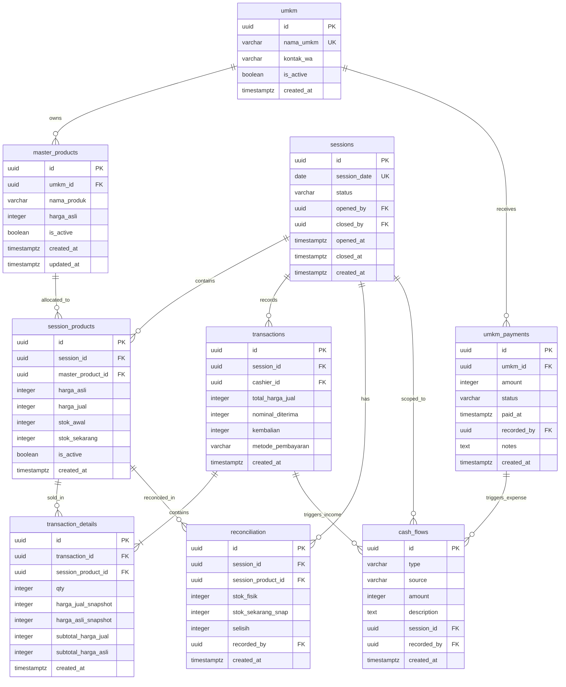

# DB_SCHEMA.md — Database Schema Reference
# OMK Consignment POS — Supabase (PostgreSQL)

> **Document Status:** Ground-Truth v4.0 — Authoritative source for AI Coding Agent  
> **Database:** Supabase (PostgreSQL 15+)  
> **Critical Rule:** Column names and types defined here are the single source of truth. Do not rename, retype, or add columns without updating this file first.

---

## Table of Contents

1. [Schema Overview](#1-schema-overview)
2. [Entity Relationship Diagram](#2-entity-relationship-diagram)
3. [Table Definitions](#3-table-definitions)
   - [3.1 companies](#31-table-companies)
   - [3.2 company_users](#32-table-company_users)
   - [3.3 umkm](#33-table-umkm)
   - [3.4 master_products](#34-table-master_products)
   - [3.5 sessions](#35-table-sessions)
   - [3.6 session_products](#36-table-session_products)
   - [3.7 transactions](#37-table-transactions)
   - [3.8 transaction_details](#38-table-transaction_details)
   - [3.9 reconciliation](#39-table-reconciliation)
   - [3.10 cash_flows](#310-table-cash_flows)
   - [3.11 umkm_payments](#311-table-umkm_payments)
   - [3.12 RBAC Tables](#312-rbac-tables)
4. [Database Functions (RPC) & Triggers](#4-database-functions-rpc--triggers)
   - [4.0 Context Resolvers & RBAC Functions](#40-context-resolvers--rbac-functions)
   - [4.1 complete_transaction](#41-complete_transaction)
   - [4.2 close_session](#42-close_session)
   - [4.3 reopen_session](#43-reopen_session)
   - [4.4 reset_session](#44-reset_session)
   - [4.5 get_session_financial_summary](#45-get_session_financial_summary)
   - [4.6 get_umkm_product_breakdown](#46-get_umkm_product_breakdown)
   - [4.7 get_product_stock_recommendation](#47-get_product_stock_recommendation)
   - [4.8 get_weekly_trends](#48-get_weekly_trends)
   - [4.9 get_umkm_product_performance](#49-get_umkm_product_performance)
   - [4.10 get_umkm_session_history](#410-get_umkm_session_history)
   - [4.11 Cash Flow RPCs](#411-cash-flow-rpcs)
   - [4.12 UMKM Payment RPCs](#412-umkm-payment-rpcs)
   - [4.13 User Management RPCs](#413-user-management-rpcs)
5. [Views](#5-views)
   - [5.1 products_cashier_view](#51-view-products_cashier_view)
   - [5.2 top_products_sales](#52-view-top_products_sales)
   - [5.3 umkm_profit_contribution](#53-view-umkm_profit_contribution)
   - [5.4 session_history_summary](#54-view-session_history_summary)
6. [Row-Level Security (RLS) Policies](#6-row-level-security-rls-policies)
7. [Indexes](#7-indexes)
8. [Realtime Configuration](#8-realtime-configuration)
9. [Seed Data & Initial Setup](#9-seed-data--initial-setup)
10. [Migration History](#10-migration-history)

---

## 1. Schema Overview

```
Schema: public (default Supabase schema)
Auth: supabase.auth.users (managed by Supabase Auth)

Multi-Company & Core Tables:
  companies           — Master organization/parish entities
  company_users       — Organization membership mapping users to companies and roles
  umkm                — Master directory of UMKM consignment partners (scoped to company_id)
  master_products     — Master product catalog owned by UMKM (scoped to company_id)
  sessions            — Sunday sales session lifecycle (scoped to company_id)
  session_products    — Products active for a specific session (scoped to company_id)
  transactions        — Completed cashier checkout transaction headers (scoped to company_id)
  transaction_details — Immutable line items per transaction (price snapshots)
  reconciliation      — End-of-day physical stock count results (scoped to company_id)
  cash_flows          — Ledger of cash flow events (scoped to company_id)
  umkm_payments       — Consignment payout records to UMKMs (scoped to company_id)

RBAC Tables:
  roles               — Master definition of roles (admin, cashier, etc.)
  permissions         — Granular system permissions catalog
  role_permissions    — Association between roles and permissions
  user_roles          — Global user-to-role assignment fallback
  user_permissions    — Per-company user custom permission overrides

Views (4 total):
  products_cashier_view   — Cashier-safe product view hiding harga_asli
  session_history_summary — Financial aggregation per session (gross, remittance, profit)
  top_products_sales      — Historical bestsellers with sell-through rate across closed sessions
  umkm_profit_contribution— OMK net profit breakdown by UMKM partner
```

**Design Principles:**
1. **Separation of Master Catalog & Session Stock:** Master products (`master_products`) define products and default cost (`harga_asli`). When a sales session opens, items are copied/allocated into `session_products` with session-specific selling prices (`harga_jual`) and stock counters.
2. **Price Immutability:** `transaction_details` stores snapshots of `harga_jual` and `harga_asli` at transaction time. Future changes never distort past accounting.
3. **Atomic Stock Updates:** Decrements happen exclusively within `complete_transaction` RPC under transactional lock (`FOR UPDATE`), never directly from frontend clients.
4. **Automated Cash Flow Sync:** DB triggers automatically log cash flow income on transaction insert and cash flow expense on UMKM payment.
5. **Soft Deletions:** Master tables use `is_active` flags rather than hard deletes to preserve historical references.

---

## 2. Entity Relationship Diagram


```mermaid
erDiagram
    umkm ||--o{ master_products : "owns"
    umkm ||--o{ umkm_payments : "receives"
    master_products ||--o{ session_products : "allocated_to"
    sessions ||--o{ session_products : "contains"
    sessions ||--o{ transactions : "records"
    sessions ||--o{ reconciliation : "has"
    sessions ||--o{ cash_flows : "scoped_to"
    transactions ||--|{ transaction_details : "contains"
    session_products ||--o{ transaction_details : "sold_in"
    session_products ||--o{ reconciliation : "reconciled_in"
    transactions ||--o{ cash_flows : "triggers_income"
    umkm_payments ||--o{ cash_flows : "triggers_expense"

    umkm {
        uuid id PK
        varchar nama_umkm UK
        varchar kontak_wa
        boolean is_active
        timestamptz created_at
    }

    master_products {
        uuid id PK
        uuid umkm_id FK
        varchar nama_produk
        integer harga_asli
        boolean is_active
        timestamptz created_at
        timestamptz updated_at
    }

    sessions {
        uuid id PK
        date session_date UK
        varchar status
        uuid opened_by FK
        uuid closed_by FK
        timestamptz opened_at
        timestamptz closed_at
        timestamptz created_at
    }

    session_products {
        uuid id PK
        uuid session_id FK
        uuid master_product_id FK
        integer harga_asli
        integer harga_jual
        integer stok_awal
        integer stok_sekarang
        boolean is_active
        timestamptz created_at
    }

    transactions {
        uuid id PK
        uuid session_id FK
        uuid cashier_id FK
        integer total_harga_jual
        integer nominal_diterima
        integer kembalian
        varchar metode_pembayaran
        timestamptz created_at
    }

    transaction_details {
        uuid id PK
        uuid transaction_id FK
        uuid session_product_id FK
        integer qty
        integer harga_jual_snapshot
        integer harga_asli_snapshot
        integer subtotal_harga_jual
        integer subtotal_harga_asli
        timestamptz created_at
    }

    reconciliation {
        uuid id PK
        uuid session_id FK
        uuid session_product_id FK
        integer stok_fisik
        integer stok_sekarang_snap
        integer selisih
        uuid recorded_by FK
        timestamptz created_at
    }

    cash_flows {
        uuid id PK
        varchar type
        varchar source
        integer amount
        text description
        uuid session_id FK
        uuid recorded_by FK
        timestamptz created_at
    }

    umkm_payments {
        uuid id PK
        uuid umkm_id FK
        integer amount
        varchar status
        timestamptz paid_at
        uuid recorded_by FK
        text notes
        timestamptz created_at
    }
```


---

## 3. Table Definitions

### 3.1 Table: `companies`

Master organization/parish entities managing consignment operations.

```sql
CREATE TABLE public.companies (
  id          UUID          PRIMARY KEY DEFAULT gen_random_uuid(),
  name        VARCHAR(100)  NOT NULL,
  slug        VARCHAR(50)   NOT NULL UNIQUE,
  logo_url    TEXT,
  address     TEXT,
  phone       VARCHAR(20),
  email       VARCHAR(100),
  settings    JSONB         NOT NULL DEFAULT '{
    "report_signature": "Sie Kewirausahaan OMK",
    "currency": "IDR",
    "timezone": "Asia/Jakarta"
  }',
  is_active   BOOLEAN       NOT NULL DEFAULT TRUE,
  created_at  TIMESTAMPTZ   NOT NULL DEFAULT NOW(),
  updated_at  TIMESTAMPTZ   NOT NULL DEFAULT NOW()
);

COMMENT ON TABLE public.companies IS 'Master organization/parish entities';
```

---

### 3.2 Table: `company_users`

Organization membership mapping users to companies and roles.

```sql
CREATE TABLE public.company_users (
  id          UUID          PRIMARY KEY DEFAULT gen_random_uuid(),
  company_id  UUID          NOT NULL REFERENCES public.companies(id) ON DELETE CASCADE,
  user_id     UUID          NOT NULL REFERENCES auth.users(id) ON DELETE CASCADE,
  role_id     UUID          NOT NULL REFERENCES public.roles(id) ON DELETE RESTRICT,
  is_default  BOOLEAN       NOT NULL DEFAULT FALSE,
  is_active   BOOLEAN       NOT NULL DEFAULT TRUE,
  created_at  TIMESTAMPTZ   NOT NULL DEFAULT NOW(),
  updated_at  TIMESTAMPTZ   NOT NULL DEFAULT NOW(),
  CONSTRAINT company_users_unique_membership UNIQUE (company_id, user_id)
);

CREATE INDEX idx_company_users_user ON public.company_users(user_id);
CREATE INDEX idx_company_users_company ON public.company_users(company_id);
```

---

### 3.3 Table: `umkm`

Master partner directory. Stores consignment partners scoped to each company.

```sql
CREATE TABLE public.umkm (
  id          UUID          DEFAULT gen_random_uuid() PRIMARY KEY,
  company_id  UUID          NOT NULL REFERENCES public.companies(id) ON DELETE RESTRICT,
  nama_umkm   VARCHAR(100)  NOT NULL,
  kontak_wa   VARCHAR(20)   NOT NULL,           -- Format: 08xxxxxxxxxx atau 628xxxxxxxxxx
  is_active   BOOLEAN       NOT NULL DEFAULT TRUE,
  created_at  TIMESTAMPTZ   NOT NULL DEFAULT NOW(),
  CONSTRAINT umkm_company_nama_unique UNIQUE (company_id, nama_umkm)
);

COMMENT ON TABLE public.umkm IS 'Master table of UMKM consignment partner businesses';
COMMENT ON COLUMN public.umkm.is_active IS 'Soft delete flag. False = partner inactive';
```

**Constraints & Notes:**
| Column | Type | Nullable | Default | Notes |
|---|---|---|---|---|
| `id` | `uuid` | NOT NULL | `gen_random_uuid()` | PK |
| `company_id` | `uuid` | NOT NULL | — | FK to companies(id) |
| `nama_umkm` | `varchar(100)` | NOT NULL | — | Partner name (unique per company) |
| `kontak_wa` | `varchar(20)` | NOT NULL | — | WhatsApp number |
| `is_active` | `boolean` | NOT NULL | `true` | Active status flag |
| `created_at` | `timestamptz` | NOT NULL | `NOW()` | Timestamp |

---

### 3.4 Table: `master_products`

Master product catalog. Each UMKM has multiple master products with their base cost (`harga_asli`), scoped to `company_id`.

```sql
CREATE TABLE public.master_products (
  id           UUID          DEFAULT gen_random_uuid() PRIMARY KEY,
  company_id   UUID          NOT NULL REFERENCES public.companies(id) ON DELETE RESTRICT,
  umkm_id      UUID          NOT NULL REFERENCES public.umkm(id) ON DELETE RESTRICT,
  nama_produk  VARCHAR(100)  NOT NULL,
  harga_asli   INTEGER       NOT NULL CHECK (harga_asli > 0),
  is_active    BOOLEAN       NOT NULL DEFAULT TRUE,
  created_at   TIMESTAMPTZ   NOT NULL DEFAULT NOW(),
  updated_at   TIMESTAMPTZ   NOT NULL DEFAULT NOW(),
  CONSTRAINT master_products_company_umkm_nama_unique UNIQUE (company_id, umkm_id, nama_produk)
);

CREATE TRIGGER trg_master_products_updated_at
  BEFORE UPDATE ON public.master_products
  FOR EACH ROW
  EXECUTE FUNCTION public.set_updated_at();
```

**Constraints & Notes:**
| Column | Type | Nullable | Default | Notes |
|---|---|---|---|---|
| `id` | `uuid` | NOT NULL | `gen_random_uuid()` | PK |
| `umkm_id` | `uuid` | NOT NULL | — | FK → `umkm.id` |
| `nama_produk` | `varchar(100)` | NOT NULL | — | Product name |
| `harga_asli` | `integer` | NOT NULL | — | Base cost in IDR (> 0) |
| `is_active` | `boolean` | NOT NULL | `true` | Active status |
| `created_at` | `timestamptz` | NOT NULL | `NOW()` | Creation time |
| `updated_at` | `timestamptz` | NOT NULL | `NOW()` | Auto-updated via trigger |

---

### 3.3 Table: `sessions`

One record per Sunday sales session. Controls POS availability.

```sql
CREATE TABLE public.sessions (
  id            UUID          DEFAULT gen_random_uuid() PRIMARY KEY,
  session_date  DATE          NOT NULL UNIQUE,    -- Unique: 1 session per date
  status        VARCHAR(10)   NOT NULL DEFAULT 'open' CHECK (status IN ('open', 'closed')),
  opened_by     UUID          REFERENCES auth.users(id) ON DELETE SET NULL,
  closed_by     UUID          REFERENCES auth.users(id) ON DELETE SET NULL,
  opened_at     TIMESTAMPTZ   NOT NULL DEFAULT NOW(),
  closed_at     TIMESTAMPTZ,
  created_at    TIMESTAMPTZ   NOT NULL DEFAULT NOW()
);

COMMENT ON TABLE public.sessions IS 'One record per Sunday session. Controls whether POS accepts transactions';
```

**Constraints & Notes:**
| Column | Type | Nullable | Default | Notes |
|---|---|---|---|---|
| `id` | `uuid` | NOT NULL | `gen_random_uuid()` | PK |
| `session_date` | `date` | NOT NULL | — | UNIQUE constraint |
| `status` | `varchar(10)` | NOT NULL | `'open'` | `'open'` or `'closed'` |
| `opened_by` | `uuid` | NULL | — | FK → `auth.users.id` |
| `closed_by` | `uuid` | NULL | — | FK → `auth.users.id` |
| `opened_at` | `timestamptz` | NOT NULL | `NOW()` | Timestamp opened |
| `closed_at` | `timestamptz` | NULL | — | Timestamp closed |
| `created_at` | `timestamptz` | NOT NULL | `NOW()` | Creation time |

---

### 3.4 Table: `session_products`

Specific items active for a session with live stock tracking.

```sql
CREATE TABLE public.session_products (
  id                  UUID          DEFAULT gen_random_uuid() PRIMARY KEY,
  session_id          UUID          NOT NULL REFERENCES public.sessions(id) ON DELETE RESTRICT,
  master_product_id   UUID          NOT NULL REFERENCES public.master_products(id) ON DELETE RESTRICT,
  harga_asli          INTEGER       NOT NULL CHECK (harga_asli > 0),
  harga_jual          INTEGER       NOT NULL CHECK (harga_jual >= harga_asli),
  stok_awal           INTEGER       NOT NULL CHECK (stok_awal > 0),
  stok_sekarang       INTEGER       NOT NULL,
  is_active           BOOLEAN       NOT NULL DEFAULT TRUE,
  created_at          TIMESTAMPTZ   NOT NULL DEFAULT NOW(),
  CONSTRAINT session_products_stok_check CHECK (stok_sekarang >= 0 AND stok_sekarang <= stok_awal),
  CONSTRAINT session_products_unique_per_session UNIQUE (session_id, master_product_id)
);

CREATE TRIGGER trg_init_stok_session_products
  BEFORE INSERT ON public.session_products
  FOR EACH ROW
  EXECUTE FUNCTION public.set_stok_sekarang();
```

**Constraints & Notes:**
| Column | Type | Nullable | Default | Notes |
|---|---|---|---|---|
| `id` | `uuid` | NOT NULL | `gen_random_uuid()` | PK |
| `session_id` | `uuid` | NOT NULL | — | FK → `sessions.id` |
| `master_product_id`| `uuid` | NOT NULL | — | FK → `master_products.id` |
| `harga_asli` | `integer` | NOT NULL | — | Cost snapshot for this session |
| `harga_jual` | `integer` | NOT NULL | — | OMK retail selling price (>= harga_asli) |
| `stok_awal` | `integer` | NOT NULL | — | Initial stock delivered (> 0) |
| `stok_sekarang` | `integer` | NOT NULL | — | Current available stock |
| `is_active` | `boolean` | NOT NULL | `true` | Session item active toggle |
| `created_at` | `timestamptz` | NOT NULL | `NOW()` | Timestamp |

---

### 3.5 Table: `transactions`

Header records for completed checkout orders.

```sql
CREATE TABLE public.transactions (
  id                 UUID         DEFAULT gen_random_uuid() PRIMARY KEY,
  session_id         UUID         NOT NULL REFERENCES public.sessions(id) ON DELETE RESTRICT,
  cashier_id         UUID         REFERENCES auth.users(id) ON DELETE SET NULL,
  total_harga_jual   INTEGER      NOT NULL,
  nominal_diterima   INTEGER      NOT NULL,
  kembalian          INTEGER      GENERATED ALWAYS AS (nominal_diterima - total_harga_jual) STORED,
  metode_pembayaran  VARCHAR(20)  DEFAULT 'cash',
  created_at         TIMESTAMPTZ  NOT NULL DEFAULT NOW()
);

-- Trigger: auto-sync transaction total to cash_flows income
CREATE TRIGGER trg_cash_flow_from_transaction
  AFTER INSERT ON public.transactions
  FOR EACH ROW
  EXECUTE FUNCTION public.trigger_add_cash_flow_from_transaction();
```

---

### 3.6 Table: `transaction_details`

Line items for each transaction. Completely immutable after insert.

```sql
CREATE TABLE public.transaction_details (
  id                  UUID        DEFAULT gen_random_uuid() PRIMARY KEY,
  transaction_id      UUID        NOT NULL REFERENCES public.transactions(id) ON DELETE RESTRICT,
  session_product_id  UUID        NOT NULL REFERENCES public.session_products(id) ON DELETE RESTRICT,
  qty                 INTEGER     NOT NULL CHECK (qty > 0),
  harga_jual_snapshot INTEGER     NOT NULL,
  harga_asli_snapshot INTEGER     NOT NULL,
  subtotal_harga_jual INTEGER     GENERATED ALWAYS AS (qty * harga_jual_snapshot) STORED,
  subtotal_harga_asli INTEGER     GENERATED ALWAYS AS (qty * harga_asli_snapshot) STORED,
  created_at          TIMESTAMPTZ NOT NULL DEFAULT NOW()
);
```

---

### 3.7 Table: `reconciliation`

Physical stock counts recorded at session closure.

```sql
CREATE TABLE public.reconciliation (
  id                 UUID        DEFAULT gen_random_uuid() PRIMARY KEY,
  session_id         UUID        NOT NULL REFERENCES public.sessions(id) ON DELETE RESTRICT,
  session_product_id UUID        NOT NULL REFERENCES public.session_products(id) ON DELETE RESTRICT,
  stok_fisik         INTEGER     NOT NULL,
  stok_sekarang_snap INTEGER     NOT NULL,
  selisih            INTEGER     GENERATED ALWAYS AS (stok_fisik - stok_sekarang_snap) STORED,
  recorded_by        UUID        REFERENCES auth.users(id) ON DELETE SET NULL,
  created_at         TIMESTAMPTZ NOT NULL DEFAULT NOW()
);
```

---

### 3.8 Table: `cash_flows`

Ledger for cash tracking. Supports transactions, manual entries (initial cash float, supplies), and consignment payments.

```sql
CREATE TABLE public.cash_flows (
  id          UUID        DEFAULT gen_random_uuid() PRIMARY KEY,
  type        VARCHAR(20) NOT NULL CHECK (type IN ('income', 'expense')),
  source      VARCHAR(20) NOT NULL CHECK (source IN ('transaction', 'manual', 'payment')),
  amount      INTEGER     NOT NULL CHECK (amount > 0),
  description TEXT,
  session_id  UUID        REFERENCES public.sessions(id) ON DELETE SET NULL,
  recorded_by UUID        REFERENCES auth.users(id) ON DELETE SET NULL,
  created_at  TIMESTAMPTZ NOT NULL DEFAULT NOW()
);
```

---

### 3.9 Table: `umkm_payments`

Settlement ledger for paying UMKM partners their consignment remittance.

```sql
CREATE TABLE public.umkm_payments (
  id          UUID        DEFAULT gen_random_uuid() PRIMARY KEY,
  umkm_id     UUID        NOT NULL REFERENCES public.umkm(id) ON DELETE RESTRICT,
  amount      INTEGER     NOT NULL CHECK (amount > 0),
  status      VARCHAR(20) NOT NULL DEFAULT 'pending' CHECK (status IN ('pending', 'paid')),
  paid_at     TIMESTAMPTZ,
  recorded_by UUID        REFERENCES auth.users(id) ON DELETE SET NULL,
  notes       TEXT,
  created_at  TIMESTAMPTZ NOT NULL DEFAULT NOW()
);

-- Trigger: auto-sync paid amount to cash_flows expense
CREATE TRIGGER trg_cash_flow_from_umkm_payment
  AFTER INSERT ON public.umkm_payments
  FOR EACH ROW
  EXECUTE FUNCTION public.trigger_add_cash_flow_from_umkm_payment();
```

---

## 4. Database Functions (RPC) & Triggers

### 4.0 Context Resolvers & RBAC Functions

Helper functions for multi-tenancy and granular role-based access control.

```sql
-- 4.0.1 is_super_admin: Checks if the user has super_admin role in public.user_roles
CREATE OR REPLACE FUNCTION public.is_super_admin(p_user_id UUID DEFAULT auth.uid())
RETURNS BOOLEAN
LANGUAGE sql
STABLE
SECURITY DEFINER
AS $$
  SELECT EXISTS (
    SELECT 1 
    FROM public.user_roles ur
    JOIN public.roles r ON r.id = ur.role_id
    WHERE ur.user_id = COALESCE(p_user_id, auth.uid())
      AND r.code = 'super_admin'
  );
$$;

-- 4.0.2 get_current_user_company_id: Resolves active company from X-Company-Id header or is_default fallback
CREATE OR REPLACE FUNCTION public.get_current_user_company_id()
RETURNS UUID
LANGUAGE plpgsql
STABLE
SECURITY DEFINER
AS $$
DECLARE
  v_req_company_id TEXT;
  v_company_uuid   UUID;
  v_user_id        UUID := auth.uid();
BEGIN
  IF v_user_id IS NULL THEN
    RETURN NULL;
  END IF;

  -- 1. Try reading from HTTP header 'X-Company-Id' (injected by client / middleware)
  BEGIN
    v_req_company_id := current_setting('request.headers', true)::json->>'x-company-id';
  EXCEPTION WHEN OTHERS THEN
    v_req_company_id := NULL;
  END;

  -- 2. If header exists and is a valid UUID
  IF v_req_company_id IS NOT NULL AND v_req_company_id ~* '^[0-9a-f]{8}-[0-9a-f]{4}-[0-9a-f]{4}-[0-9a-f]{4}-[0-9a-f]{12}$' THEN
    v_company_uuid := v_req_company_id::UUID;
    
    -- Super Admin can access any company
    IF public.is_super_admin() THEN
      RETURN v_company_uuid;
    END IF;

    -- Regular users must be active members in company_users
    IF EXISTS (
      SELECT 1 FROM public.company_users
      WHERE user_id = v_user_id 
        AND company_id = v_company_uuid 
        AND is_active = TRUE
    ) THEN
      RETURN v_company_uuid;
    END IF;
  END IF;

  -- 3. Fallback: Get default company membership
  SELECT company_id INTO v_company_uuid
  FROM public.company_users
  WHERE user_id = v_user_id AND is_active = TRUE
  ORDER BY is_default DESC, created_at ASC
  LIMIT 1;

  -- 4. Fallback for Super Admin if not explicitly mapped
  IF v_company_uuid IS NULL AND public.is_super_admin() THEN
    SELECT id INTO v_company_uuid FROM public.companies WHERE is_active = TRUE ORDER BY created_at ASC LIMIT 1;
  END IF;

  RETURN v_company_uuid;
END;
$$;

-- 4.0.3 get_user_role: Resolves active tenant role from company_users, with fallback to global role/JWT
CREATE OR REPLACE FUNCTION public.get_user_role()
RETURNS TEXT
LANGUAGE plpgsql
STABLE
SECURITY DEFINER
AS $$
DECLARE
  v_role_code TEXT;
  v_cid UUID;
BEGIN
  -- 1. Super Admin is always 'admin'
  IF public.is_super_admin() THEN
    RETURN 'admin';
  END IF;

  -- 2. Check company_users for current active company
  v_cid := public.get_current_user_company_id();
  IF v_cid IS NOT NULL AND auth.uid() IS NOT NULL THEN
    SELECT r.code INTO v_role_code
    FROM public.company_users cu
    JOIN public.roles r ON r.id = cu.role_id
    WHERE cu.user_id = auth.uid() AND cu.company_id = v_cid AND cu.is_active = TRUE;

    IF v_role_code IS NOT NULL THEN
      RETURN v_role_code;
    END IF;
  END IF;

  -- 3. Fallback to global user_roles table
  SELECT r.code INTO v_role_code
  FROM public.user_roles ur
  JOIN public.roles r ON r.id = ur.role_id
  WHERE ur.user_id = auth.uid();

  IF v_role_code IS NOT NULL THEN
    RETURN v_role_code;
  END IF;

  -- 4. Final fallback: JWT user_metadata
  RETURN COALESCE(
    auth.jwt() -> 'user_metadata' ->> 'role',
    'cashier'
  );
END;
$$;

-- 4.0.4 authorize: Checks granular permission against role and company-specific overrides
CREATE OR REPLACE FUNCTION public.authorize(p_permission TEXT)
RETURNS BOOLEAN
LANGUAGE plpgsql
STABLE
SECURITY DEFINER
AS $$
DECLARE
  v_user_id UUID := auth.uid();
  v_company_id UUID;
  v_has_permission BOOLEAN;
BEGIN
  IF v_user_id IS NULL THEN
    RETURN FALSE;
  END IF;

  IF public.is_super_admin() THEN
    RETURN TRUE;
  END IF;

  v_company_id := public.get_current_user_company_id();

  -- 1. Check direct user_permissions override for current company
  SELECT up.is_granted INTO v_has_permission
  FROM public.user_permissions up
  JOIN public.permissions p ON p.id = up.permission_id
  WHERE up.user_id = v_user_id
    AND p.code = p_permission
    AND (up.company_id = v_company_id OR up.company_id IS NULL)
  ORDER BY up.company_id NULLS LAST
  LIMIT 1;

  IF v_has_permission IS NOT NULL THEN
    RETURN v_has_permission;
  END IF;

  -- 2. Check role-based permission via company_users
  IF v_company_id IS NOT NULL THEN
    SELECT EXISTS (
      SELECT 1
      FROM public.company_users cu
      JOIN public.role_permissions rp ON rp.role_id = cu.role_id
      JOIN public.permissions p ON p.id = rp.permission_id
      WHERE cu.user_id = v_user_id
        AND cu.company_id = v_company_id
        AND cu.is_active = TRUE
        AND p.code = p_permission
    ) INTO v_has_permission;

    IF v_has_permission THEN
      RETURN TRUE;
    END IF;
  END IF;

  -- 3. Fallback: check global user_roles
  SELECT EXISTS (
    SELECT 1
    FROM public.user_roles ur
    JOIN public.role_permissions rp ON rp.role_id = ur.role_id
    JOIN public.permissions p ON p.id = rp.permission_id
    WHERE ur.user_id = v_user_id
      AND p.code = p_permission
  ) INTO v_has_permission;

  RETURN COALESCE(v_has_permission, FALSE);
END;
$$;

-- 4.0.5 get_user_effective_permissions: Returns list of granted permissions for user & tenant
CREATE OR REPLACE FUNCTION public.get_user_effective_permissions(
  p_user_id UUID,
  p_company_id UUID
)
RETURNS TABLE (
  permission_code VARCHAR,
  permission_name VARCHAR,
  module VARCHAR,
  source VARCHAR
)
LANGUAGE plpgsql
STABLE
SECURITY DEFINER
AS $$
BEGIN
  RETURN QUERY
  WITH base_permissions AS (
    SELECT 
      p.code AS perm_code,
      p.name AS perm_name,
      p.module AS perm_module,
      'role'::VARCHAR AS perm_source
    FROM public.company_users cu
    JOIN public.role_permissions rp ON rp.role_id = cu.role_id
    JOIN public.permissions p ON p.id = rp.permission_id
    WHERE cu.user_id = p_user_id
      AND cu.company_id = p_company_id
      AND cu.is_active = TRUE
  ),
  overridden_permissions AS (
    SELECT 
      p.code AS perm_code,
      p.name AS perm_name,
      p.module AS perm_module,
      CASE WHEN up.is_granted THEN 'custom_grant'::VARCHAR ELSE 'revoked'::VARCHAR END AS perm_source,
      up.is_granted
    FROM public.user_permissions up
    JOIN public.permissions p ON p.id = up.permission_id
    WHERE up.user_id = p_user_id
      AND (up.company_id = p_company_id OR up.company_id IS NULL)
  )
  SELECT 
    bp.perm_code,
    bp.perm_name,
    bp.perm_module,
    bp.perm_source
  FROM base_permissions bp
  WHERE NOT EXISTS (
    SELECT 1 FROM overridden_permissions op 
    WHERE op.perm_code = bp.perm_code AND op.is_granted = FALSE
  )
  UNION
  SELECT 
    op.perm_code,
    op.perm_name,
    op.perm_module,
    op.perm_source
  FROM overridden_permissions op
  WHERE op.is_granted = TRUE;
END;
$$;

-- 1-arg overload defaulting to active company
CREATE OR REPLACE FUNCTION public.get_user_effective_permissions(p_user_id UUID)
RETURNS TABLE (
  permission_code VARCHAR,
  permission_name VARCHAR,
  module VARCHAR,
  source VARCHAR
)
LANGUAGE plpgsql
STABLE
SECURITY DEFINER
AS $$
BEGIN
  RETURN QUERY
  SELECT * FROM public.get_user_effective_permissions(p_user_id, public.get_current_user_company_id());
END;
$$;
```

---

### 4.1 `complete_transaction`

Atomically validates cart items, verifies stock with row locks (`FOR UPDATE`) within tenant boundaries, deducts stock from `session_products`, inserts into `transactions` with `company_id`, and creates `transaction_details`.

```sql
CREATE OR REPLACE FUNCTION public.complete_transaction(
  p_session_id        UUID,
  p_cashier_id        UUID,
  p_nominal_diterima  INTEGER,
  p_cart_items        JSONB,
  p_metode_pembayaran VARCHAR DEFAULT 'cash'
)
RETURNS JSONB
LANGUAGE plpgsql
SECURITY DEFINER
AS $$
DECLARE
  v_transaction_id     UUID;
  v_total_harga_jual   INTEGER := 0;
  v_item               JSONB;
  v_session_product_id UUID;
  v_qty                INTEGER;
  v_harga_jual         INTEGER;
  v_stok_sekarang      INTEGER;
  v_session_status     VARCHAR(20);
  v_company_id         UUID;
BEGIN
  -- 1. Validasi sesi & ambil company_id
  SELECT status, company_id INTO v_session_status, v_company_id 
  FROM public.sessions 
  WHERE id = p_session_id;

  IF v_session_status IS NULL THEN
    RAISE EXCEPTION 'Session not found: %', p_session_id;
  END IF;
  IF v_session_status != 'open' THEN
    RAISE EXCEPTION 'Session is closed. No transactions allowed.';
  END IF;

  -- 2. Validasi cart items & hitung total
  FOR v_item IN SELECT * FROM jsonb_array_elements(p_cart_items) LOOP
    v_session_product_id := (v_item->>'product_id')::UUID;
    v_qty                := (v_item->>'qty')::INTEGER;
    v_harga_jual         := (v_item->>'harga_jual')::INTEGER;
    IF v_qty <= 0 THEN
      RAISE EXCEPTION 'Invalid qty for session_product %', v_session_product_id;
    END IF;
    v_total_harga_jual := v_total_harga_jual + (v_qty * v_harga_jual);
  END LOOP;

  -- 3. Validasi nominal bayar
  IF p_nominal_diterima < v_total_harga_jual THEN
    RAISE EXCEPTION 'nominal_diterima (%) is less than total (%).',
      p_nominal_diterima, v_total_harga_jual;
  END IF;

  -- 4. Buat record transaksi dengan company_id
  INSERT INTO public.transactions (
    session_id, cashier_id, total_harga_jual, nominal_diterima, metode_pembayaran, company_id
  )
  VALUES (
    p_session_id, p_cashier_id, v_total_harga_jual, p_nominal_diterima, p_metode_pembayaran, v_company_id
  )
  RETURNING id INTO v_transaction_id;

  -- 5. Lock stok, verifikasi ketersediaan di company yang sama, kurangi stok, dan snapshot detail
  FOR v_item IN SELECT * FROM jsonb_array_elements(p_cart_items) LOOP
    v_session_product_id := (v_item->>'product_id')::UUID;
    v_qty                := (v_item->>'qty')::INTEGER;

    SELECT stok_sekarang INTO v_stok_sekarang
    FROM public.session_products
    WHERE id = v_session_product_id 
      AND company_id = v_company_id
      AND is_active = TRUE
    FOR UPDATE;

    IF v_stok_sekarang IS NULL THEN
      RAISE EXCEPTION 'Session product % not found, inactive, or company mismatch', v_session_product_id;
    END IF;
    IF v_stok_sekarang < v_qty THEN
      RAISE EXCEPTION 'Insufficient stock for session_product %. Available: %, Requested: %',
        v_session_product_id, v_stok_sekarang, v_qty;
    END IF;

    UPDATE public.session_products
    SET stok_sekarang = stok_sekarang - v_qty
    WHERE id = v_session_product_id AND company_id = v_company_id;

    INSERT INTO public.transaction_details (
      transaction_id, session_product_id, qty, harga_jual_snapshot, harga_asli_snapshot
    )
    SELECT v_transaction_id, v_session_product_id, v_qty, sp.harga_jual, sp.harga_asli
    FROM public.session_products sp 
    WHERE sp.id = v_session_product_id AND sp.company_id = v_company_id;
  END LOOP;

  RETURN jsonb_build_object(
    'transaction_id',    v_transaction_id,
    'total_harga_jual',  v_total_harga_jual,
    'kembalian',         p_nominal_diterima - v_total_harga_jual,
    'metode_pembayaran', p_metode_pembayaran
  );
EXCEPTION WHEN OTHERS THEN RAISE;
END;
$$;
```

---

### 4.2 `close_session`

Validates that all active session products have reconciliation rows, then closes the session.

```sql
CREATE OR REPLACE FUNCTION public.close_session(
  p_session_id  UUID,
  p_admin_id    UUID
)
RETURNS JSONB
LANGUAGE plpgsql
SECURITY DEFINER
AS $$
DECLARE
  v_product_count        INTEGER;
  v_reconciliation_count INTEGER;
BEGIN
  SELECT COUNT(*) INTO v_product_count
  FROM public.session_products sp
  WHERE sp.session_id = p_session_id AND sp.is_active = TRUE;

  SELECT COUNT(*) INTO v_reconciliation_count
  FROM public.reconciliation
  WHERE session_id = p_session_id;

  IF v_reconciliation_count < v_product_count THEN
    RAISE EXCEPTION 'Reconciliation incomplete. % of % products reconciled.',
      v_reconciliation_count, v_product_count;
  END IF;

  UPDATE public.sessions
  SET
    status     = 'closed',
    closed_by  = p_admin_id,
    closed_at  = NOW()
  WHERE id = p_session_id AND status = 'open';

  IF NOT FOUND THEN
    RAISE EXCEPTION 'Session % not found or already closed.', p_session_id;
  END IF;

  RETURN jsonb_build_object('session_id', p_session_id, 'status', 'closed');
END;
$$;
```

---

### 4.3 `reopen_session`

Reopens a closed session for authorized admins.

```sql
CREATE OR REPLACE FUNCTION public.reopen_session(
  p_session_id  UUID,
  p_admin_id    UUID
)
RETURNS JSONB
LANGUAGE plpgsql
SECURITY DEFINER
AS $$
DECLARE
  v_is_authorized BOOLEAN;
BEGIN
  SELECT COALESCE(
    (auth.jwt() -> 'user_metadata' ->> 'can_reopen_session')::BOOLEAN,
    (public.get_user_role() = 'admin')
  ) INTO v_is_authorized;

  IF NOT v_is_authorized THEN
    RAISE EXCEPTION 'Unauthorized: User does not have can_reopen_session permission.';
  END IF;

  UPDATE public.sessions
  SET status = 'open', closed_by = NULL, closed_at = NULL
  WHERE id = p_session_id AND status = 'closed';

  IF NOT FOUND THEN
    RAISE EXCEPTION 'Session % not found or not in closed state.', p_session_id;
  END IF;

  RETURN jsonb_build_object('session_id', p_session_id, 'status', 'open');
END;
$$;
```

---

### 4.4 `reset_session`

Empties transaction and reconciliation data for a session and resets stock to `stok_awal`.

```sql
CREATE OR REPLACE FUNCTION public.reset_session(
  p_session_id  UUID,
  p_admin_id    UUID
)
RETURNS JSONB
LANGUAGE plpgsql
SECURITY DEFINER
AS $$
BEGIN
  IF NOT public.is_super_admin() AND NOT public.authorize('session:reset') THEN
    RAISE EXCEPTION 'Access Denied: Memerlukan hak akses Reset Sesi (Platform Super Admin).';
  END IF;

  DELETE FROM public.transaction_details
  WHERE transaction_id IN (SELECT id FROM public.transactions WHERE session_id = p_session_id);
  DELETE FROM public.transactions WHERE session_id = p_session_id;
  DELETE FROM public.reconciliation WHERE session_id = p_session_id;

  UPDATE public.session_products
  SET stok_sekarang = stok_awal
  WHERE session_id = p_session_id;

  UPDATE public.sessions
  SET status = 'open', closed_by = NULL, closed_at = NULL
  WHERE id = p_session_id;

  RETURN jsonb_build_object('session_id', p_session_id, 'status', 'open', 'reset', true);
END;
$$;
```

---

### 4.5 `get_session_financial_summary`

Computes session gross revenue, total consignment remittance due, OMK profit, and per-UMKM sub-breakdown.

```sql
CREATE OR REPLACE FUNCTION public.get_session_financial_summary(
  p_session_id UUID
)
RETURNS JSONB
LANGUAGE plpgsql
SECURITY DEFINER
AS $$
DECLARE
  v_totals   JSONB;
  v_per_umkm JSONB;
BEGIN
  SELECT jsonb_build_object(
    'session_id',        p_session_id,
    'gross_revenue',     COALESCE(SUM(td.subtotal_harga_jual), 0),
    'total_remittance',  COALESCE(SUM(td.subtotal_harga_asli), 0),
    'omk_net_profit',    COALESCE(SUM(td.subtotal_harga_jual - td.subtotal_harga_asli), 0),
    'transaction_count', COUNT(DISTINCT t.id)
  )
  INTO v_totals
  FROM public.transactions t
  JOIN public.transaction_details td ON td.transaction_id = t.id
  WHERE t.session_id = p_session_id;

  SELECT COALESCE(
    jsonb_agg(
      jsonb_build_object(
        'umkm_id',        agg.umkm_id,
        'nama_umkm',      agg.nama_umkm,
        'items_sold',     agg.items_sold,
        'gross_sales',    agg.gross_sales,
        'remittance_due', agg.remittance_due,
        'omk_profit',     agg.omk_profit
      ) ORDER BY agg.nama_umkm
    ), '[]'::jsonb
  )
  INTO v_per_umkm
  FROM (
    SELECT
      u.id              AS umkm_id,
      u.nama_umkm,
      COALESCE(SUM(td.qty), 0)                                          AS items_sold,
      COALESCE(SUM(td.subtotal_harga_jual), 0)                          AS gross_sales,
      COALESCE(SUM(td.subtotal_harga_asli), 0)                          AS remittance_due,
      COALESCE(SUM(td.subtotal_harga_jual - td.subtotal_harga_asli), 0) AS omk_profit
    FROM public.transactions t
    JOIN public.transaction_details td ON td.transaction_id = t.id
    JOIN public.session_products sp ON sp.id = td.session_product_id
    JOIN public.master_products mp ON mp.id = sp.master_product_id
    JOIN public.umkm u ON u.id = mp.umkm_id
    WHERE t.session_id = p_session_id
    GROUP BY u.id, u.nama_umkm
  ) agg;

  IF v_totals IS NULL THEN
    RETURN jsonb_build_object(
      'session_id', p_session_id, 'gross_revenue', 0, 'total_remittance', 0,
      'omk_net_profit', 0, 'transaction_count', 0, 'per_umkm', '[]'::jsonb
    );
  END IF;

  RETURN v_totals || jsonb_build_object('per_umkm', v_per_umkm);
END;
$$;
```

---

### 4.6 `get_umkm_product_breakdown`

Detailed product performance for one UMKM in a given session.

```sql
CREATE OR REPLACE FUNCTION public.get_umkm_product_breakdown(
  p_session_id UUID,
  p_umkm_id    UUID
)
RETURNS JSONB
LANGUAGE plpgsql
SECURITY DEFINER
AS $$
DECLARE
  v_result JSONB;
BEGIN
  SELECT COALESCE(
    jsonb_agg(
      jsonb_build_object(
        'master_product_id', mp.id,
        'nama_produk',       mp.nama_produk,
        'stok_awal',         sp.stok_awal,
        'stok_sekarang',     sp.stok_sekarang,
        'sold',              COALESCE(s.qty_sold, 0),
        'revenue',           COALESCE(s.rev, 0),
        'cost',              COALESCE(s.cost, 0),
        'profit',            COALESCE(s.rev - s.cost, 0)
      ) ORDER BY mp.nama_produk
    ), '[]'::jsonb
  )
  INTO v_result
  FROM public.session_products sp
  JOIN public.master_products mp ON mp.id = sp.master_product_id
  LEFT JOIN (
    SELECT td.session_product_id,
           SUM(td.qty)                 AS qty_sold,
           SUM(td.subtotal_harga_jual) AS rev,
           SUM(td.subtotal_harga_asli) AS cost
    FROM public.transaction_details td
    JOIN public.transactions t ON t.id = td.transaction_id
    WHERE t.session_id = p_session_id
    GROUP BY td.session_product_id
  ) s ON s.session_product_id = sp.id
  WHERE mp.umkm_id = p_umkm_id AND sp.session_id = p_session_id;

  RETURN v_result;
END;
$$;
```

---

### 4.7 `get_product_stock_recommendation`

Calculates weighted moving average stock recommendation across the last 3 closed sessions:  
`rec = CEIL(0.5 * S1 + 0.3 * S2 + 0.2 * S3)`

```sql
CREATE OR REPLACE FUNCTION public.get_product_stock_recommendation(
  p_master_product_id UUID
)
RETURNS TABLE(recommendation INTEGER, s1_sold INTEGER, s2_sold INTEGER, s3_sold INTEGER)
LANGUAGE plpgsql
SECURITY DEFINER
AS $$
DECLARE
  v_s1 INTEGER := 0; v_s2 INTEGER := 0; v_s3 INTEGER := 0;
  v_rec INTEGER; r RECORD; idx INTEGER := 1;
BEGIN
  FOR r IN (
    SELECT COALESCE(SUM(td.qty), 0)::INTEGER AS total_sold
    FROM public.sessions s
    JOIN public.session_products sp ON sp.session_id = s.id
    LEFT JOIN public.transaction_details td ON td.session_product_id = sp.id
    WHERE s.status = 'closed'
      AND sp.master_product_id = p_master_product_id
    GROUP BY s.id, s.session_date
    ORDER BY s.session_date DESC LIMIT 3
  ) LOOP
    IF idx = 1 THEN v_s1 := r.total_sold;
    ELSIF idx = 2 THEN v_s2 := r.total_sold;
    ELSIF idx = 3 THEN v_s3 := r.total_sold; END IF;
    idx := idx + 1;
  END LOOP;

  IF idx = 1 THEN RETURN; END IF;

  v_rec := CEIL((0.5 * v_s1) + (0.3 * v_s2) + (0.2 * v_s3));
  RETURN QUERY SELECT v_rec, v_s1, v_s2, v_s3;
END;
$$;
```

---

### 4.8 `get_weekly_trends`

Returns historical financial performance for closed sessions scoped to active company.

```sql
CREATE OR REPLACE FUNCTION public.get_weekly_trends(p_limit integer, p_company_id uuid)
RETURNS TABLE(session_id uuid, session_date date, gross_revenue bigint, total_remittance bigint, omk_net_profit bigint)
LANGUAGE plpgsql
SECURITY DEFINER
AS $$
DECLARE
  v_cid UUID := COALESCE(p_company_id, public.get_current_user_company_id());
BEGIN
  RETURN QUERY
  SELECT 
    shs.session_id,
    shs.session_date,
    shs.gross_revenue::BIGINT,
    shs.total_remittance::BIGINT,
    shs.omk_net_profit::BIGINT
  FROM public.session_history_summary shs
  WHERE shs.status = 'closed'
    AND (v_cid IS NULL OR shs.company_id = v_cid)
  ORDER BY shs.session_date DESC
  LIMIT p_limit;
END;
$$;

CREATE OR REPLACE FUNCTION public.get_weekly_trends(p_limit integer DEFAULT 10)
RETURNS TABLE(session_id uuid, session_date date, gross_revenue bigint, total_remittance bigint, omk_net_profit bigint)
LANGUAGE plpgsql
SECURITY DEFINER
AS $$
BEGIN
  RETURN QUERY
  SELECT * FROM public.get_weekly_trends(p_limit, public.get_current_user_company_id());
END;
$$;
```

---

### 4.9 `get_umkm_product_performance`

```sql
CREATE OR REPLACE FUNCTION public.get_umkm_product_performance(p_umkm_id uuid)
RETURNS TABLE(master_product_id uuid, nama_produk character varying, harga_asli numeric, total_terjual bigint, total_setoran numeric)
LANGUAGE plpgsql
SECURITY DEFINER
AS $$
BEGIN
  RETURN QUERY
  SELECT 
    mp.id as master_product_id,
    mp.nama_produk::varchar(255),
    mp.harga_asli::numeric,
    COALESCE(SUM(td.qty)::bigint, 0) as total_terjual,
    COALESCE(SUM(td.subtotal_harga_asli)::numeric, 0) as total_setoran
  FROM public.master_products mp
  LEFT JOIN public.session_products sp ON sp.master_product_id = mp.id
  LEFT JOIN public.transaction_details td ON td.session_product_id = sp.id
  WHERE mp.umkm_id = p_umkm_id
  GROUP BY mp.id, mp.nama_produk, mp.harga_asli;
END;
$$;

GRANT EXECUTE ON FUNCTION public.get_umkm_product_performance(uuid) TO anon, authenticated;
```

---

### 4.10 `get_umkm_session_history`

```sql
CREATE OR REPLACE FUNCTION public.get_umkm_session_history(p_umkm_id uuid)
RETURNS TABLE(session_id uuid, session_date date, status character varying, total_terjual bigint, total_setoran numeric)
LANGUAGE plpgsql
SECURITY DEFINER
AS $$
BEGIN
  RETURN QUERY
  SELECT 
    s.id as session_id,
    s.session_date,
    s.status,
    COALESCE(SUM(td.qty)::bigint, 0) as total_terjual,
    COALESCE(SUM(td.subtotal_harga_asli)::numeric, 0) as total_setoran
  FROM public.sessions s
  JOIN public.session_products sp ON sp.session_id = s.id
  JOIN public.master_products mp ON mp.id = sp.master_product_id
  LEFT JOIN public.transaction_details td ON td.session_product_id = sp.id
  WHERE mp.umkm_id = p_umkm_id
  GROUP BY s.id, s.session_date, s.status
  ORDER BY s.session_date DESC;
END;
$$;

GRANT EXECUTE ON FUNCTION public.get_umkm_session_history(uuid) TO anon, authenticated;
```

---

### 4.11 Cash Flow RPCs & Triggers

```sql
CREATE OR REPLACE FUNCTION public.add_cash_flow(
  p_type VARCHAR(20),
  p_amount INTEGER,
  p_description TEXT,
  p_session_id UUID DEFAULT NULL,
  p_recorded_by UUID DEFAULT NULL
)
RETURNS TABLE(id UUID, type VARCHAR(20), source VARCHAR(20), amount INTEGER, description TEXT, session_id UUID, recorded_by UUID, created_at TIMESTAMPTZ, company_id UUID)
LANGUAGE plpgsql
SECURITY DEFINER
AS $$
DECLARE
  v_source VARCHAR(20);
  v_recorded_by UUID;
  v_company_id UUID;
BEGIN
  IF p_session_id IS NOT NULL THEN
    v_source := 'transaction';
    SELECT s.company_id INTO v_company_id FROM public.sessions s WHERE s.id = p_session_id;
  ELSE
    v_source := 'manual';
    v_company_id := public.get_current_user_company_id();
  END IF;

  IF v_company_id IS NULL THEN
    v_company_id := public.get_current_user_company_id();
  END IF;

  v_recorded_by := COALESCE(p_recorded_by, auth.uid());
  RETURN QUERY
  INSERT INTO public.cash_flows (type, source, amount, description, session_id, recorded_by, company_id)
  VALUES (p_type, v_source, p_amount, p_description, p_session_id, v_recorded_by, v_company_id)
  RETURNING cash_flows.id, cash_flows.type, cash_flows.source, cash_flows.amount, cash_flows.description, cash_flows.session_id, cash_flows.recorded_by, cash_flows.created_at, cash_flows.company_id;
END;
$$;

CREATE OR REPLACE FUNCTION public.get_cash_flow_summary(
  p_start_date DATE DEFAULT NULL,
  p_end_date DATE DEFAULT NULL
)
RETURNS TABLE(total_income BIGINT, total_expense BIGINT, saldo BIGINT)
LANGUAGE plpgsql
SECURITY DEFINER
AS $$
DECLARE
  v_cid UUID := public.get_current_user_company_id();
BEGIN
  RETURN QUERY
  SELECT
    COALESCE(SUM(CASE WHEN cf.type = 'income' THEN cf.amount ELSE 0 END), 0)::BIGINT AS total_income,
    COALESCE(SUM(CASE WHEN cf.type = 'expense' THEN cf.amount ELSE 0 END), 0)::BIGINT AS total_expense,
    COALESCE(SUM(CASE WHEN cf.type = 'income' THEN cf.amount ELSE -cf.amount END), 0)::BIGINT AS saldo
  FROM public.cash_flows cf
  WHERE (v_cid IS NULL OR cf.company_id = v_cid)
    AND (p_start_date IS NULL OR cf.created_at::DATE >= p_start_date)
    AND (p_end_date IS NULL OR cf.created_at::DATE <= p_end_date);
END;
$$;

CREATE OR REPLACE FUNCTION public.get_cash_flow_list(
  p_start_date DATE DEFAULT NULL,
  p_end_date DATE DEFAULT NULL,
  p_limit INTEGER DEFAULT 50,
  p_offset INTEGER DEFAULT 0
)
RETURNS TABLE(id UUID, type VARCHAR(20), source VARCHAR(20), amount INTEGER, description TEXT, session_id UUID, recorded_by UUID, created_at TIMESTAMPTZ, session_date DATE, company_id UUID)
LANGUAGE plpgsql
SECURITY DEFINER
AS $$
DECLARE
  v_cid UUID := public.get_current_user_company_id();
BEGIN
  RETURN QUERY
  SELECT
    cf.id, cf.type, cf.source, cf.amount, cf.description, cf.session_id, cf.recorded_by, cf.created_at, s.session_date, cf.company_id
  FROM public.cash_flows cf
  LEFT JOIN public.sessions s ON cf.session_id = s.id
  WHERE (v_cid IS NULL OR cf.company_id = v_cid)
    AND (p_start_date IS NULL OR cf.created_at::DATE >= p_start_date)
    AND (p_end_date IS NULL OR cf.created_at::DATE <= p_end_date)
  ORDER BY cf.created_at DESC
  LIMIT p_limit OFFSET p_offset;
END;
$$;

CREATE OR REPLACE FUNCTION public.get_cash_flow_count(
  p_start_date DATE DEFAULT NULL,
  p_end_date DATE DEFAULT NULL
)
RETURNS TABLE(total_count BIGINT)
LANGUAGE plpgsql
SECURITY DEFINER
AS $$
DECLARE
  v_cid UUID := public.get_current_user_company_id();
BEGIN
  RETURN QUERY
  SELECT COUNT(*)::BIGINT
  FROM public.cash_flows cf
  WHERE (v_cid IS NULL OR cf.company_id = v_cid)
    AND (p_start_date IS NULL OR cf.created_at::DATE >= p_start_date)
    AND (p_end_date IS NULL OR cf.created_at::DATE <= p_end_date);
END;
$$;

-- Trigger: auto-sync transaction total to cash_flows income
CREATE OR REPLACE FUNCTION public.trigger_add_cash_flow_from_transaction()
RETURNS TRIGGER
LANGUAGE plpgsql
SECURITY DEFINER
AS $$
BEGIN
  INSERT INTO public.cash_flows (type, source, amount, description, session_id, recorded_by, company_id)
  VALUES (
    'income',
    'transaction',
    NEW.total_harga_jual,
    'Auto: Penjualan kasir transaksi #' || NEW.id,
    NEW.session_id,
    NEW.cashier_id,
    NEW.company_id
  );
  RETURN NEW;
END;
$$;

-- Trigger: auto-sync paid amount to cash_flows expense
CREATE OR REPLACE FUNCTION public.trigger_add_cash_flow_from_umkm_payment()
RETURNS TRIGGER
LANGUAGE plpgsql
SECURITY DEFINER
AS $$
DECLARE
  v_nama_umkm VARCHAR;
BEGIN
  SELECT nama_umkm INTO v_nama_umkm FROM public.umkm WHERE id = NEW.umkm_id;

  INSERT INTO public.cash_flows (type, source, amount, description, session_id, recorded_by, company_id)
  VALUES (
    'expense',
    'payment',
    NEW.amount,
    'Pembayaran konsinyasi: ' || COALESCE(v_nama_umkm, 'UMKM'),
    NULL,
    NEW.recorded_by,
    NEW.company_id
  );
  RETURN NEW;
END;
$$;
```

---

### 4.12 UMKM Payment RPCs

```sql
CREATE OR REPLACE FUNCTION public.get_umkm_payment_summary()
RETURNS TABLE(umkm_id UUID, nama_umkm VARCHAR(100), total_terutang BIGINT)
LANGUAGE plpgsql
SECURITY DEFINER
AS $$
DECLARE
  v_cid UUID := public.get_current_user_company_id();
BEGIN
  RETURN QUERY
  SELECT
    u.id AS umkm_id,
    u.nama_umkm,
    COALESCE(SUM(td.subtotal_harga_asli), 0)::BIGINT AS total_terutang
  FROM public.umkm u
  LEFT JOIN public.master_products mp ON mp.umkm_id = u.id AND (v_cid IS NULL OR mp.company_id = v_cid)
  LEFT JOIN public.session_products sp ON sp.master_product_id = mp.id AND (v_cid IS NULL OR sp.company_id = v_cid)
  LEFT JOIN public.transaction_details td ON td.session_product_id = sp.id
  WHERE u.is_active = true
    AND (v_cid IS NULL OR u.company_id = v_cid)
  GROUP BY u.id, u.nama_umkm
  ORDER BY u.nama_umkm;
END;
$$;

CREATE OR REPLACE FUNCTION public.mark_umkm_as_paid(
  p_umkm_id UUID,
  p_amount INTEGER,
  p_notes TEXT DEFAULT NULL,
  p_recorded_by UUID DEFAULT NULL
)
RETURNS TABLE(id UUID, umkm_id UUID, amount INTEGER, status VARCHAR(20), paid_at TIMESTAMPTZ, recorded_by UUID, notes TEXT, created_at TIMESTAMPTZ, company_id UUID)
LANGUAGE plpgsql
SECURITY DEFINER
AS $$
DECLARE
  v_recorded_by UUID;
  v_company_id UUID;
BEGIN
  SELECT company_id INTO v_company_id FROM public.umkm WHERE id = p_umkm_id;
  IF v_company_id IS NULL THEN
    v_company_id := public.get_current_user_company_id();
  END IF;

  v_recorded_by := COALESCE(p_recorded_by, auth.uid());
  RETURN QUERY
  INSERT INTO public.umkm_payments (umkm_id, amount, status, paid_at, recorded_by, notes, company_id)
  VALUES (p_umkm_id, p_amount, 'paid', NOW(), v_recorded_by, p_notes, v_company_id)
  RETURNING
    umkm_payments.id, umkm_payments.umkm_id, umkm_payments.amount, umkm_payments.status,
    umkm_payments.paid_at, umkm_payments.recorded_by, umkm_payments.notes, umkm_payments.created_at, umkm_payments.company_id;
END;
$$;

CREATE OR REPLACE FUNCTION public.get_umkm_payment_history(p_umkm_id UUID)
RETURNS TABLE(id UUID, umkm_id UUID, amount INTEGER, status VARCHAR(20), paid_at TIMESTAMPTZ, recorded_by UUID, notes TEXT, created_at TIMESTAMPTZ)
LANGUAGE plpgsql
SECURITY DEFINER
AS $$
BEGIN
  RETURN QUERY
  SELECT up.id, up.umkm_id, up.amount, up.status, up.paid_at, up.recorded_by, up.notes, up.created_at
  FROM public.umkm_payments up
  WHERE up.umkm_id = p_umkm_id
  ORDER BY up.created_at DESC;
END;
$$;

CREATE OR REPLACE FUNCTION public.get_umkm_payment_history_all()
RETURNS TABLE(id UUID, umkm_id UUID, amount INTEGER, status VARCHAR(20), paid_at TIMESTAMPTZ, recorded_by UUID, notes TEXT, created_at TIMESTAMPTZ, nama_umkm VARCHAR(100), company_id UUID)
LANGUAGE plpgsql
SECURITY DEFINER
AS $$
DECLARE
  v_cid UUID := public.get_current_user_company_id();
BEGIN
  RETURN QUERY
  SELECT up.id, up.umkm_id, up.amount, up.status, up.paid_at, up.recorded_by, up.notes, up.created_at, u.nama_umkm, up.company_id
  FROM public.umkm_payments up
  JOIN public.umkm u ON up.umkm_id = u.id
  WHERE (v_cid IS NULL OR up.company_id = v_cid)
  ORDER BY up.created_at DESC;
END;
$$;
```

---

### 4.13 User Management RPCs

Manages `auth.users` directly for the admin user management dashboard:

- `admin_create_user(p_email, p_password, p_role)` ➜ returns user `UUID`
- `admin_update_user(p_user_id, p_email, p_password, p_role)` ➜ updates auth record
- `admin_delete_user(p_user_id)` ➜ permanently removes user
- `admin_toggle_user_active(p_user_id, p_is_active)` ➜ updates active flag
- `get_all_users()` ➜ returns user list table
- `get_user_role()` ➜ STABLE helper returning caller role (`admin` or `cashier`) from JWT metadata

---

## 5. Views

All views are defined with `WITH (security_invoker = true)` so that the querying user's RLS policies and tenant boundaries are automatically enforced during execution.

### 5.1 View: `products_cashier_view`

Cashier-safe view joining `session_products` and `master_products`. Purposefully excludes `harga_asli` so cashiers only see retail price and available stock. Scoped by `company_id`.

```sql
CREATE OR REPLACE VIEW public.products_cashier_view 
WITH (security_invoker = true) AS
  SELECT
    sp.id,
    sp.session_id,
    mp.umkm_id,
    mp.nama_produk,
    sp.harga_jual,
    sp.stok_awal,
    sp.stok_sekarang,
    sp.is_active,
    sp.created_at,
    sp.company_id
  FROM public.session_products sp
  JOIN public.master_products mp ON mp.id = sp.master_product_id AND mp.company_id = sp.company_id;

GRANT SELECT ON public.products_cashier_view TO authenticated;
```

### 5.2 View: `top_products_sales`

Aggregates historical sales and sell-through rate across closed sessions, partitioned by `company_id`.

```sql
CREATE OR REPLACE VIEW public.top_products_sales 
WITH (security_invoker = true) AS
  WITH product_sales AS (
    SELECT mp.id AS master_product_id, mp.nama_produk, mp.company_id,
           COALESCE(SUM(td.qty), 0)::BIGINT AS total_sold
    FROM public.master_products mp
    JOIN public.session_products sp ON sp.master_product_id = mp.id AND sp.company_id = mp.company_id
    JOIN public.transaction_details td ON td.session_product_id = sp.id
    JOIN public.transactions t ON t.id = td.transaction_id AND t.company_id = mp.company_id
    JOIN public.sessions s ON s.id = t.session_id AND s.company_id = mp.company_id
    WHERE s.status = 'closed'
    GROUP BY mp.id, mp.nama_produk, mp.company_id
  ), product_stock AS (
    SELECT mp.id AS master_product_id, mp.company_id, SUM(sp.stok_awal) AS total_stok_awal
    FROM public.master_products mp
    JOIN public.session_products sp ON sp.master_product_id = mp.id AND sp.company_id = mp.company_id
    JOIN public.sessions s ON s.id = sp.session_id AND s.company_id = mp.company_id
    WHERE s.status = 'closed'
    GROUP BY mp.id, mp.company_id
  )
  SELECT ps.master_product_id, ps.nama_produk, ps.total_sold, pst.total_stok_awal,
         CASE WHEN pst.total_stok_awal > 0
           THEN ROUND((ps.total_sold::NUMERIC / pst.total_stok_awal::NUMERIC) * 100, 1)
           ELSE 0 END AS sell_through_rate,
         ps.company_id
  FROM product_sales ps
  JOIN product_stock pst ON pst.master_product_id = ps.master_product_id AND pst.company_id = ps.company_id
  ORDER BY ps.total_sold DESC;

GRANT SELECT ON public.top_products_sales TO authenticated;
```

### 5.3 View: `umkm_profit_contribution`

Calculates cumulative net profit generated for OMK grouped by partner UMKM across closed sessions, isolated by `company_id`.

```sql
CREATE OR REPLACE VIEW public.umkm_profit_contribution 
WITH (security_invoker = true) AS
  SELECT u.nama_umkm,
         u.company_id,
         COALESCE(SUM((td.harga_jual_snapshot - td.harga_asli_snapshot) * td.qty), 0)::BIGINT AS omk_profit
  FROM public.umkm u
  JOIN public.master_products mp ON mp.umkm_id = u.id AND mp.company_id = u.company_id
  JOIN public.session_products sp ON sp.master_product_id = mp.id AND sp.company_id = u.company_id
  JOIN public.transaction_details td ON td.session_product_id = sp.id
  JOIN public.transactions t ON t.id = td.transaction_id AND t.company_id = u.company_id
  JOIN public.sessions s ON s.id = t.session_id AND s.company_id = u.company_id
  WHERE s.status = 'closed'
  GROUP BY u.nama_umkm, u.company_id;

GRANT SELECT ON public.umkm_profit_contribution TO authenticated;
```

### 5.4 View: `session_history_summary`

High-level financial summaries for every session scoped by `company_id`.

```sql
CREATE OR REPLACE VIEW public.session_history_summary 
WITH (security_invoker = true) AS
  SELECT s.id AS session_id, s.session_date, s.status, s.closed_at, s.opened_at, s.company_id,
         COALESCE(COUNT(DISTINCT t.id), 0)::BIGINT AS total_transactions,
         COALESCE(COUNT(DISTINCT t.id), 0)::BIGINT AS transaction_count,
         COALESCE(SUM(td.subtotal_harga_jual), 0)::BIGINT AS gross_revenue,
         COALESCE(SUM(td.subtotal_harga_asli), 0)::BIGINT AS total_remittance,
         COALESCE(SUM(td.subtotal_harga_jual - td.subtotal_harga_asli), 0)::BIGINT AS omk_net_profit
  FROM public.sessions s
  LEFT JOIN public.transactions t ON t.session_id = s.id AND t.company_id = s.company_id
  LEFT JOIN public.transaction_details td ON td.transaction_id = t.id
  GROUP BY s.id, s.session_date, s.status, s.closed_at, s.opened_at, s.company_id;

GRANT SELECT ON public.session_history_summary TO authenticated;
```

---

## 6. Row-Level Security (RLS) Policies

All 12 tables have Row-Level Security enabled (`rowsecurity = true`):

```sql
ALTER TABLE public.companies           ENABLE ROW LEVEL SECURITY;
ALTER TABLE public.company_users       ENABLE ROW LEVEL SECURITY;
ALTER TABLE public.umkm                ENABLE ROW LEVEL SECURITY;
ALTER TABLE public.master_products     ENABLE ROW LEVEL SECURITY;
ALTER TABLE public.sessions            ENABLE ROW LEVEL SECURITY;
ALTER TABLE public.session_products    ENABLE ROW LEVEL SECURITY;
ALTER TABLE public.transactions        ENABLE ROW LEVEL SECURITY;
ALTER TABLE public.transaction_details ENABLE ROW LEVEL SECURITY;
ALTER TABLE public.reconciliation      ENABLE ROW LEVEL SECURITY;
ALTER TABLE public.cash_flows          ENABLE ROW LEVEL SECURITY;
ALTER TABLE public.umkm_payments       ENABLE ROW LEVEL SECURITY;
ALTER TABLE public.user_permissions    ENABLE ROW LEVEL SECURITY;
```

### Policy Summary Table:
| Table | Policy Name | Command | Role / Condition | Purpose |
|---|---|---|---|---|
| `companies` | `super_admin_manage_companies` | ALL | `public.is_super_admin()` | Super admin full CRUD over companies |
| `companies` | `tenant_select_companies` | SELECT | `public.is_super_admin() OR id IN (SELECT company_id FROM company_users WHERE user_id = auth.uid() AND is_active = TRUE)` | Members can view their companies |
| `company_users` | `tenant_select_company_users` | SELECT | `public.is_super_admin() OR company_id = public.get_current_user_company_id() OR user_id = auth.uid()` | View memberships within tenant |
| `company_users` | `tenant_manage_company_users` | ALL | `public.is_super_admin() OR (company_id = public.get_current_user_company_id() AND public.authorize('manage_users'))` | Admin manages company members |
| `umkm` | `tenant_select_umkm` | SELECT | `company_id = public.get_current_user_company_id() OR public.is_super_admin()` | View partners in current tenant |
| `umkm` | `tenant_manage_umkm` | ALL | `(company_id = public.get_current_user_company_id() AND public.authorize('manage_umkm')) OR public.is_super_admin()` | Admin manages partners |
| `master_products` | `tenant_select_master_products` | SELECT | `company_id = public.get_current_user_company_id() OR public.is_super_admin()` | Read catalog within tenant |
| `master_products` | `tenant_manage_master_products` | ALL | `(company_id = public.get_current_user_company_id() AND public.authorize('manage_products')) OR public.is_super_admin()` | Admin manages master products |
| `sessions` | `tenant_select_sessions` | SELECT | `company_id = public.get_current_user_company_id() OR public.is_super_admin()` | Read session list & status |
| `sessions` | `tenant_manage_sessions` | ALL | `(company_id = public.get_current_user_company_id() AND public.authorize('manage_sessions')) OR public.is_super_admin()` | Admin manages sessions |
| `session_products`| `tenant_select_session_products` | SELECT | `company_id = public.get_current_user_company_id() OR public.is_super_admin()` | View session items |
| `session_products`| `tenant_manage_session_products` | ALL | `(company_id = public.get_current_user_company_id() AND public.authorize('manage_sessions')) OR public.is_super_admin()` | Admin manages stock allocation |
| `transactions` | `tenant_select_transactions` | SELECT | `(company_id = public.get_current_user_company_id() AND (public.authorize('view_transactions') OR public.authorize('view_reports'))) OR public.is_super_admin()` | View transactions |
| `transactions` | `tenant_manage_transactions` | ALL | `(company_id = public.get_current_user_company_id() AND public.authorize('manage_sessions')) OR public.is_super_admin()` | Admin manages transactions |
| `transaction_details`| `tenant_select_transaction_details` | SELECT | `EXISTS (SELECT 1 FROM transactions t WHERE t.id = transaction_details.transaction_id AND (t.company_id = public.get_current_user_company_id() OR public.is_super_admin())) AND (public.authorize('view_transactions') OR public.authorize('view_reports') OR public.is_super_admin())` | Protects line items and cost |
| `reconciliation` | `tenant_select_reconciliation` | SELECT | `company_id = public.get_current_user_company_id() OR public.is_super_admin()` | View reconciliation rows |
| `reconciliation` | `tenant_manage_reconciliation` | ALL | `(company_id = public.get_current_user_company_id() AND public.authorize('manage_sessions')) OR public.is_super_admin()` | Admin records stock count |
| `cash_flows` | `tenant_select_cash_flows` | SELECT | `company_id = public.get_current_user_company_id() OR public.is_super_admin()` | View cash flow ledger |
| `cash_flows` | `tenant_insert_cash_flows` | INSERT | `(company_id = public.get_current_user_company_id() AND auth.uid() = recorded_by) OR public.is_super_admin()` | Record cash flow entries |
| `cash_flows` | `tenant_update_cash_flows` | UPDATE | `(company_id = public.get_current_user_company_id() AND public.authorize('manage_cash_flow')) OR public.is_super_admin()` | Admin updates cash flows |
| `umkm_payments` | `tenant_select_umkm_payments` | SELECT | `company_id = public.get_current_user_company_id() OR public.is_super_admin()` | View payment records |
| `umkm_payments` | `tenant_manage_umkm_payments` | ALL | `(company_id = public.get_current_user_company_id() AND public.authorize('manage_umkm_payments')) OR public.is_super_admin()` | Record and manage payouts |
| `user_permissions` | `tenant_select_user_permissions` | SELECT | `user_id = auth.uid() OR company_id = public.get_current_user_company_id() OR public.is_super_admin()` | View custom permissions |
| `user_permissions` | `tenant_manage_user_permissions` | ALL | `(company_id = public.get_current_user_company_id() AND public.authorize('manage_users')) OR public.is_super_admin()` | Admin grants/revokes permissions |

---

## 7. Indexes

```sql
-- Multi-Tenancy (company_id)
CREATE INDEX idx_company_users_user ON public.company_users(user_id);
CREATE INDEX idx_company_users_company ON public.company_users(company_id);
CREATE INDEX idx_umkm_company ON public.umkm(company_id);
CREATE INDEX idx_master_products_company ON public.master_products(company_id);
CREATE INDEX idx_sessions_company ON public.sessions(company_id);
CREATE INDEX idx_session_products_company ON public.session_products(company_id);
CREATE INDEX idx_transactions_company ON public.transactions(company_id);
CREATE INDEX idx_reconciliation_company ON public.reconciliation(company_id);
CREATE INDEX idx_cash_flows_company ON public.cash_flows(company_id);
CREATE INDEX idx_umkm_payments_company ON public.umkm_payments(company_id);
CREATE INDEX idx_user_permissions_company ON public.user_permissions(company_id);

-- UMKM & Master Products
CREATE INDEX idx_master_products_umkm ON public.master_products(umkm_id);
CREATE INDEX idx_master_products_active ON public.master_products(umkm_id, is_active) WHERE is_active = TRUE;

-- Session & Session Products
CREATE INDEX idx_session_products_session ON public.session_products(session_id);
CREATE INDEX idx_session_products_master ON public.session_products(master_product_id);
CREATE INDEX idx_session_products_active ON public.session_products(session_id, is_active) WHERE is_active = TRUE;

-- Transactions & Reconciliation
CREATE INDEX idx_td_session_product ON public.transaction_details(session_product_id);
CREATE INDEX idx_transactions_session ON public.transactions(session_id);
CREATE INDEX idx_reconciliation_session ON public.reconciliation(session_id);

-- Cash Flows & Payments
CREATE INDEX idx_cash_flows_session ON public.cash_flows(session_id);
CREATE INDEX idx_cash_flows_created ON public.cash_flows(created_at);
CREATE INDEX idx_cash_flows_type ON public.cash_flows(type);
CREATE INDEX idx_cash_flows_source ON public.cash_flows(source);
CREATE INDEX idx_umkm_payments_umkm ON public.umkm_payments(umkm_id);
CREATE INDEX idx_umkm_payments_status ON public.umkm_payments(status);
CREATE INDEX idx_umkm_payments_created ON public.umkm_payments(created_at);
```

---

## 8. Realtime Configuration

Supabase Realtime replication is enabled for tables requiring live multi-device UI synchronization:

```sql
ALTER PUBLICATION supabase_realtime ADD TABLE public.umkm;
ALTER PUBLICATION supabase_realtime ADD TABLE public.session_products;
```

---

## 9. Seed Data & Initial Setup

Initial setup and development seed scripts:
- **`supabase_setup_dev.sql`**: Full DDL schema script creating all 9 tables, views, RPCs, triggers, and RLS policies.
- **`supabase_seed_data.sql`**: Comprehensive dummy dataset containing 4 UMKMs, 10 master products, 3 sessions, 20 session products, 9 transactions, 19 details, 12 reconciliation rows, 16 cash flow entries, and 4 payment rows.

---

## 10. Migration History

Applied migrations to reach current schema (v4.0):

1. **`20260629130149_001_split_products_to_master_and_session`**:
   - Split legacy `products` into `master_products` (catalog per UMKM) and `session_products` (per session stock).
   - Retargeted foreign keys on `transaction_details` and `reconciliation` to `session_product_id`.
   - Recreated views and updated `complete_transaction`, `close_session`, and financial RPCs.
2. **`20260707124708_create_cash_flows_table`**:
   - Created `cash_flows` table, indexes, and RLS policies.
3. **`20260707124733_add_cash_flow_rpc_and_trigger`**:
   - Added `add_cash_flow`, `get_cash_flow_summary`, `get_cash_flow_list`.
   - Added trigger `trg_cash_flow_from_transaction` to automatically record cash income on checkout.
4. **`20260707125702_add_pagination_to_cash_flow_rpc`**:
   - Updated `get_cash_flow_list` with pagination limit/offset and added `get_cash_flow_count`.
5. **`20260707131602_create_umkm_payments_table`**:
   - Created `umkm_payments` table, indexes, and RLS policies.
6. **`20260707131628_add_umkm_payment_rpcs`**:
   - Added `get_umkm_payment_summary`, `mark_umkm_as_paid`, `get_umkm_payment_history`, `get_umkm_payment_history_all`.
7. **`20260707132245_fix_mark_umkm_as_paid`**:
   - Resolved column ambiguity in `mark_umkm_as_paid` RETURNING clause.
8. **`20260707132427_add_payment_source_and_trigger`**:
   - Added `'payment'` check constraint to `cash_flows.source`.
   - Added `trg_cash_flow_from_umkm_payment` trigger to automatically record cash expense when UMKM payment is inserted.
9. **`20260922000000_create_rbac_tables`**:
   - Created `roles`, `permissions`, `role_permissions`, `user_roles`, and `user_permissions`.
   - Seeded modular permissions and system roles.
10. **`20260928000000_multi_company_phase1`**:
   - Created `companies` and `company_users` tables.
   - Seeded default company (`00000000-0000-0000-0000-000000000001`).
   - Added `company_id` column to `umkm`, `master_products`, `sessions`, `session_products`, `transactions`, `cash_flows`, `umkm_payments`, `reconciliation`, and `user_permissions`.
   - Backfilled existing data and mapped users to `company_users`.
   - Enforced `NOT NULL` constraints and created composite unique constraints (`sessions_company_date_unique`, `umkm_company_nama_unique`, `master_products_company_umkm_nama_unique`).
   - Added B-tree indexes for `company_id` on all tables.
11. **`20260928000001_multi_company_phase2_rpc_rls`**:
   - Added context resolvers & permission helpers: `is_super_admin()`, `get_current_user_company_id()`, `get_user_role()`, `authorize()`, and overloaded `get_user_effective_permissions()`.
   - Recreated database views with `company_id` and `WITH (security_invoker = true)`: `products_cashier_view`, `session_history_summary`, `top_products_sales`, `umkm_profit_contribution`.
   - Updated RPCs and triggers for multi-tenant isolation: `complete_transaction`, `get_weekly_trends`, `add_cash_flow`, `get_cash_flow_summary`, `get_cash_flow_list`, `get_cash_flow_count`, `mark_umkm_as_paid`, `get_umkm_payment_summary`, `get_umkm_payment_history_all`, `trigger_add_cash_flow_from_transaction`, `trigger_add_cash_flow_from_umkm_payment`.
   - Granted anonymous and authenticated execute permissions on public UMKM performance RPCs (`get_umkm_product_performance`, `get_umkm_session_history`).
   - Enforced Row-Level Security (`rowsecurity = true`) and tenant isolation policies (`tenant_*`, `super_admin_*`) across all 12 tables.

