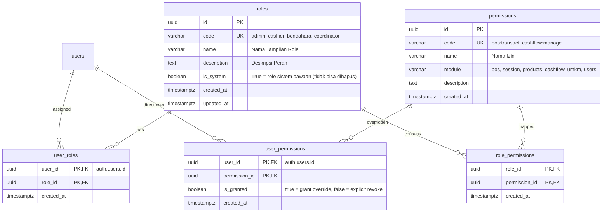
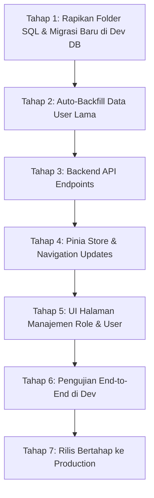

# Rencana Implementasi RBAC (Role-Based Access Control) & User Permissions
# OMK POS — Konsinyasi

> **Status Dokumen:** DRAFT / PROPOSED  
> **Target Rilis:** v3.1  
> **Prinsip Utama:** Zero-Downtime, Backward-Compatible, Layered Authorization

---

## 1. Latar Belakang & Tujuan

### 1.1 Kondisi Saat Ini
- Autentikasi dan otorisasi saat ini hanya mendukung 2 role tetap: `'admin'` dan `'cashier'`.
- Role disimpan di kolom JSONB `raw_user_meta_data` pada tabel internal Supabase `auth.users`.
- Pengecekan di database (RLS) dan Nuxt API mengandalkan evaluasi statis `role = 'admin'`.
- Tidak ada kemampuan memberikan hak akses khusus per modul (misal: kasir yang hanya boleh melihat arus kas tanpa bisa mengubah stok, atau bendahara yang bisa melunasi setoran UMKM tanpa akses kelola akun admin).

### 1.2 Tujuan
1. **Fleksibilitas Role:** Admin dapat membuat, mengubah, dan menghapus peran (*custom roles*) secara dinamis dari dashboard.
2. **Hak Akses Granular (Permissions):** Mendefinisikan hak akses per modul (POS, Sesi, Produk/Katalog, Kas/Keuangan, Pembayaran UMKM, Manajemen User).
3. **User Overrides (`user_permissions`):** Memungkinkan pemberian hak khusus (*custom grant*) atau pencabutan izin tertentu (*revoke*) langsung pada user individu tanpa harus membuat role baru.
4. **Migrasi Mulus (Zero Breakage):** Akun yang sudah ada tidak boleh terputus atau mengalami error saat pembaruan diterapkan.

---

## 2. Arsitektur Database

### 2.1 Entity Relationship Diagram (ERD)



---

### 2.2 Daftar Modul & Hak Akses Standar (*Seed Permissions*)

Kita membatasi hak akses pada ~10 permission modular agar sistem tidak over-engineered:

| Modul | Kode Izin | Nama Izin | Keterangan |
|---|---|---|---|
| **POS** | `pos:transact` | Transaksi Kasir | Akses checkout belanja kasir & cetak struk |
| **Sesi** | `session:manage` | Buka & Tutup Sesi | Membuka sesi minggu, input rekonsiliasi, tutup sesi |
| | `session:reset` | Reset Sesi | Membersihkan transaksi sesi (akses khusus) |
| **Katalog** | `products:manage` | Kelola Katalog Master | Tambah/ubah master produk & mitra UMKM |
| | `session_stock:manage` | Alokasi Stok Sesi | Mengatur stok awal dan harga jual mingguan |
| **Keuangan** | `cashflow:view` | Lihat Buku Kas | Melihat daftar arus kas & ringkasan saldo |
| | `cashflow:manage` | Catat Kas Masuk/Keluar | Input kas modal awal atau belanja operasional |
| | `umkm:payout` | Pembayaran UMKM | Menandai lunas setoran bagi hasil ke mitra |
| **Pengguna** | `users:manage` | Kelola Akun Pengguna | Tambah kasir baru, ganti password, nonaktifkan user |
| | `roles:manage` | Kelola Role & Izin | Mengatur mapping role dan permissions |

---

### 2.3 Matriks Default Roles (*System Roles*)

| Izin | `admin` | `cashier` | `bendahara` (Opsi Baru) | `stokis` (Opsi Baru) |
|---|:---:|:---:|:---:|:---:|
| `pos:transact` | ✅ *(Bypass)* | ✅ | ❌ | ❌ |
| `session:manage` | ✅ *(Bypass)* | ❌ | ❌ | ✅ |
| `session:reset` | ✅ *(Bypass)* | ❌ | ❌ | ❌ |
| `products:manage` | ✅ *(Bypass)* | ❌ | ❌ | ✅ |
| `session_stock:manage` | ✅ *(Bypass)* | ❌ | ❌ | ✅ |
| `cashflow:view` | ✅ *(Bypass)* | ❌ | ✅ | ❌ |
| `cashflow:manage` | ✅ *(Bypass)* | ❌ | ✅ | ❌ |
| `umkm:payout` | ✅ *(Bypass)* | ❌ | ✅ | ❌ |
| `users:manage` | ✅ *(Bypass)* | ❌ | ❌ | ❌ |
| `roles:manage` | ✅ *(Bypass)* | ❌ | ❌ | ❌ |

> 👑 **Admin Superuser Shortcut:** Akun dengan role `admin` otomatis memiliki semua hak akses (`bypass`), sehingga admin tidak perlu dicek izinnya satu per satu.

---

## 3. Desain Mesin Otorisasi (Database Level)

### 3.1 Fungsi `public.authorize(p_permission TEXT)`
Fungsi inti untuk RLS dan RPC dengan evaluasi hirarkis:
1. Cek `user_permissions` (apakah ada override `is_granted = true` atau `false` untuk user tersebut).
2. Cek `user_roles` ➜ `role_permissions`.
3. **Fallback Keamanan (Backward Compatibility):** Jika user belum ada di tabel `user_roles`, baca token `auth.jwt() -> 'user_metadata' ->> 'role' = 'admin'`.

```sql
CREATE OR REPLACE FUNCTION public.authorize(p_permission TEXT)
RETURNS BOOLEAN
LANGUAGE plpgsql
STABLE
SECURITY DEFINER
AS $$
DECLARE
  v_user_id UUID := auth.uid();
  v_has_override BOOLEAN;
BEGIN
  IF v_user_id IS NULL THEN
    RETURN FALSE;
  END IF;

  -- 1. Evaluasi Direct User Permission Override
  SELECT up.is_granted INTO v_has_override
  FROM public.user_permissions up
  JOIN public.permissions p ON p.id = up.permission_id
  WHERE up.user_id = v_user_id AND p.code = p_permission;

  IF v_has_override IS NOT NULL THEN
    RETURN v_has_override;
  END IF;

  -- 2. Evaluasi Role Permissions
  IF EXISTS (
    SELECT 1
    FROM public.user_roles ur
    JOIN public.roles r ON r.id = ur.role_id
    JOIN public.role_permissions rp ON rp.role_id = r.id
    JOIN public.permissions p ON p.id = rp.permission_id
    WHERE ur.user_id = v_user_id
      AND (r.code = 'admin' OR p.code = p_permission)
  ) THEN
    RETURN TRUE;
  END IF;

  -- 3. Fallback Legacy Metadata
  IF (auth.jwt() -> 'user_metadata' ->> 'role') = 'admin' THEN
    RETURN TRUE;
  END IF;

  RETURN FALSE;
END;
$$;
```

---

## 4. Desain Lapisan Aplikasi (Nuxt & Pinia)

### 4.1 Pinia Auth Store (`stores/auth.ts`)
Tambahkan computed dan method untuk otorisasi di sisi client:

```ts
// Array permission yang dimiliki user saat ini
const permissions = ref<string[]>([])

// Helper cek izin
const can = (permissionCode: string): boolean => {
  if (role.value === 'admin') return true
  return permissions.value.includes(permissionCode)
}

// Helper cek role
const hasRole = (roleCode: string): boolean => {
  return role.value === roleCode
}
```

### 4.2 Navigasi Terpusat (`app/config/navigation.ts`)
Menu navigasi otomatis memfilter item berdasarkan izin:

```ts
export const adminNavigation = [
  { label: 'Kasir POS', to: '/pos', permission: 'pos:transact' },
  { label: 'Katalog Produk', to: '/admin/products', permission: 'products:manage' },
  { label: 'Sesi Penjualan', to: '/admin/sessions', permission: 'session:manage' },
  { label: 'Buku Kas', to: '/admin/cashflow', permission: 'cashflow:view' },
  { label: 'Setoran UMKM', to: '/admin/umkm-payments', permission: 'umkm:payout' },
  { label: 'Kelola User', to: '/admin/users', permission: 'users:manage' },
  { label: 'Role & Izin', to: '/admin/roles', permission: 'roles:manage' },
]
```

### 4.3 Route Middleware (`app/middleware/permission.ts`)
Mencegah akses via URL langsung jika pengguna tidak memiliki hak:

```ts
export default defineNuxtRouteMiddleware((to) => {
  const auth = useAuthStore()
  const requiredPerm = to.meta.permission as string | undefined

  if (requiredPerm && !auth.can(requiredPerm)) {
    return navigateTo('/unauthorized') // atau redirect ke /pos
  }
})
```

### 4.4 Server Utilities (`server/utils/requirePermission.ts`)
Proteksi endpoint API Nitro:

```ts
export async function requirePermission(event: H3Event, permission: string) {
  const user = await serverSupabaseUser(event)
  if (!user) throw createError({ status: 401, statusText: 'Unauthorized' })

  // Admin bypass
  if (user.user_metadata?.role === 'admin') return user

  // Cek izin dari database / cached token
  const hasPerm = await checkUserPermission(user.id, permission)
  if (!hasPerm) {
    throw createError({ status: 403, statusText: 'Forbidden: Insufficient Permissions' })
  }

  return user
}
```

---

## 5. Struktur Folder & Standarisasi File SQL

Sebagai bagian dari perencanaan ini, seluruh file SQL yang sebelumnya berada di root project akan dirapikan ke dalam direktori standar Supabase:

```
pos-omk/
├── supabase/
│   ├── migrations/                      # Skema DDL & Perubahan Bertahap
│   │   ├── 20260629130149_001_split_products.sql
│   │   ├── 20260707124708_create_cash_flows.sql
│   │   ├── 20260707131602_create_umkm_payments.sql
│   │   ├── 20260920000000_initial_base_schema.sql   # (Pindahan dari supabase_setup_dev.sql)
│   │   └── 20260921000000_create_rbac_tables.sql    # [PLAN] Migrasi RBAC baru
│   └── seeds/                           # Dataset Dummy / Testing
│       └── dev_seed.sql                             # (Pindahan dari supabase_seed_data.sql)
```

**Aturan Penamaan:**
- Semua file migrasi skema diletakkan di `supabase/migrations/` dengan format `<YYYYMMDDHHMMSS>_<nama_deskriptif>.sql`.
- File data uji coba / dummy diletakkan di `supabase/seeds/`.
- Root project dibersihkan dari file `.sql` lepas.

---

## 6. Rencana Tahapan Eksekusi & Verifikasi



### Tahap 1 & 2: Database Migration & Auto-Backfill (Di `omk-pos-dev`)
- [ ] Pindahkan file SQL root ke struktur folder `supabase/migrations/` dan `supabase/seeds/`.
- [ ] Siapkan file migrasi `supabase/migrations/20260921000000_create_rbac_tables.sql`.
- [ ] Buat tabel: `roles`, `permissions`, `role_permissions`, `user_roles`, `user_permissions`.
- [ ] Insert seed data permissions dan default roles (`admin`, `cashier`, `bendahara`, `stokis`).
- [ ] Backfill otomatis: Isi `user_roles` untuk semua akun yang ada di `auth.users` berdasarkan metadata saat ini.
- [ ] Deploy fungsi `authorize()` dan update RLS policies bertahap.

### Tahap 3: Backend API (Server Nitro)
- [ ] Buat endpoint `GET /api/roles` & `POST /api/roles` (manajemen role).
- [ ] Buat endpoint `GET /api/permissions` (daftar modul dan izin).
- [ ] Buat endpoint `GET/PUT /api/users/[id]/permissions` (manajemen custom user overrides).
- [ ] Perbarui endpoint `GET /api/users` agar merespons daftar role dan permissions tiap user.

### Tahap 4: Frontend Otorisasi
- [ ] Perbarui `app/stores/auth.ts` dengan method `can()` dan pemuatan data permissions saat login.
- [ ] Pasang pengecekan navigasi di navbar/sidebar.
- [ ] Pasang middleware proteksi halaman.

### Tahap 5: UI Manajemen Role & Hak Akses
- [ ] Buat halaman baru `/admin/roles`:
  - Tabel daftar role.
  - Form tambah/edit role dengan checkbox permission per modul.
- [ ] Perbarui halaman `/admin/users`:
  - Dropdown role mengambil data dinamis dari tabel `roles`.
  - Modal "Override Izin Khusus" untuk user tertentu.

### Tahap 6: Uji Coba & Verifikasi
- [ ] Uji login kasir: hanya bisa buka kasir, tidak bisa buka buku kas / users.
- [ ] Uji login bendahara: bisa buka buku kas & pembayaran UMKM, tidak bisa buka POS / edit katalog.
- [ ] Uji login admin: akses 100% semua menu (bypass).
- [ ] Uji user override: kasir yang diberi izin khusus `cashflow:view` dapat melihat menu Buku Kas.

---

## 6. Prosedur Rilis ke Production (*Zero Downtime Playbook*)

1. **Jalankan SQL Migration di Production:**
   Karena fungsi `authorize()` memiliki fallback ke metadata lama, eksekusi migrasi database **tidak akan menyebabkan error** pada aplikasi yang sedang berjalan.
2. **Deploy Aplikasi (Nuxt/Vercel/Server):**
   Deploy kode frontend dan backend yang baru.
3. **Verifikasi Akun Admin:**
   Pastikan admin utama dapat mengakses menu baru `/admin/roles`.
4. **Selesai.**
