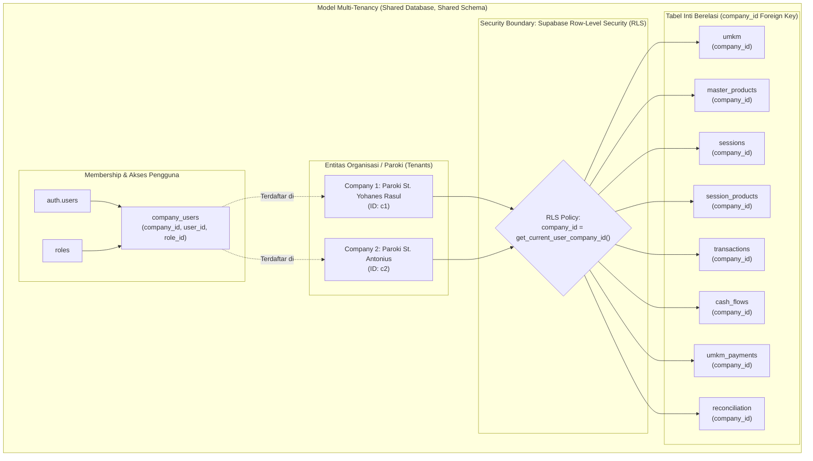
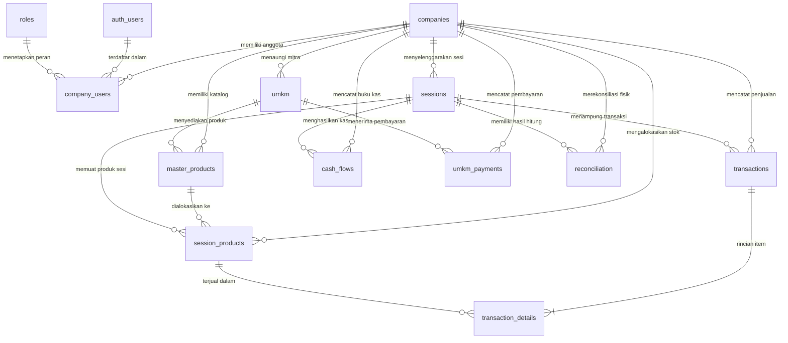
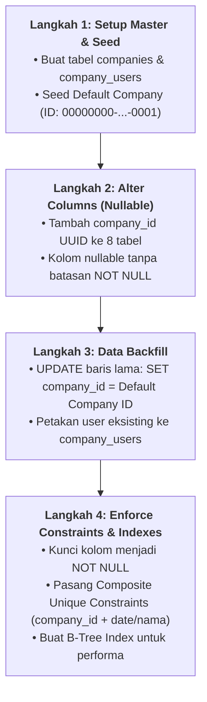

# Rencana Detail Fase 1 — Migrasi Skema Database & Data Eksisting (Multi-Company)

> **Fitur:** Multi-Company / Multi-Organisasi (Multi-Tenancy)  
> **Fase:** 1 dari 4 (Database Schema & Existing Data Migration)  
> **Lokasi File Dokumen:** `docs/plans/completed/multi-company/01_database_and_data_migration.md`  
> **Status Dokumen:** `COMPLETED & MERGED (LOCKED)` (PR #8)  
> **Target Database:** Supabase (PostgreSQL 15+)  


---

## 1. Latar Belakang & Tujuan

Saat ini aplikasi **OMK POS** dirancang sebagai sistem *single-tenant*, di mana seluruh data mitra UMKM, katalog produk, sesi mingguan, transaksi kasir, dan arus kas diasumsikan milik satu entitas OMK paroki tunggal.

Tujuan dari **Fase 1** ini adalah meletakkan fondasi level database agar aplikasi dapat mendukung banyak organisasi (multi-paroki / multi-komunitas) dengan:
1. **Isolasi Data Penuh:** Setiap organisasi hanya dapat mengakses dan mengelola datanya sendiri.
2. **Pencegahan Konflik:** Memungkinkan nama UMKM yang sama atau tanggal sesi penjualan yang sama (misal sama-sama hari Minggu) berjalan serentak di organisasi berbeda tanpa memicu benturan constraint unik.
3. **Zero Data Loss & Zero Downtime:** Seluruh data historis yang sudah ada di database saat ini tetap utuh 100% dan langsung dialokasikan ke sebuah organisasi default (*Default Company*).

---

## 2. Model Arsitektur Multi-Tenancy

Model yang dipilih adalah **Shared Database, Shared Schema with Discriminator Column (`company_id`)**.

### 2.1 Diagram Topologi Multi-Tenancy



### 2.2 Entity Relationship Diagram (ERD) Multi-Company



**Alasan Pemilihan Model Ini:**
- Kompatibel penuh dengan **Supabase Row-Level Security (RLS)**.
- Biaya operasional efisien (tidak memerlukan database atau schema terpisah per gereja).
- Pemeliharaan migrasi schema di masa depan tetap terpusat pada satu schema `public`.

---

## 3. Spesifikasi Skema Database Baru

### 3.1 Tabel Baru: `companies`
Menyimpan profil master setiap organisasi/paroki.

```sql
CREATE TABLE public.companies (
  id          UUID PRIMARY KEY DEFAULT gen_random_uuid(),
  name        VARCHAR(100) NOT NULL,               -- Contoh: "OMK Paroki St. Yohanes Rasul"
  slug        VARCHAR(50)  NOT NULL UNIQUE,        -- Contoh: "omk-yohanes-rasul" (untuk URL/identifikasi)
  logo_url    TEXT,                                -- URL logo organisasi
  address     TEXT,                                -- Alamat fisik paroki/organisasi
  phone       VARCHAR(20),                         -- Nomor kontak resmi
  email       VARCHAR(100),                        -- Email resmi organisasi
  settings    JSONB NOT NULL DEFAULT '{
    "report_signature": "Sie Kewirausahaan OMK",
    "currency": "IDR",
    "timezone": "Asia/Jakarta",
    "qris_name": null,
    "bank_info": null
  }',
  is_active   BOOLEAN NOT NULL DEFAULT TRUE,
  created_at  TIMESTAMPTZ NOT NULL DEFAULT NOW(),
  updated_at  TIMESTAMPTZ NOT NULL DEFAULT NOW()
);

COMMENT ON TABLE public.companies IS 'Master entitas organisasi/paroki pengelola konsinyasi';
```

### 3.2 Tabel Baru: `company_users`
Memetakan keanggotaan akun pengguna (`auth.users`) ke satu atau lebih organisasi, lengkap dengan perannya.

```sql
CREATE TABLE public.company_users (
  id          UUID PRIMARY KEY DEFAULT gen_random_uuid(),
  company_id  UUID NOT NULL REFERENCES public.companies(id) ON DELETE CASCADE,
  user_id     UUID NOT NULL REFERENCES auth.users(id) ON DELETE CASCADE,
  role_id     UUID NOT NULL REFERENCES public.roles(id) ON DELETE RESTRICT,
  is_default  BOOLEAN NOT NULL DEFAULT FALSE,       -- Organisasi aktif default saat login
  is_active   BOOLEAN NOT NULL DEFAULT TRUE,        -- Status aktif pengguna di organisasi ini
  created_at  TIMESTAMPTZ NOT NULL DEFAULT NOW(),
  updated_at  TIMESTAMPTZ NOT NULL DEFAULT NOW(),
  CONSTRAINT company_users_unique_membership UNIQUE (company_id, user_id)
);

CREATE INDEX idx_company_users_user ON public.company_users(user_id);
CREATE INDEX idx_company_users_company ON public.company_users(company_id);
```

---

## 4. Modifikasi Tabel Eksisting (Penambahan `company_id`)

Setiap tabel di bawah ini akan ditambahkan kolom:
`company_id UUID NOT NULL REFERENCES public.companies(id) ON DELETE RESTRICT`

| Nama Tabel | Peran Relasi Multi-Company | Penyesuaian Kolom & Constraint |
|---|---|---|
| **`umkm`** | Mitra UMKM terdaftar di bawah paroki terkait | - Tambah `company_id`<br>- Drop `UNIQUE (nama_umkm)`<br>- Tambah `UNIQUE (company_id, nama_umkm)` |
| **`master_products`** | Master produk milik mitra di paroki terkait | - Tambah `company_id`<br>- Drop `CONSTRAINT master_products_unique_per_umkm`<br>- Tambah `UNIQUE (company_id, umkm_id, nama_produk)` |
| **`sessions`** | Sesi penjualan hari Minggu | - Tambah `company_id`<br>- Drop `UNIQUE (session_date)`<br>- Tambah `UNIQUE (company_id, session_date)` |
| **`session_products`** | Alokasi stok sesi aktif | - Tambah `company_id` (untuk integritas query cepat tanpa harus selalu join ke `sessions`) |
| **`transactions`** | Transaksi belanja kasir | - Tambah `company_id` |
| **`cash_flows`** | Buku kas pemasukan & pengeluaran | - Tambah `company_id` (kritis untuk mutasi kas manual di luar sesi) |
| **`umkm_payments`** | Pelunasan dana titipan ke mitra | - Tambah `company_id` |
| **`reconciliation`** | Rekonsiliasi fisik akhir hari | - Tambah `company_id` |
| **`user_permissions`** | Hak akses granular override per user | - Tambah `company_id`<br>- Drop PK `(user_id, permission_id)`<br>- Tambah PK `(company_id, user_id, permission_id)` (mencegah kebocoran override izin antar paroki) |

---

## 5. Strategi Migrasi Data Eksisting (4 Tahap Zero-Downtime)

Agar database tidak mengalami error `NOT NULL violation` pada data yang sudah ada, migrasi dijalankan dalam **4 langkah berurutan**:



### Langkah 1: Buat Tabel Master & Seed Default Company
1. Eksekusi pembuatan tabel `public.companies` dan `public.company_users`.
2. Masukkan 1 baris perusahaan default dengan ID paten:
   ```sql
   INSERT INTO public.companies (
     id,
     name,
     slug,
     settings,
     is_active
   ) VALUES (
     '00000000-0000-0000-0000-000000000001',
     'OMK Paroki Default',
     'omk-default',
     '{"report_signature": "Sie Kewirausahaan OMK", "currency": "IDR", "timezone": "Asia/Jakarta"}',
     TRUE
   ) ON CONFLICT (id) DO NOTHING;
   ```

### Langkah 2: Tambah Kolom `company_id` sebagai NULLABLE
Tambahkan kolom `company_id` ke seluruh tabel target tanpa batasan `NOT NULL` terlebih dahulu:
```sql
ALTER TABLE public.umkm ADD COLUMN IF NOT EXISTS company_id UUID REFERENCES public.companies(id);
ALTER TABLE public.master_products ADD COLUMN IF NOT EXISTS company_id UUID REFERENCES public.companies(id);
ALTER TABLE public.sessions ADD COLUMN IF NOT EXISTS company_id UUID REFERENCES public.companies(id);
ALTER TABLE public.session_products ADD COLUMN IF NOT EXISTS company_id UUID REFERENCES public.companies(id);
ALTER TABLE public.transactions ADD COLUMN IF NOT EXISTS company_id UUID REFERENCES public.companies(id);
ALTER TABLE public.cash_flows ADD COLUMN IF NOT EXISTS company_id UUID REFERENCES public.companies(id);
ALTER TABLE public.umkm_payments ADD COLUMN IF NOT EXISTS company_id UUID REFERENCES public.companies(id);
ALTER TABLE public.reconciliation ADD COLUMN IF NOT EXISTS company_id UUID REFERENCES public.companies(id);
ALTER TABLE public.user_permissions ADD COLUMN IF NOT EXISTS company_id UUID REFERENCES public.companies(id);
```

### Langkah 3: Backfill Data Historis ke Default Company
Isi seluruh data yang kolom `company_id`-nya masih kosong dengan ID perusahaan default:
```sql
UPDATE public.umkm SET company_id = '00000000-0000-0000-0000-000000000001' WHERE company_id IS NULL;
UPDATE public.master_products SET company_id = '00000000-0000-0000-0000-000000000001' WHERE company_id IS NULL;
UPDATE public.sessions SET company_id = '00000000-0000-0000-0000-000000000001' WHERE company_id IS NULL;
UPDATE public.session_products SET company_id = '00000000-0000-0000-0000-000000000001' WHERE company_id IS NULL;
UPDATE public.transactions SET company_id = '00000000-0000-0000-0000-000000000001' WHERE company_id IS NULL;
UPDATE public.cash_flows SET company_id = '00000000-0000-0000-0000-000000000001' WHERE company_id IS NULL;
UPDATE public.umkm_payments SET company_id = '00000000-0000-0000-0000-000000000001' WHERE company_id IS NULL;
UPDATE public.reconciliation SET company_id = '00000000-0000-0000-0000-000000000001' WHERE company_id IS NULL;
UPDATE public.user_permissions SET company_id = '00000000-0000-0000-0000-000000000001' WHERE company_id IS NULL;

-- Petakan semua user eksisting ke Default Company
INSERT INTO public.company_users (company_id, user_id, role_id, is_default, is_active)
SELECT 
  '00000000-0000-0000-0000-000000000001',
  ur.user_id,
  ur.role_id,
  TRUE,
  TRUE
FROM public.user_roles ur
ON CONFLICT (company_id, user_id) DO NOTHING;
```

### Langkah 4: Kunci Constraint `NOT NULL` & Pasang Komposit Index
Setelah seluruh baris data terisi, pasang batasan wajib (`NOT NULL`) dan ubah constraint unik:
```sql
ALTER TABLE public.umkm ALTER COLUMN company_id SET NOT NULL;
ALTER TABLE public.master_products ALTER COLUMN company_id SET NOT NULL;
ALTER TABLE public.sessions ALTER COLUMN company_id SET NOT NULL;
ALTER TABLE public.session_products ALTER COLUMN company_id SET NOT NULL;
ALTER TABLE public.transactions ALTER COLUMN company_id SET NOT NULL;
ALTER TABLE public.cash_flows ALTER COLUMN company_id SET NOT NULL;
ALTER TABLE public.umkm_payments ALTER COLUMN company_id SET NOT NULL;
ALTER TABLE public.reconciliation ALTER COLUMN company_id SET NOT NULL;
ALTER TABLE public.user_permissions ALTER COLUMN company_id SET NOT NULL;

-- Penyesuaian Primary Key user_permissions agar per-company
ALTER TABLE public.user_permissions DROP CONSTRAINT IF EXISTS user_permissions_pkey;
ALTER TABLE public.user_permissions ADD PRIMARY KEY (company_id, user_id, permission_id);

-- Penyesuaian Unique Constraint sessions (kritis)
ALTER TABLE public.sessions DROP CONSTRAINT IF EXISTS sessions_session_date_key;
ALTER TABLE public.sessions ADD CONSTRAINT sessions_company_date_unique UNIQUE (company_id, session_date);

-- Penyesuaian Unique Constraint umkm
ALTER TABLE public.umkm DROP CONSTRAINT IF EXISTS umkm_nama_umkm_key;
ALTER TABLE public.umkm ADD CONSTRAINT umkm_company_nama_unique UNIQUE (company_id, nama_umkm);

-- Penyesuaian Unique Constraint master_products
ALTER TABLE public.master_products DROP CONSTRAINT IF EXISTS master_products_unique_per_umkm;
ALTER TABLE public.master_products ADD CONSTRAINT master_products_company_umkm_nama_unique UNIQUE (company_id, umkm_id, nama_produk);
```

---

## 6. Full SQL Migration Script (File Siap Eksekusi)

Script ini disiapkan untuk disimpan pada folder `supabase/migrations/` dengan nama `20260928000000_multi_company_phase1.sql`.

```sql
-- Migration: 20260928000000_multi_company_phase1.sql
-- Description: Multi-Company Phase 1 - Tables, Columns, Backfill, and Constraints

BEGIN;

-- 1. Create companies table
CREATE TABLE IF NOT EXISTS public.companies (
  id          UUID PRIMARY KEY DEFAULT gen_random_uuid(),
  name        VARCHAR(100) NOT NULL,
  slug        VARCHAR(50)  NOT NULL UNIQUE,
  logo_url    TEXT,
  address     TEXT,
  phone       VARCHAR(20),
  email       VARCHAR(100),
  settings    JSONB NOT NULL DEFAULT '{
    "report_signature": "Sie Kewirausahaan OMK",
    "currency": "IDR",
    "timezone": "Asia/Jakarta"
  }',
  is_active   BOOLEAN NOT NULL DEFAULT TRUE,
  created_at  TIMESTAMPTZ NOT NULL DEFAULT NOW(),
  updated_at  TIMESTAMPTZ NOT NULL DEFAULT NOW()
);

-- 2. Create company_users table
CREATE TABLE IF NOT EXISTS public.company_users (
  id          UUID PRIMARY KEY DEFAULT gen_random_uuid(),
  company_id  UUID NOT NULL REFERENCES public.companies(id) ON DELETE CASCADE,
  user_id     UUID NOT NULL REFERENCES auth.users(id) ON DELETE CASCADE,
  role_id     UUID NOT NULL REFERENCES public.roles(id) ON DELETE RESTRICT,
  is_default  BOOLEAN NOT NULL DEFAULT FALSE,
  is_active   BOOLEAN NOT NULL DEFAULT TRUE,
  created_at  TIMESTAMPTZ NOT NULL DEFAULT NOW(),
  updated_at  TIMESTAMPTZ NOT NULL DEFAULT NOW(),
  CONSTRAINT company_users_unique_membership UNIQUE (company_id, user_id)
);

CREATE INDEX IF NOT EXISTS idx_company_users_user ON public.company_users(user_id);
CREATE INDEX IF NOT EXISTS idx_company_users_company ON public.company_users(company_id);

-- 3. Seed Default Company for Existing Data
INSERT INTO public.companies (
  id,
  name,
  slug,
  settings,
  is_active
) VALUES (
  '00000000-0000-0000-0000-000000000001',
  'OMK Paroki Default',
  'omk-default',
  '{"report_signature": "Sie Kewirausahaan OMK", "currency": "IDR", "timezone": "Asia/Jakarta"}',
  TRUE
) ON CONFLICT (id) DO NOTHING;

-- 4. Add company_id columns as NULLABLE
ALTER TABLE public.umkm ADD COLUMN IF NOT EXISTS company_id UUID REFERENCES public.companies(id);
ALTER TABLE public.master_products ADD COLUMN IF NOT EXISTS company_id UUID REFERENCES public.companies(id);
ALTER TABLE public.sessions ADD COLUMN IF NOT EXISTS company_id UUID REFERENCES public.companies(id);
ALTER TABLE public.session_products ADD COLUMN IF NOT EXISTS company_id UUID REFERENCES public.companies(id);
ALTER TABLE public.transactions ADD COLUMN IF NOT EXISTS company_id UUID REFERENCES public.companies(id);
ALTER TABLE public.cash_flows ADD COLUMN IF NOT EXISTS company_id UUID REFERENCES public.companies(id);
ALTER TABLE public.umkm_payments ADD COLUMN IF NOT EXISTS company_id UUID REFERENCES public.companies(id);
ALTER TABLE public.reconciliation ADD COLUMN IF NOT EXISTS company_id UUID REFERENCES public.companies(id);
ALTER TABLE public.user_permissions ADD COLUMN IF NOT EXISTS company_id UUID REFERENCES public.companies(id);

-- 5. Backfill Existing Data
UPDATE public.umkm SET company_id = '00000000-0000-0000-0000-000000000001' WHERE company_id IS NULL;
UPDATE public.master_products SET company_id = '00000000-0000-0000-0000-000000000001' WHERE company_id IS NULL;
UPDATE public.sessions SET company_id = '00000000-0000-0000-0000-000000000001' WHERE company_id IS NULL;
UPDATE public.session_products SET company_id = '00000000-0000-0000-0000-000000000001' WHERE company_id IS NULL;
UPDATE public.transactions SET company_id = '00000000-0000-0000-0000-000000000001' WHERE company_id IS NULL;
UPDATE public.cash_flows SET company_id = '00000000-0000-0000-0000-000000000001' WHERE company_id IS NULL;
UPDATE public.umkm_payments SET company_id = '00000000-0000-0000-0000-000000000001' WHERE company_id IS NULL;
UPDATE public.reconciliation SET company_id = '00000000-0000-0000-0000-000000000001' WHERE company_id IS NULL;
UPDATE public.user_permissions SET company_id = '00000000-0000-0000-0000-000000000001' WHERE company_id IS NULL;

-- 6. Backfill company_users from user_roles
INSERT INTO public.company_users (company_id, user_id, role_id, is_default, is_active)
SELECT 
  '00000000-0000-0000-0000-000000000001',
  ur.user_id,
  ur.role_id,
  TRUE,
  TRUE
FROM public.user_roles ur
ON CONFLICT (company_id, user_id) DO NOTHING;

-- 7. Apply NOT NULL Constraints
ALTER TABLE public.umkm ALTER COLUMN company_id SET NOT NULL;
ALTER TABLE public.master_products ALTER COLUMN company_id SET NOT NULL;
ALTER TABLE public.sessions ALTER COLUMN company_id SET NOT NULL;
ALTER TABLE public.session_products ALTER COLUMN company_id SET NOT NULL;
ALTER TABLE public.transactions ALTER COLUMN company_id SET NOT NULL;
ALTER TABLE public.cash_flows ALTER COLUMN company_id SET NOT NULL;
ALTER TABLE public.umkm_payments ALTER COLUMN company_id SET NOT NULL;
ALTER TABLE public.reconciliation ALTER COLUMN company_id SET NOT NULL;
ALTER TABLE public.user_permissions ALTER COLUMN company_id SET NOT NULL;

-- Penyesuaian Primary Key user_permissions
ALTER TABLE public.user_permissions DROP CONSTRAINT IF EXISTS user_permissions_pkey;
ALTER TABLE public.user_permissions ADD PRIMARY KEY (company_id, user_id, permission_id);

-- 8. Update Unique Constraints
ALTER TABLE public.sessions DROP CONSTRAINT IF EXISTS sessions_session_date_key;
DO $$ BEGIN
  IF NOT EXISTS (SELECT 1 FROM pg_constraint WHERE conname = 'sessions_company_date_unique') THEN
    ALTER TABLE public.sessions ADD CONSTRAINT sessions_company_date_unique UNIQUE (company_id, session_date);
  END IF;
END $$;

ALTER TABLE public.umkm DROP CONSTRAINT IF EXISTS umkm_nama_umkm_key;
DO $$ BEGIN
  IF NOT EXISTS (SELECT 1 FROM pg_constraint WHERE conname = 'umkm_company_nama_unique') THEN
    ALTER TABLE public.umkm ADD CONSTRAINT umkm_company_nama_unique UNIQUE (company_id, nama_umkm);
  END IF;
END $$;

ALTER TABLE public.master_products DROP CONSTRAINT IF EXISTS master_products_unique_per_umkm;
DO $$ BEGIN
  IF NOT EXISTS (SELECT 1 FROM pg_constraint WHERE conname = 'master_products_company_umkm_nama_unique') THEN
    ALTER TABLE public.master_products ADD CONSTRAINT master_products_company_umkm_nama_unique UNIQUE (company_id, umkm_id, nama_produk);
  END IF;
END $$;

-- 9. Add Performance Indexes
CREATE INDEX IF NOT EXISTS idx_umkm_company ON public.umkm(company_id);
CREATE INDEX IF NOT EXISTS idx_master_products_company ON public.master_products(company_id);
CREATE INDEX IF NOT EXISTS idx_sessions_company ON public.sessions(company_id);
CREATE INDEX IF NOT EXISTS idx_session_products_company ON public.session_products(company_id);
CREATE INDEX IF NOT EXISTS idx_transactions_company ON public.transactions(company_id);
CREATE INDEX IF NOT EXISTS idx_cash_flows_company ON public.cash_flows(company_id);
CREATE INDEX IF NOT EXISTS idx_umkm_payments_company ON public.umkm_payments(company_id);
CREATE INDEX IF NOT EXISTS idx_reconciliation_company ON public.reconciliation(company_id);
CREATE INDEX IF NOT EXISTS idx_user_permissions_company ON public.user_permissions(company_id);

COMMIT;
```

---

## 7. Verifikasi & Pengujian Validasi Data Pasca Migrasi

Sebelum melangkah ke Fase 2, rangkaian query pengujian ini wajib dijalankan untuk memastikan integritas data:

| Check | Query Verifikasi | Ekspektasi Hasil |
|---|---|---|
| **Verifikasi Baris Tanpa Company** | `SELECT COUNT(*) FROM public.sessions WHERE company_id IS NULL;` (ulangi untuk seluruh tabel) | Harus `0` di setiap tabel |
| **Verifikasi Keutuhan Data Default** | `SELECT COUNT(*) FROM public.company_users WHERE company_id = '00000000-0000-0000-0000-000000000001';` | Sama dengan jumlah total baris di `user_roles` |
| **Uji Benturan Tanggal Antar Company** | Insert sesi tanggal sama untuk company berbeda:<br>`INSERT INTO public.sessions (company_id, session_date, status) VALUES ('<id_baru>', CURRENT_DATE, 'open');` | Berhasil tanpa constraint error |
| **Uji Benturan Tanggal di Company Sama** | Insert sesi tanggal sama untuk company yang sama | Harus gagal (*duplicate key value violates unique constraint `sessions_company_date_unique`*) |

---

## 8. Rencana Rollback (Jika Ditemukan Anomali)

Jika saat pengujian ditemukan kendala tak terduga, rollback dapat dieksekusi dengan aman:
```sql
BEGIN;
-- Drop constraints baru
ALTER TABLE public.sessions DROP CONSTRAINT IF EXISTS sessions_company_date_unique;
ALTER TABLE public.sessions ADD CONSTRAINT sessions_session_date_key UNIQUE (session_date);

ALTER TABLE public.umkm DROP CONSTRAINT IF EXISTS umkm_company_nama_unique;
ALTER TABLE public.umkm ADD CONSTRAINT umkm_nama_umkm_key UNIQUE (nama_umkm);

ALTER TABLE public.master_products DROP CONSTRAINT IF EXISTS master_products_company_umkm_nama_unique;
ALTER TABLE public.master_products ADD CONSTRAINT master_products_unique_per_umkm UNIQUE (umkm_id, nama_produk);

ALTER TABLE public.user_permissions DROP CONSTRAINT IF EXISTS user_permissions_pkey;
ALTER TABLE public.user_permissions ADD PRIMARY KEY (user_id, permission_id);

-- Drop kolom company_id
ALTER TABLE public.user_permissions DROP COLUMN IF EXISTS company_id;
ALTER TABLE public.reconciliation DROP COLUMN IF EXISTS company_id;
ALTER TABLE public.umkm_payments DROP COLUMN IF EXISTS company_id;
ALTER TABLE public.cash_flows DROP COLUMN IF EXISTS company_id;
ALTER TABLE public.transactions DROP COLUMN IF EXISTS company_id;
ALTER TABLE public.session_products DROP COLUMN IF EXISTS company_id;
ALTER TABLE public.sessions DROP COLUMN IF EXISTS company_id;
ALTER TABLE public.master_products DROP COLUMN IF EXISTS company_id;
ALTER TABLE public.umkm DROP COLUMN IF EXISTS company_id;

-- Drop tabel baru
DROP TABLE IF EXISTS public.company_users;
DROP TABLE IF EXISTS public.companies;
COMMIT;
```

---

## 9. Keterkaitan dengan Fase Selanjutnya

Setelah Fase 1 selesai dan skema database memiliki `company_id`:
- **Fase 2 (RPC, Views & RLS):** Memperbarui `complete_transaction`, `get_weekly_trends`, `products_cashier_view`, dan memasang Row-Level Security tenant isolation.
- **Fase 3 (Backend Nitro & Cache):** Menyesuaikan `rbacCache.ts` agar tenant-scoped dan menyaring user per `company_id`.
- **Fase 4 (Frontend UI & Switcher):** Memasang `useCompanyStore` dan dropdown *Company Switcher* di layout navigasi admin.
