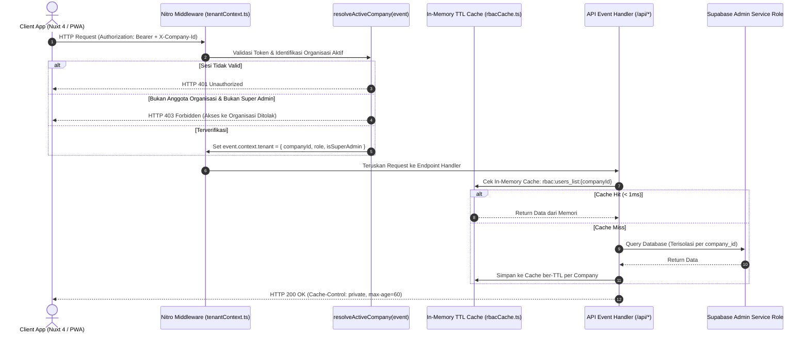
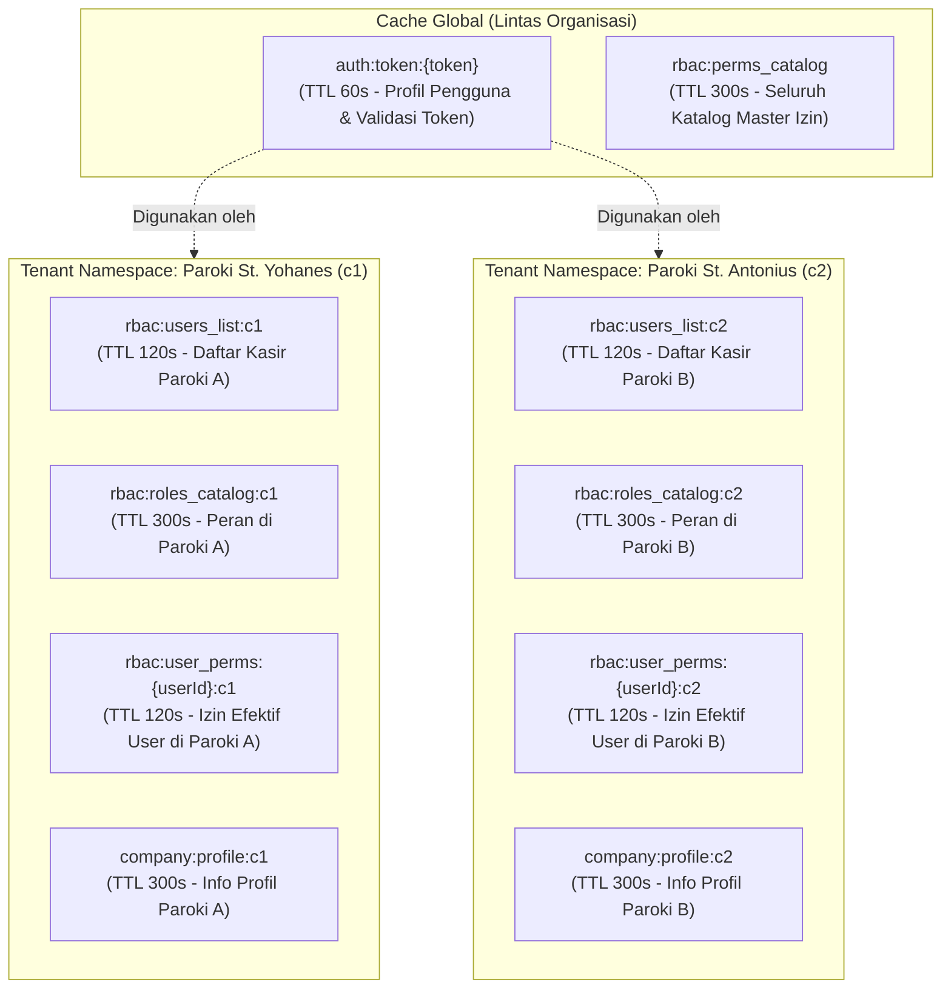
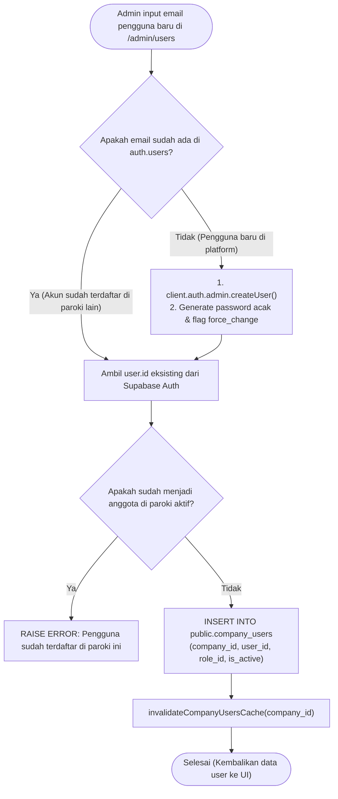

# Rencana Detail Fase 3 — Backend Nitro, Context Resolution, Caching, & Endpoints

> **Fitur:** Multi-Company / Multi-Organisasi (Multi-Tenancy)  
> **Fase:** 3 dari 4 (Backend Nitro Server, Multi-Tenant Context, In-Memory Caching, & API Endpoints)  
> **Lokasi File Dokumen:** `docs/plans/completed/multi-company/03_backend_nitro_and_caching.md`  
> **Status Dokumen:** `COMPLETED & MERGED (LOCKED)` (PR #8)  
> **Prasyarat:** Fase 1 (`01_database_and_data_migration.md`) & Fase 2 (`02_rpc_views_and_rls.md`) telah disetujui  

> **Target Runtime:** Nuxt 4 Nitro Engine (Node.js Server) + TypeScript Strict Mode  

---

## 1. Latar Belakang & Tujuan Fase 3

Setelah skema database dan keamanan Row-Level Security (RLS) pada **Fase 1** dan **Fase 2** terisolasi di level PostgreSQL, layer backend Nitro Server (`server/`) harus menjadi gerbang utama (*gateway*) yang cerdas untuk:
1. **Mengidentifikasi Tenant Konteks (`Tenant Context Resolution`):** Setiap request HTTP dari client harus diverifikasi: *Siapa penggunanya? Organisasi/Paroki mana yang sedang ia kelola? Apakah ia memiliki hak akses aktif di organisasi tersebut?*
2. **Namespace Caching Multi-Tenant:** Arsitektur in-memory cache (`server/utils/rbacCache.ts`) yang sebelumnya bersifat flat/global wajib dirombak menjadi ter-isolasi per organisasi (`namespace`), sehingga mutasi data di Paroki A tidak menghapus cache Paroki B.
3. **Mengamankan Helper Otorisasi (`requireAdmin` & `requirePermission`):** Menghilangkan asumsi *single-tenant* (seperti `user.user_metadata?.role === 'admin'`) karena seorang pengguna bisa saja berstatus *Administrator* di Paroki St. Yohanes, tetapi hanya berstatus *Kasir* di Paroki St. Antonius.
4. **Isolasi Penuh Manajemen Pengguna (`server/api/users/*`):** Menjamin admin gereja hanya melihat dan mengelola kasir yang terdaftar di parokinya sendiri, tanpa membeberkan akun pengguna paroki lain dari Supabase Auth global.
5. **Penyediaan Endpoint REST Organisasi (`server/api/companies/*`):** Menyediakan API untuk membaca profil paroki aktif, mengubah identitas/logo/tanda tangan nota, serta daftar paroki untuk fitur *Organization Switcher* di frontend.

---

## 2. Diagram Arsitektur & Alur Data Backend (Mermaid)

### 2.1 Siklus Request Nitro Server dengan Resolusi Tenant & Cache



### 2.2 Hierarki Namespace In-Memory Cache Multi-Tenant



### 2.3 Alur Penyediaan Akun (Single Identity, Multi-Organization Membership)



---

## 3. Resolusi Konteks Tenant Server

### 3.1 Kontrak Objek Konteks Tenant (`TenantContext`)
Definisikan tipe data konteks di `shared/types/tenant.ts`:

```typescript
// shared/types/tenant.ts
export interface TenantContext {
  companyId: string
  companyName: string
  companySlug: string
  roleCode: string       // 'admin' | 'cashier' | dll
  isSuperAdmin: boolean  // True jika marcellinusyovian@gmail.com
}

declare module 'h3' {
  interface H3EventContext {
    tenant?: TenantContext
  }
}
```

### 3.2 Server Utility: `server/utils/tenantResolver.ts`
Fungsi independen untuk mengurai dan memvalidasi `company_id` pemanggil:

```typescript
// server/utils/tenantResolver.ts
import { serverSupabaseServiceRole } from '#supabase/server'
import type { H3Event } from 'h3'
import { resolveAuthUser } from './rbacCache'
import type { TenantContext } from '~/shared/types/tenant'

const SUPER_ADMIN_EMAIL = 'marcellinusyovian@gmail.com'

export async function resolveActiveCompany(event: H3Event): Promise<TenantContext> {
  // Jika sudah ter-resolve di context request sebelumnya, gunakan kembali
  if (event.context.tenant) {
    return event.context.tenant
  }

  // 1. Resolve User yang sedang login
  const user = await resolveAuthUser(event)
  if (!user) {
    throw createError({ status: 401, statusText: 'Unauthorized: Sesi tidak ditemukan' })
  }

  const isSuperAdmin = user.email === SUPER_ADMIN_EMAIL
  const reqCompanyId = getRequestHeader(event, 'x-company-id')?.trim()
  const client = serverSupabaseServiceRole(event)

  let activeCompanyId: string | null = null
  let roleCode = 'cashier'
  let companyName = ''
  let companySlug = ''

  // 2. Jika Super Admin mengirimkan header X-Company-Id, izinkan akses ke company manapun
  if (isSuperAdmin && reqCompanyId) {
    const { data: comp } = await client
      .from('companies')
      .select('id, name, slug')
      .eq('id', reqCompanyId)
      .eq('is_active', true)
      .single()

    if (comp) {
      activeCompanyId = comp.id
      companyName = comp.name
      companySlug = comp.slug
      roleCode = 'admin'
    }
  }

  // 3. Jika pengguna reguler mengirimkan header X-Company-Id
  if (!activeCompanyId && reqCompanyId) {
    const { data: membership } = await client
      .from('company_users')
      .select(`
        company_id,
        is_active,
        roles (code),
        companies (id, name, slug, is_active)
      `)
      .eq('user_id', user.id)
      .eq('company_id', reqCompanyId)
      .eq('is_active', true)
      .single()

    if (membership && (membership.companies as any)?.is_active) {
      activeCompanyId = membership.company_id
      roleCode = (membership.roles as any)?.code || 'cashier'
      companyName = (membership.companies as any)?.name || ''
      companySlug = (membership.companies as any)?.slug || ''
    }
  }

  // 4. Fallback: Ambil default company dari keanggotaan pengguna
  if (!activeCompanyId) {
    const { data: defaultMembership } = await client
      .from('company_users')
      .select(`
        company_id,
        roles (code),
        companies (id, name, slug, is_active)
      `)
      .eq('user_id', user.id)
      .eq('is_active', true)
      .order('is_default', { ascending: false })
      .order('created_at', { ascending: true })
      .limit(1)
      .maybeSingle()

    if (defaultMembership && (defaultMembership.companies as any)?.is_active) {
      activeCompanyId = defaultMembership.company_id
      roleCode = (defaultMembership.roles as any)?.code || 'cashier'
      companyName = (defaultMembership.companies as any)?.name || ''
      companySlug = (defaultMembership.companies as any)?.slug || ''
    }
  }

  // 5. Jika tetap tidak memiliki company aktif
  if (!activeCompanyId) {
    if (isSuperAdmin) {
      // Super admin tanpa paroki spesifik default ke Paroki Utama pertama
      const { data: firstComp } = await client.from('companies').select('id, name, slug').limit(1).single()
      if (firstComp) {
        activeCompanyId = firstComp.id
        companyName = firstComp.name
        companySlug = firstComp.slug
        roleCode = 'admin'
      }
    }
  }

  if (!activeCompanyId) {
    throw createError({
      status: 403,
      statusText: 'Forbidden: Anda tidak terdaftar aktif di organisasi manapun.'
    })
  }

  const tenant: TenantContext = {
    companyId: activeCompanyId,
    companyName,
    companySlug,
    roleCode: isSuperAdmin ? 'admin' : roleCode,
    isSuperAdmin,
  }

  event.context.tenant = tenant
  return tenant
}
```

---

## 4. Pembaruan In-Memory Caching Multi-Tenant (`server/utils/rbacCache.ts`)

Perbarui fungsi-fungsi pada `server/utils/rbacCache.ts` agar menyertakan parameter `companyId`:

```typescript
// server/utils/rbacCache.ts (Kutipan Penyesuaian Multi-Tenant)

export const RBAC_CACHE_TTL = {
  AUTH_TOKEN: 60,       // 60s token Supabase
  USER_PERMS: 120,      // 120s izin user per company
  USERS_LIST: 120,      // 120s daftar user per company
  ROLES_CATALOG: 300,   // 300s peran per company
  PERMS_CATALOG: 300,   // 300s katalog izin global
  COMPANY_PROFILE: 300, // 300s profil & konfigurasi company
} as const

// --- GETTERS & SETTERS DENGAN TENANT NAMESPACE ---

// 1. Users List per Company
export function getCachedUsers(companyId: string): any[] | null {
  return cacheGet<any[]>(`rbac:users_list:${companyId}`)
}

export function setCachedUsers(companyId: string, users: any[], ttl = RBAC_CACHE_TTL.USERS_LIST) {
  cacheSet(`rbac:users_list:${companyId}`, users, ttl)
}

// 2. User Effective Permissions per Company
export function getCachedUserPermissions(userId: string, companyId: string): string[] | null {
  return cacheGet<string[]>(`rbac:user_perms:${userId}:${companyId}`)
}

export function setCachedUserPermissions(userId: string, companyId: string, perms: string[], ttl = RBAC_CACHE_TTL.USER_PERMS) {
  cacheSet(`rbac:user_perms:${userId}:${companyId}`, perms, ttl)
}

// 3. User Permissions Detail Modal per Company
export function getCachedUserPermissionsDetail(userId: string, companyId: string): any | null {
  return cacheGet<any>(`rbac:user_perms_detail:${userId}:${companyId}`)
}

export function setCachedUserPermissionsDetail(userId: string, companyId: string, data: any, ttl = RBAC_CACHE_TTL.USER_PERMS) {
  cacheSet(`rbac:user_perms_detail:${userId}:${companyId}`, data, ttl)
}

// 4. Roles Catalog per Company
export function getCachedRoles(companyId: string): any[] | null {
  return cacheGet<any[]>(`rbac:roles_catalog:${companyId}`)
}

export function setCachedRoles(companyId: string, roles: any[], ttl = RBAC_CACHE_TTL.ROLES_CATALOG) {
  cacheSet(`rbac:roles_catalog:${companyId}`, roles, ttl)
}

// 5. Profil Company
export function getCachedCompanyProfile(companyId: string): any | null {
  return cacheGet<any>(`company:profile:${companyId}`)
}

export function setCachedCompanyProfile(companyId: string, data: any, ttl = RBAC_CACHE_TTL.COMPANY_PROFILE) {
  cacheSet(`company:profile:${companyId}`, data, ttl)
}

// --- INVALIDATION HOOKS SPESIFIK TENANT ---

export function invalidateCompanyUsersCache(companyId: string): void {
  cacheDelete(`rbac:users_list:${companyId}`)
}

export function invalidateCompanyUserCache(userId: string, companyId: string): void {
  cacheDelete(`rbac:user_perms:${userId}:${companyId}`)
  cacheDelete(`rbac:user_perms_detail:${userId}:${companyId}`)
  // Catatan: Token auth tidak dihapus jika user masih aktif di organisasi lain
}

export function invalidateCompanyRolesCache(companyId: string): void {
  cacheDelete(`rbac:roles_catalog:${companyId}`)
  cacheDeletePrefix(`rbac:user_perms:`)
  cacheDeletePrefix(`rbac:user_perms_detail:`)
  cacheDelete(`rbac:users_list:${companyId}`)
}

export function invalidateCompanyProfileCache(companyId: string): void {
  cacheDelete(`company:profile:${companyId}`)
}

export function invalidateAllCompanyCache(companyId: string): void {
  cacheDelete(`rbac:users_list:${companyId}`)
  cacheDelete(`rbac:roles_catalog:${companyId}`)
  cacheDelete(`company:profile:${companyId}`)
  cacheDeletePrefix(`rbac:user_perms:`)
  cacheDeletePrefix(`rbac:user_perms_detail:`)
}
```

---

## 5. Pembaruan Otorisasi Server (`requireAdmin` & `requirePermission`)

### 5.1 Penyesuaian `server/utils/requireAdmin.ts`
Memastikan status admin diperiksa pada organisasi aktif, bukan sekadar metadata global:

```typescript
// server/utils/requireAdmin.ts
import type { H3Event } from 'h3'
import { resolveActiveCompany } from './tenantResolver'

export async function requireAdmin(event: H3Event) {
  const tenant = await resolveActiveCompany(event)

  if (!tenant.isSuperAdmin && tenant.roleCode !== 'admin') {
    throw createError({
      status: 403,
      statusText: 'Forbidden: Tindakan ini memerlukan hak akses Administrator pada organisasi ini'
    })
  }

  return tenant
}
```

### 5.2 Penyesuaian `server/utils/requirePermission.ts`
Memeriksa izin efektif pengguna spesifik pada `companyId` aktif:

```typescript
// server/utils/requirePermission.ts
import { serverSupabaseServiceRole } from '#supabase/server'
import type { H3Event } from 'h3'
import { resolveAuthUser, getCachedUserPermissions, setCachedUserPermissions } from './rbacCache'
import { resolveActiveCompany } from './tenantResolver'

export async function requirePermission(event: H3Event, permission: string) {
  const user = await resolveAuthUser(event)
  if (!user) {
    throw createError({ status: 401, statusText: 'Unauthorized' })
  }

  const tenant = await resolveActiveCompany(event)

  // 1. Super Admin bypass seluruh pengecekan izin
  if (tenant.isSuperAdmin || tenant.roleCode === 'admin') {
    return user
  }

  // 2. Periksa cache izin user untuk companyId ini
  let permissions = getCachedUserPermissions(user.id, tenant.companyId)

  if (!permissions) {
    const client = serverSupabaseServiceRole(event)
    const { data, error } = await client.rpc('get_user_effective_permissions', {
      p_user_id: user.id
    })

    if (error) {
      throw createError({ status: 500, statusText: error.message })
    }

    permissions = (data as Array<{ permission_code: string }> || []).map(p => p.permission_code)
    setCachedUserPermissions(user.id, tenant.companyId, permissions)
  }

  if (!permissions.includes(permission)) {
    throw createError({
      status: 403,
      statusText: `Forbidden: Memerlukan izin '${permission}' pada ${tenant.companyName}`
    })
  }

  return user
}
```

---

## 6. Perombakan Endpoint Manajemen Pengguna (`server/api/users/*`)

### 6.1 `GET /api/users` (Daftar Pengguna Organisasi)
Tidak lagi memanggil `listUsers()` global, melainkan mengambil keanggotaan dari `company_users`:

```typescript
// server/api/users/index.get.ts
export default defineEventHandler(async (event) => {
  const tenant = await requireAdmin(event)
  const companyId = tenant.companyId

  setHeader(event, 'Cache-Control', 'private, max-age=60, stale-while-revalidate=120')

  // 1. Cek Cache in-memory per Company
  const cached = getCachedUsers(companyId)
  if (cached) return cached as UserRecord[]

  const client = serverSupabaseServiceRole(event)

  // 2. Query keanggotaan company_users
  const { data: members, error } = await client
    .from('company_users')
    .select(`
      user_id,
      is_active,
      created_at,
      roles (id, code, name)
    `)
    .eq('company_id', companyId)

  if (error) throw createError({ status: 500, statusText: error.message })

  // 3. Ambil detail akun email & auth dari Supabase Auth
  const userIds = (members || []).map(m => m.user_id)
  const users: UserRecord[] = []

  for (const m of (members || [])) {
    const { data: authUser } = await client.auth.admin.getUserById(m.user_id)
    if (authUser?.user) {
      const u = authUser.user
      const role = m.roles as any
      users.push({
        id: u.id,
        email: u.email || '',
        role: role?.code || 'cashier',
        role_name: role?.name || 'Kasir',
        is_active: m.is_active,
        created_at: m.created_at,
        last_sign_in_at: u.last_sign_in_at ?? null,
        email_confirmed_at: u.email_confirmed_at ?? null,
        custom_overrides_count: 0 // Dihitung dari user_permissions
      })
    }
  }

  setCachedUsers(companyId, users)
  return users
})
```

### 6.2 `POST /api/users` (Tambah / Tautkan Pengguna ke Organisasi)
Mendukung skenario jika email sudah pernah terdaftar di gereja lain:

```typescript
// server/api/users/index.post.ts (Inti Logika)
export default defineEventHandler(async (event) => {
  const tenant = await requirePermission(event, 'users:manage')
  const body = await readBody<CreateUserBody>(event)
  const client = serverSupabaseServiceRole(event)

  const email = body.email.trim().toLowerCase()
  let userId: string

  // 1. Cek apakah user sudah terdaftar di Supabase Auth
  const { data: existingList } = await client.auth.admin.listUsers()
  const foundUser = existingList.users.find(u => u.email?.toLowerCase() === email)

  if (foundUser) {
    userId = foundUser.id
  } else {
    // 2. Buat akun baru jika belum pernah ada
    const password = generatePassword()
    const { data: newUser, error: createError } = await client.auth.admin.createUser({
      email,
      password,
      email_confirm: true,
      user_metadata: { role: body.role || 'cashier', force_password_change: true }
    })
    if (createError) throw createError
    userId = newUser.user.id
  }

  // 3. Tautkan ke company_users
  const { error: linkError } = await client
    .from('company_users')
    .upsert({
      company_id: tenant.companyId,
      user_id: userId,
      role_id: targetRoleId,
      is_active: true
    }, { onConflict: 'company_id,user_id' })

  if (linkError) throw linkError

  invalidateCompanyUsersCache(tenant.companyId)
  setResponseStatus(event, 201)
  return { success: true, user_id: userId, email }
})
```

### 6.3 `GET / PUT /api/users/[id]/permissions` (Granular RBAC per Organisasi)
Memastikan override izin pengguna selalu difilter dan disimpan dengan menyertakan `company_id`:

```typescript
// server/api/users/[id]/permissions.get.ts (Kutipan Penyesuaian)
const tenant = await resolveActiveCompany(event)

// Query user_permissions spesifik paroki aktif
const { data: overridesData } = await client
  .from('user_permissions')
  .select('permission_id, is_granted')
  .eq('user_id', userId)
  .eq('company_id', tenant.companyId)
```

```typescript
// server/api/users/[id]/permissions.put.ts (Kutipan Penyesuaian)
// Saat simpan override izin baru:
await client.from('user_permissions').delete()
  .eq('user_id', userId)
  .eq('company_id', tenant.companyId)

if (overridesToInsert.length > 0) {
  const records = overridesToInsert.map(ov => ({
    company_id: tenant.companyId,
    user_id: userId,
    permission_id: ov.permission_id,
    is_granted: ov.is_granted
  }))
  await client.from('user_permissions').insert(records)
}
```

### 6.4 Endpoint Publik Performa Mitra UMKM (`server/api/public/umkm-performance/[id].get.ts`)
Menyediakan API aman tanpa login (*unauthenticated*) untuk mendukung fitur **F-13: Public UMKM Performance Dashboard**, tanpa perlu mengekspos tabel inti ke publik via RLS:

```typescript
// server/api/public/umkm-performance/[id].get.ts
export default defineEventHandler(async (event) => {
  const umkmId = getRouterParam(event, 'id')
  if (!umkmId) throw createError({ status: 400, statusText: 'ID UMKM diperlukan' })

  const client = serverSupabaseServiceRole(event)

  // 1. Ambil data profil UMKM
  const { data: umkm, error: umkmErr } = await client
    .from('umkm')
    .select('id, nama_umkm, is_active')
    .eq('id', umkmId)
    .single()

  if (umkmErr || !umkm) throw createError({ status: 404, statusText: 'Mitra UMKM tidak ditemukan' })

  // 2. Ambil ringkasan performa via RPC SECURITY DEFINER
  const [prodRes, sessRes] = await Promise.all([
    client.rpc('get_umkm_product_performance', { p_umkm_id: umkmId }),
    client.rpc('get_umkm_session_history', { p_umkm_id: umkmId })
  ])

  return {
    umkm: { id: umkm.id, nama_umkm: umkm.nama_umkm },
    products: prodRes.data || [],
    sessions: sessRes.data || []
  }
})
```

---

## 7. Endpoint REST Organisasi Baru (`server/api/companies/*`) & Endpoint Publik

| Endpoint | Method | Hak Akses | Deskripsi & Fungsi |
|---|---|---|---|
| `/api/companies/my-companies` | `GET` | `authenticated` | Mengambil daftar seluruh organisasi yang dapat diakses oleh akun pengguna saat ini (ID, Nama, Logo, Peran, Status Default) |
| `/api/companies/active` | `GET` | `authenticated` | Mengambil profil & pengaturan lengkap dari paroki/organisasi yang sedang aktif |
| `/api/companies/active` | `PATCH` | `admin` | Memperbarui nama paroki, kontak, alamat, logo URL, dan pengaturan tanda tangan nota WhatsApp |
| `/api/companies` | `POST` | `Super Admin` | Mendaftarkan entitas paroki/komunitas baru ke dalam sistem |
| `/api/companies` | `GET` | `Super Admin` | Mengambil daftar seluruh paroki di platform untuk monitoring terpusat |
| `/api/companies/[id]/toggle-active` | `PATCH` | `Super Admin` | Menonaktifkan / mengaktifkan kembali paroki tertentu |
| `/api/public/umkm-performance/[id]` | `GET` | `Public (Unauthenticated)` | Mengambil data performa mitra UMKM secara aman via Service Role untuk dashboard publik WhatsApp (F-13) |

---

## 8. Rencana Pengujian & Verifikasi Fase 3 (Vitest)

Pengujian backend otomatis akan mencakup rangkaian skenario berikut:

1. **`server/utils/__tests__/tenantResolver.test.ts`**:
   - Resolusi berhasil via header `X-Company-Id` untuk user anggota.
   - Penolakan (403 Forbidden) jika user mencoba mengakses `company_id` paroki lain.
   - Super Admin berhasil berpindah (*switch*) ke company manapun menggunakan header.
   - Fallback otomatis ke default company jika header tidak dikirim.

2. **`server/utils/__tests__/rbacCache.test.ts` (Tenant Scoping)**:
   - Validasi bahwa `setCachedUsers('comp-1', dataA)` dan `setCachedUsers('comp-2', dataB)` tidak saling menimpa.
   - Pemanggilan `invalidateCompanyUsersCache('comp-1')` hanya menghapus data Paroki 1, sedangkan cache Paroki 2 tetap utuh (*zero cross-tenant invalidation*).

3. **`server/api/users/__tests__/users.test.ts` (Multi-Company)**:
   - `GET /api/users` hanya mengembalikan anggota paroki aktif.
   - Menambahkan pengguna yang sudah ada di paroki lain berhasil menautkan keanggotaan baru tanpa error *duplicate email*.
   - Menghapus pengguna dari Paroki A tidak menghapus akun auth-nya jika masih menjadi kasir di Paroki B.

4. **`server/api/companies/__tests__/companies.test.ts`**:
   - Verifikasi pengambilan `my-companies`.
   - Update pengaturan paroki aktif oleh Admin paroki terkait.

---

## 9. Langkah Selanjutnya (Transisi ke Fase 4)

Setelah backend Nitro dan sistem caching multi-tenant selesai:
- **Fase 4 (Frontend UI & Switcher):** Membangun `useCompanyStore` di Nuxt, mengintegrasikan header `X-Company-Id` pada `useApi.ts`, memasang komponen *Company Switcher Dropdown* pada header navbar admin, dan menambahkan halaman pengaturan profil organisasi (`/admin/settings/company`).
