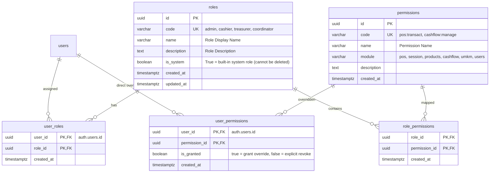
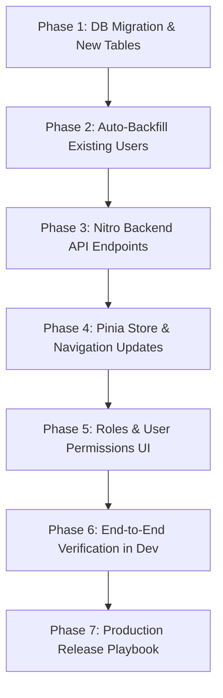

# RBAC (Role-Based Access Control) & User Permissions Implementation Plan
# OMK POS — Consignment System

> **Document Status:** DRAFT / PROPOSED  
> **Target Release:** v3.1  
> **Core Principles:** Zero-Downtime, Backward-Compatible, Layered Authorization

---

## 1. Background & Objectives

### 1.1 Current State
- Authentication and authorization currently support only 2 fixed roles: `'admin'` and `'cashier'`.
- Roles are stored in the JSONB column `raw_user_meta_data` on Supabase's internal `auth.users` table.
- Database checks (RLS) and Nuxt server APIs rely on static evaluation of `role = 'admin'`.
- There is no ability to grant specific modular access (e.g., a cashier who can view cash flow without altering inventory, or a treasurer who can settle UMKM payouts without access to admin account management).

### 1.2 Objectives
1. **Dynamic Roles:** Admins can dynamically create, edit, and delete custom roles from the dashboard.
2. **Granular Permissions:** Define modular permissions (POS, Session, Catalog/Products, Cash Flow, UMKM Settlements, User Management).
3. **User Overrides (`user_permissions`):** Support granting custom permissions or explicitly revoking permissions for individual users without needing to create new roles.
4. **Seamless Migration (Zero Breakage):** Existing accounts must not experience session interruptions or errors during rollout.

---

## 2. Database Architecture

### 2.1 Entity Relationship Diagram (ERD)



---

### 2.2 Modular Permission Definitions (*Seed Permissions*)

Permissions are intentionally limited to ~10 modular items to prevent over-engineering:

| Module | Permission Code | Display Name | Description |
|---|---|---|---|
| **POS** | `pos:transact` | Cashier Checkout | Access cashier checkout & receipt printing |
| **Session** | `session:manage` | Open & Close Session | Open Sunday sessions, enter reconciliation counts, close session |
| | `session:reset` | Reset Session | Purge session transactions (restricted administrative access) |
| **Catalog** | `products:manage` | Manage Master Catalog | Create/edit master products and UMKM partners |
| | `session_stock:manage` | Allocate Session Stock | Configure weekly starting stock and retail selling price |
| **Finance** | `cashflow:view` | View Cash Ledger | View cash flow list and ledger balance summary |
| | `cashflow:manage` | Record Cash Entries | Enter starting cash balance or operational expenses |
| | `umkm:payout` | Settle UMKM Payouts | Settle consignment remittances to UMKM partners |
| **Users** | `users:manage` | Manage User Accounts | Create cashiers, reset passwords, toggle user active status |
| | `roles:manage` | Manage Roles & Permissions | Configure role and permission mappings |

---

### 2.3 Default System Roles Matrix

| Permission | `admin` | `cashier` | `treasurer` (New) | `stockkeeper` (New) |
|---|:---:|:---:|:---:|:---:|
| `pos:transact` | ✅ *(Bypass)* | ✅ | ❌ | ❌ |
| `session:manage` | ✅ *(Bypass)* | ❌ | ❌ | ✅ |
| `session:reset` | ✅ *(Bypass)* | ❌ | ❌ | ❌ |
| `products:manage` | ✅ *(Bypass)* | ❌ | ❌ | ✅ |
| `session_stock:manage` | ✅ *(Bypass)* | ❌ | ❌ | ✅ |
| `cashflow:view` | ✅ *(Bypass)* | ❌ | ✅ | ❌ |
| `cashflow:manage` | ✅ *(Bypass)* | ❌ | ✅ | ❌ |
| `umkm:payout` | ✅ *(Bypass)* | ❌ | ✅ | ❌ |
| `users:manage` | ✅ *(Bypass)* | ❌ | ❌ | ❌ |
| `roles:manage` | ✅ *(Bypass)* | ❌ | ❌ | ❌ |

> 👑 **Admin Superuser Shortcut:** Accounts with role `admin` automatically bypass permission checks, granting full access across all modules without individual permission evaluation.

---

## 3. Database-Level Authorization Engine

### 3.1 Function `public.authorize(p_permission TEXT)`
Core function for RLS policies and RPC execution with hierarchical evaluation:
1. Check `user_permissions` (direct user override: `is_granted = true` or `false`).
2. Check `user_roles` ➜ `role_permissions`.
3. **Legacy Fallback (Backward Compatibility):** If user has no entries in `user_roles`, evaluate token `auth.jwt() -> 'user_metadata' ->> 'role' = 'admin'`.

```sql
CREATE OR REPLACE FUNCTION public.authorize(p_permission TEXT)
RETURNS BOOLEAN
LANGUAGE plpgsql
STABLE
SECURITY DEFINER
AS $$
DECLARE
  v_user_id UUID := auth.uid();
  v_has_override BOOLEAN;
BEGIN
  IF v_user_id IS NULL THEN
    RETURN FALSE;
  END IF;

  -- 1. Direct User Permission Override
  SELECT up.is_granted INTO v_has_override
  FROM public.user_permissions up
  JOIN public.permissions p ON p.id = up.permission_id
  WHERE up.user_id = v_user_id AND p.code = p_permission;

  IF v_has_override IS NOT NULL THEN
    RETURN v_has_override;
  END IF;

  -- 2. Role Permissions Evaluation
  IF EXISTS (
    SELECT 1
    FROM public.user_roles ur
    JOIN public.roles r ON r.id = ur.role_id
    JOIN public.role_permissions rp ON rp.role_id = r.id
    JOIN public.permissions p ON p.id = rp.permission_id
    WHERE ur.user_id = v_user_id
      AND (r.code = 'admin' OR p.code = p_permission)
  ) THEN
    RETURN TRUE;
  END IF;

  -- 3. Legacy Metadata Fallback
  IF (auth.jwt() -> 'user_metadata' ->> 'role') = 'admin' THEN
    RETURN TRUE;
  END IF;

  RETURN FALSE;
END;
$$;
```

---

## 4. Application Layer Architecture (Nuxt & Pinia)

### 4.1 Pinia Auth Store (`stores/auth.ts`)
Add state and helpers for client-side permission evaluation:

```ts
// Permissions assigned to currently authenticated user
const permissions = ref<string[]>([])

// Check permission helper
const can = (permissionCode: string): boolean => {
  if (role.value === 'admin') return true
  return permissions.value.includes(permissionCode)
}

// Check role helper
const hasRole = (roleCode: string): boolean => {
  return role.value === roleCode
}
```

### 4.2 Centralized Navigation (`app/config/navigation.ts`)
Navigation items filtered dynamically based on user permissions:

```ts
export const adminNavigation = [
  { label: 'POS Cashier', to: '/pos', permission: 'pos:transact' },
  { label: 'Product Catalog', to: '/admin/products', permission: 'products:manage' },
  { label: 'Sales Sessions', to: '/admin/sessions', permission: 'session:manage' },
  { label: 'Cash Flow', to: '/admin/cashflow', permission: 'cashflow:view' },
  { label: 'UMKM Settlements', to: '/admin/umkm-payments', permission: 'umkm:payout' },
  { label: 'User Management', to: '/admin/users', permission: 'users:manage' },
  { label: 'Roles & Permissions', to: '/admin/roles', permission: 'roles:manage' },
]
```

### 4.3 Route Middleware (`app/middleware/permission.ts`)
Guards against unauthorized direct URL navigation:

```ts
export default defineNuxtRouteMiddleware((to) => {
  const auth = useAuthStore()
  const requiredPerm = to.meta.permission as string | undefined

  if (requiredPerm && !auth.can(requiredPerm)) {
    return navigateTo('/pos')
  }
})
```

### 4.4 Server Utilities (`server/utils/requirePermission.ts`)
Protects Nitro backend API endpoints:

```ts
export async function requirePermission(event: H3Event, permission: string) {
  const user = await serverSupabaseUser(event)
  if (!user) throw createError({ status: 401, statusText: 'Unauthorized' })

  // Admin bypass
  if (user.user_metadata?.role === 'admin') return user

  // Check user permission in DB
  const hasPerm = await checkUserPermission(user.id, permission)
  if (!hasPerm) {
    throw createError({ status: 403, statusText: 'Forbidden: Insufficient Permissions' })
  }

  return user
}
```

---

## 5. Directory Structure & SQL File Standardization

All SQL files are standardized into Supabase-conventional directories:

```
pos-omk/
├── supabase/
│   ├── migrations/                      # DDL Schemas & Sequential Migrations
│   │   ├── 20260629130149_001_split_products.sql
│   │   ├── 20260707124708_create_cash_flows.sql
│   │   ├── 20260707131602_create_umkm_payments.sql
│   │   ├── 20260920000000_initial_base_schema.sql
│   │   └── 20260921000000_create_rbac_tables.sql    # [PLAN] New RBAC migration
│   └── seeds/                           # Dummy / Test Datasets
│       └── dev_seed.sql
```

**Naming Standards:**
- All schema migration files reside in `supabase/migrations/` using format `<YYYYMMDDHHMMSS>_<descriptive_name>.sql`.
- Seed and test datasets reside in `supabase/seeds/`.

---

## 6. Execution & Verification Roadmap



### Phase 1 & 2: Database Migration & Auto-Backfill
- [ ] Prepare migration file `supabase/migrations/20260921000000_create_rbac_tables.sql`.
- [ ] Create tables: `roles`, `permissions`, `role_permissions`, `user_roles`, `user_permissions`.
- [ ] Seed default permissions and initial system roles (`admin`, `cashier`, `treasurer`, `stockkeeper`).
- [ ] Auto-backfill: Populate `user_roles` for all existing users in `auth.users` based on current metadata.
- [ ] Deploy `authorize()` function and update RLS policies incrementally.

### Phase 3: Nitro Backend API
- [ ] Implement `GET /api/roles` & `POST /api/roles` (role management).
- [ ] Implement `GET /api/permissions` (list modules & permissions).
- [ ] Implement `GET/PUT /api/users/[id]/permissions` (custom user overrides).
- [ ] Update `GET /api/users` response to include active roles and permissions per user.

### Phase 4: Frontend Authorization
- [ ] Update `app/stores/auth.ts` with `can()` helper and permission hydration on login.
- [ ] Integrate permission checks into admin sidebar navigation.
- [ ] Implement route protection middleware.

### Phase 5: Roles & Permissions Management UI
- [ ] Create `/admin/roles` page:
  - Role list table.
  - Create/edit role form with modular permission checkboxes.
- [ ] Update `/admin/users` page:
  - Dynamic role selection from `roles` table.
  - "Custom Permissions Override" modal for specific users.

### Phase 6: Testing & Verification
- [ ] Cashier login test: can access POS only, denied from cash ledger and user management.
- [ ] Treasurer login test: can access cash flow and settlements, denied from POS and master catalog editing.
- [ ] Admin login test: full 100% unrestricted access across all modules (bypass).
- [ ] User override test: a cashier granted explicit `cashflow:view` override can access the Cash Flow page.

---

## 7. Production Release Playbook (*Zero Downtime*)

1. **Run Database Migration in Production:**
   Because `authorize()` includes a fallback to legacy metadata, applying the schema changes **will not disrupt** active user sessions.
2. **Deploy Application Build (Nuxt/Nitro):**
   Deploy frontend and backend builds.
3. **Verify Admin Access:**
   Confirm superadmin access to `/admin/roles` and all existing administration screens.
4. **Complete.**
