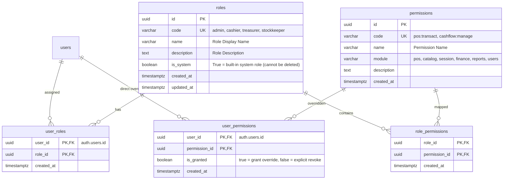
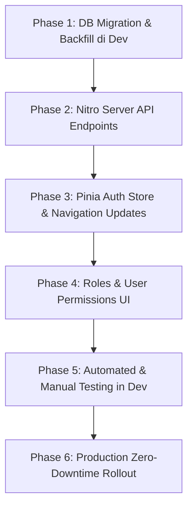

# RBAC (Role-Based Access Control) & Granular Permissions Implementation Plan
# OMK POS — Consignment & Cashier System

> **Document Status:** PROPOSED (Architectural Proposal)  
> **Target Document Location:** `docs/plans/proposed/RBAC_PERMISSIONS_PLAN.md`  
> **Target Release:** v3.1  
> **Core Principles:** Zero-Downtime, Backward-Compatible, Strict Consignment Protection, Layered Authorization

---

## 1. Background & Governance Compliance

### 1.1 Current State
- Authentication and authorization currently support only 2 fixed roles: `'admin'` and `'cashier'`.
- Roles are stored in the JSONB column `raw_user_meta_data` on Supabase's internal `auth.users` table (`user_metadata.role`).
- Database Row-Level Security (RLS) and Nuxt server Nitro APIs rely on static evaluation of `role = 'admin'`.
- There is no ability to grant granular, modular access (e.g., a treasurer who settles UMKM payouts without access to cashier account creation, or an inventory manager who configures weekly catalogs without viewing ledger balances).

### 1.2 Objectives
1. **Dynamic Roles:** Administrators can dynamically create, view, edit, and deactivate roles via a dedicated UI (`/admin/roles`).
2. **Granular Permissions:** Modular permission codes mapped to specific features (POS, Catalog Setup, Stock Allocation, Financial Ledger, UMKM Settlements, User & Role Management).
3. **User Overrides (`user_permissions`):** Support granting custom permissions or explicitly revoking permissions for individual users without needing to create bespoke roles.
4. **Zero Downtime & Backward Compatibility:** Existing cashier and admin accounts must not experience session interruptions, login errors, or permission lockouts during schema rollout.

### 1.3 Governance & Compliance with Locked Features
Per [GEMINI.md Bagian 7 & 8](file:///home/rodex/Documents/cell/projects/pos-omk/GEMINI.md) and [docs/FEATURES.md](file:///home/rodex/Documents/cell/projects/pos-omk/docs/FEATURES.md), features **F-01 (Auth & RBAC)** and **F-14 (User Management)** are marked as **`LOCKED`**. This plan is formulated as an **authorized supervised extension**:
- **Consignment Cost Isolation (`harga_asli`):** Cashier accounts remain **strictly forbidden** from querying `harga_asli`. Cashiers only access `products_cashier_view` with RLS enforcement.
- **Atomic Checkout Preserved:** Checkout logic remains strictly encapsulated in the atomic database RPC `complete_transaction`.
- **Superuser Fallback:** Any user with `user_metadata->>'role' = 'admin'` automatically bypasses permission checks as a superadmin, ensuring legacy admin sessions remain 100% operational.
- **Design System Mandate:** No third-party UI libraries (PrimeVue, Vuetify, DaisyUI, etc.) or Axios are introduced. All new interfaces are built strictly with Tailwind CSS and atomic UI primitives (`AppButton`, `AppInput`, `AppModal`, `AppToast`).

---

## 2. Database Architecture

### 2.1 Entity Relationship Diagram (ERD)



---

### 2.2 Modular Permission Definitions (*Seed Permissions*)

Permissions are mapped directly to the 14 project features in [docs/FEATURES.md](file:///home/rodex/Documents/cell/projects/pos-omk/docs/FEATURES.md) without over-engineering:

| Module | Permission Code | Display Name | Target Features / Routes | Description |
|---|---|---|---|---|
| **POS** | `pos:transact` | Kasir POS | F-02 (`/pos`) | Mengoperasikan kasir, memilih produk, menerima pembayaran Cash/QRIS, dan cetak struk |
| **Catalog** | `products:manage` | Master Produk & UMKM | F-04 (`/admin/umkm`) | Tambah, ubah, dan nonaktifkan mitra UMKM serta katalog master produk |
| | `session_stock:manage` | Alokasi Stok Sesi | F-05 (`/admin/setup`) | Setup sesi mingguan, memilih produk aktif, menentukan harga jual, dan stok awal |
| **Session** | `session:manage` | Operasional Sesi | F-05, F-07 (`/admin/reconciliation`) | Buka sesi Minggu, input rekonsiliasi fisik (*stok fisik*), dan tutup sesi (*Close Session*) |
| | `session:reset` | Reset & Buka Ulang Sesi | F-06 (`/admin/dashboard`) | Buka kembali sesi ditutup atau reset data transaksi sesi untuk kebutuhan recovery |
| **Finance** | `cashflow:view` | Lihat Finansial & Kas | F-06, F-09, F-10, F-11 | Melihat dashboard finansial, riwayat sesi, analitik grafik, dan buku kas |
| | `cashflow:manage` | Kelola Buku Kas | F-11 (`/admin/cash-flow`) | Input pemasukan/pengeluaran kas operasional manual dan saldo awal kas |
| | `umkm:payout` | Pembayaran UMKM | F-12 (`/admin/payments`) | Catat pelunasan bagi hasil konsinyasi ke mitra UMKM (otomatis mencatat beban kas) |
| **Reports** | `reports:view` | Laporan WhatsApp | F-08 (`/admin/reports`) | Generate dan salin rekap laporan bagi hasil mitra UMKM ke clipboard |
| **Settings** | `users:manage` | Kelola Pengguna | F-14 (`/admin/users`) | Buat akun kasir baru, reset password, dan aktif/nonaktifkan status pengguna |
| | `roles:manage` | Kelola Peran & Izin | New (`/admin/roles`) | Konfigurasi hak akses peran dan kustomisasi perizinan per user |

---

### 2.3 Default System Roles Matrix

| Permission | `admin` (System) | `cashier` (System) | `treasurer` (Bendahara) | `stockkeeper` (Logistik) |
|---|:---:|:---:|:---:|:---:|
| `pos:transact` | ✅ *(Bypass)* | ✅ | ❌ | ❌ |
| `products:manage` | ✅ *(Bypass)* | ❌ | ❌ | ✅ |
| `session_stock:manage` | ✅ *(Bypass)* | ❌ | ❌ | ✅ |
| `session:manage` | ✅ *(Bypass)* | ❌ | ❌ | ✅ |
| `session:reset` | ✅ *(Bypass)* | ❌ | ❌ | ❌ |
| `cashflow:view` | ✅ *(Bypass)* | ❌ | ✅ | ❌ |
| `cashflow:manage` | ✅ *(Bypass)* | ❌ | ✅ | ❌ |
| `umkm:payout` | ✅ *(Bypass)* | ❌ | ✅ | ❌ |
| `reports:view` | ✅ *(Bypass)* | ❌ | ✅ | ✅ |
| `users:manage` | ✅ *(Bypass)* | ❌ | ❌ | ❌ |
| `roles:manage` | ✅ *(Bypass)* | ❌ | ❌ | ❌ |

> 👑 **Admin Superuser Shortcut:** Pengguna dengan role `admin` secara otomatis melewati pengecekan perizinan (*bypass*), memiliki akses 100% penuh ke seluruh modul tanpa perlu evaluasi baris izin satu per satu.

---

## 3. Database-Level Authorization Engine

### 3.1 Function `public.authorize(p_permission TEXT)`
Fungsi inti PostgreSQL untuk RLS policies dan eksekusi RPC dengan evaluasi bertingkat (*hierarchical precedence*):
1. **Direct User Permission Override (`user_permissions`):** Mengecek apakah ada override eksplisit per pengguna (`is_granted = true` atau `false`). Override `false` dapat mencabut izin yang diwariskan dari role.
2. **Role Permissions Evaluation (`user_roles` ➜ `role_permissions`):** Mengecek apakah role pengguna memiliki izin tersebut atau memiliki role `admin`.
3. **Legacy Metadata Fallback (Zero Downtime Guarantee):** Jika data belum ter-backfill di tabel relasional, fallback mengecek JWT token `auth.jwt() -> 'user_metadata' ->> 'role' = 'admin'`.

```sql
CREATE OR REPLACE FUNCTION public.authorize(p_permission TEXT)
RETURNS BOOLEAN
LANGUAGE plpgsql
STABLE
SECURITY DEFINER
AS $$
DECLARE
  v_user_id UUID := auth.uid();
  v_has_override BOOLEAN;
BEGIN
  IF v_user_id IS NULL THEN
    RETURN FALSE;
  END IF;

  -- 1. Direct User Permission Override (Precedence Tertinggi)
  SELECT up.is_granted INTO v_has_override
  FROM public.user_permissions up
  JOIN public.permissions p ON p.id = up.permission_id
  WHERE up.user_id = v_user_id AND p.code = p_permission;

  IF v_has_override IS NOT NULL THEN
    RETURN v_has_override;
  END IF;

  -- 2. Role Permissions Evaluation (Termasuk role 'admin' bypass)
  IF EXISTS (
    SELECT 1
    FROM public.user_roles ur
    JOIN public.roles r ON r.id = ur.role_id
    LEFT JOIN public.role_permissions rp ON rp.role_id = r.id
    LEFT JOIN public.permissions p ON p.id = rp.permission_id
    WHERE ur.user_id = v_user_id
      AND (r.code = 'admin' OR p.code = p_permission)
  ) THEN
    RETURN TRUE;
  END IF;

  -- 3. Legacy Metadata Fallback (Backward Compatibility saat Deploy)
  IF (auth.jwt() -> 'user_metadata' ->> 'role') = 'admin' THEN
    RETURN TRUE;
  END IF;

  RETURN FALSE;
END;
$$;
```

---

## 4. Application Layer Architecture (Nuxt & Pinia)

### 4.1 Pinia Auth Store (`app/stores/auth.ts`)
Memperluas state dan helper untuk evaluasi izin di sisi klien:

```ts
// State
const permissions = ref<string[]>([])
const isSuperAdmin = computed(() => role.value === 'admin')

// Helper evaluasi izin
const can = (permissionCode: string): boolean => {
  if (isSuperAdmin.value) return true
  return permissions.value.includes(permissionCode)
}

// Helper evaluasi role
const hasRole = (roleCode: string): boolean => {
  return role.value === roleCode
}
```

---

### 4.2 Integrasi Navigasi Admin (`app/layouts/admin.vue`)
Menyesuaikan struktur `navGroups` aktual di `admin.vue` dengan menambahkan properti `permission?: string`. Item menu difilter secara reaktif, dan grup yang seluruh itemnya tidak memiliki akses akan disembunyikan otomatis:

```ts
interface NavItem {
  name: string
  path: string
  icon: string
  permission?: string             // [NEW] Kode izin RBAC
  requiresSession?: boolean
  requiresClosedSession?: boolean
}

interface NavGroup {
  label: string
  items: NavItem[]
}

const navGroups: NavGroup[] = [
  {
    label: 'Umum',
    items: [
      { name: 'Ikhtisar', path: '/admin', icon: 'heroicons:squares-2x2', permission: 'cashflow:view' },
      { name: 'Riwayat Sesi', path: '/admin/history', icon: 'heroicons:archive-box', permission: 'cashflow:view' },
      { name: 'Analitik Sesi', path: '/admin/analytics', icon: 'heroicons:presentation-chart-line', permission: 'cashflow:view' },
    ]
  },
  {
    label: 'UMKM & Produk',
    items: [
      { name: 'Master Data UMKM', path: '/admin/umkm', icon: 'heroicons:building-storefront', permission: 'products:manage' },
      { name: 'Setup Katalog', path: '/admin/setup', icon: 'heroicons:cog-8-tooth', permission: 'session_stock:manage' },
    ]
  },
  {
    label: 'Keuangan',
    items: [
      { name: 'Finansial Sesi', path: '/admin/dashboard', icon: 'heroicons:chart-bar', permission: 'cashflow:view', requiresSession: true },
      { name: 'Cash Flow', path: '/admin/cash-flow', icon: 'heroicons:banknotes', permission: 'cashflow:view' },
      { name: 'Pembayaran UMKM', path: '/admin/payments', icon: 'heroicons:currency-dollar', permission: 'umkm:payout' },
    ]
  },
  {
    label: 'Operasional',
    items: [
      { name: 'Rekonsiliasi Stok', path: '/admin/reconciliation', icon: 'heroicons:clipboard-document-check', permission: 'session:manage', requiresSession: true },
      { name: 'Laporan WhatsApp', path: '/admin/reports', icon: 'heroicons:chat-bubble-bottom-center-text', permission: 'reports:view', requiresClosedSession: true },
    ]
  },
  {
    label: 'Pengaturan',
    items: [
      { name: 'Kelola Pengguna', path: '/admin/users', icon: 'heroicons:users', permission: 'users:manage' },
      { name: 'Peran & Hak Akses', path: '/admin/roles', icon: 'heroicons:shield-check', permission: 'roles:manage' }, // [NEW]
    ]
  }
]

// Filter dinamis: Item disaring berdasarkan permission, grup kosong disembunyikan
const authorizedNavGroups = computed(() => {
  return navGroups
    .map(group => ({
      ...group,
      items: group.items.filter(item => !item.permission || authStore.can(item.permission))
    }))
    .filter(group => group.items.length > 0)
})
```

---

### 4.3 Route Middleware (`app/middleware/permission.ts`)
Melindungi rute dari navigasi URL langsung:

```ts
export default defineNuxtRouteMiddleware((to) => {
  const authStore = useAuthStore()
  const requiredPerm = to.meta.permission as string | undefined

  if (requiredPerm && !authStore.can(requiredPerm)) {
    // Jika tidak punya izin ke halaman admin tersebut, lempar ke POS atau halaman pertama yang diizinkan
    return navigateTo('/pos')
  }
})
```

---

### 4.4 Server Utilities (`server/utils/requirePermission.ts`)
Melindungi endpoint Nitro REST API dengan tetap mempertahankan kompatibilitas `requireAdmin.ts`:

```ts
export async function requirePermission(event: H3Event, permission: string) {
  const user = await serverSupabaseUser(event)
  if (!user) throw createError({ status: 401, statusText: 'Unauthorized' })

  // Admin superuser bypass
  if (user.user_metadata?.role === 'admin') return user

  // Evaluasi izin via stored function authorize() atau query user_permissions/user_roles
  const hasPerm = await checkUserPermission(user.id, permission)
  if (!hasPerm) {
    throw createError({ status: 403, statusText: 'Forbidden: Insufficient Permissions' })
  }

  return user
}
```

---

### 4.5 Kepatuhan Desain Sistem & Ergonomi UI
Mengikuti standar di [docs/ARCHITECTURE.md](file:///home/rodex/Documents/cell/projects/pos-omk/docs/ARCHITECTURE.md):
- **Bebas Library Eksternal:** Seluruh komponen UI dibuat murni dengan Tailwind CSS. Dilarang menginstal PrimeVue, DaisyUI, Vuetify, dsb.
- **Komponen Primitif:** Menggunakan `AppButton.vue` (loading state & variants), `AppInput.vue`, `AppModal.vue`, dan `AppToast.vue`.
- **Target Sentuh Mobile:** Checkbox modul izin dan toggle user menggunakan batas minimal tap target **48×48px** (`min-h-touch`, `min-w-touch`).
- **Palet Warna:** Navy `#1e3a5f` (`brand-900`) untuk header dan tombol utama, serta semantik `success`, `warning`, `danger` untuk status badge.

---

## 5. Standarisasi File Migrasi SQL

Sesuai standar Supabase CLI dan penataan repositori:

```
pos-omk/
├── supabase/
│   ├── migrations/                                  # DDL Schemas & Sequential Migrations
│   │   └── 20260922000000_create_rbac_tables.sql    # [PLAN] Skrip migrasi RBAC & RLS
│   └── seeds/
│       └── dev_seed.sql                             # Seed data roles & modular permissions
├── docs/
│   ├── archive/
│   │   └── migrations_v2/                           # Arsip migrasi historis v2
│   └── plans/
│       ├── completed/                               # PRD & plan selesai
│       └── proposed/                                # Proposal masa depan (RBAC_PERMISSIONS_PLAN.md)
```

**Aturan Penamaan Migrasi:**
- Berkas migrasi baru wajib berada di `supabase/migrations/` dengan format `<YYYYMMDDHHMMSS>_<nama_deskriptif>.sql`.
- Berisi DDL tabel baru, default seeds, fungsi `authorize()`, update RLS policies, serta backfill script.

---

## 6. Roadmap Eksekusi & Protokol Git

Sesuai [GEMINI.md Bagian 10](file:///home/rodex/Documents/cell/projects/pos-omk/GEMINI.md#L159-L167), pelaksanaan plan ini wajib mematuhi aturan:
1. **Branch Terpisah:** Wajib membuat branch baru dari `master` (misal: `feat/rbac-dynamic-permissions`). Dilarang bekerja atau push langsung ke `master`.
2. **Conventional Commits:** Menggunakan format commit baku (`feat(rbac): ...`, `test(rbac): ...`, `docs(rbac): ...`).
3. **Verifikasi Wajib:** Wajib lolos `npm test` dan `npm run build` sebelum push ke remote origin.



### Phase 1: Database Migration & Auto-Backfill (Dev Supabase: `irnbpdhkjrjmxmsbntna`)
- [ ] Buat file migrasi `supabase/migrations/20260922000000_create_rbac_tables.sql`.
- [ ] Buat tabel: `roles`, `permissions`, `role_permissions`, `user_roles`, `user_permissions`.
- [ ] Seed daftar permission awal dan default system roles (`admin`, `cashier`, `treasurer`, `stockkeeper`).
- [ ] Buat skrip auto-backfill: Sinkronkan seluruh user dari `auth.users` ke `user_roles` berdasarkan `user_metadata.role`.
- [ ] Implementasikan fungsi `public.authorize(p_permission)` dan pasang RLS policies.

### Phase 2: Nitro Backend API
- [ ] Endpoint `GET /api/roles` & `POST /api/roles` (manajemen role).
- [ ] Endpoint `GET /api/permissions` (daftar modul & izin).
- [ ] Endpoint `GET /api/users/[id]/permissions` & `PUT /api/users/[id]/permissions` (user override).
- [ ] Perbarui response `GET /api/users` agar menyertakan data role relasional dan override user.

### Phase 3: Frontend State & Navigation
- [ ] Tambahkan state `permissions`, getter `can()`, dan hidrasi izin saat login di `app/stores/auth.ts`.
- [ ] Integrasikan pengecekan `permission` di `navGroups` pada `app/layouts/admin.vue`.
- [ ] Pasang middleware route guard `app/middleware/permission.ts`.

### Phase 4: UI Manajemen Peran & Izin Pengguna
- [ ] Buat halaman `/admin/roles`:
  - Tabel daftar peran & badge tipe (`System` / `Custom`).
  - Modal form buat/edit peran dengan grid checkbox izin per modul.
- [ ] Perbarui halaman `/admin/users`:
  - Dropdown pemilihan role dinamis (mengambil dari tabel `roles`).
  - Modal "Kustomisasi Hak Akses" (*User Permission Override*) untuk grant/revoke izin spesifik per user.

### Phase 5: Pengujian & Verifikasi
- [ ] **Uji Kasir:** Akun kasir hanya dapat mengakses `/pos`. Akses ke `/admin/*` otomatis dialihkan ke `/pos`.
- [ ] **Uji Bendahara (`treasurer`):** Dapat membuka `/admin/cash-flow` dan `/admin/payments`, tetapi ditolak saat membuka `/admin/users` atau setup katalog.
- [ ] **Uji Superadmin (`admin`):** Memiliki akses 100% tanpa hambatan (*bypass* penuh).
- [ ] **Uji User Override:** Kasir yang diberi override `is_granted = true` untuk `cashflow:view` dapat melihat halaman Cash Flow tanpa mengubah role dasarnya.
- [ ] Jalankan automated tests: `npm test` dan `npm run build`.

---

## 7. Playbook Rilis Produksi (*Zero Downtime*)

1. **Jalankan Migrasi Database di Produksi:**
   Karena fungsi `authorize()` memiliki fallback ke metadata lama (`user_metadata->>'role' = 'admin'`), penerapan skrip DDL dan backfill **tidak akan memutus** sesi pengguna aktif di kasir gereja.
2. **Deploy Build Aplikasi (Nuxt & Nitro):**
   Deploy build frontend dan server.
3. **Verifikasi Akun Admin & Kasir:**
   Pastikan admin dapat mengakses menu baru `/admin/roles` dan akun kasir bertransaksi lancar di `/pos`.
4. **Selesai.**
