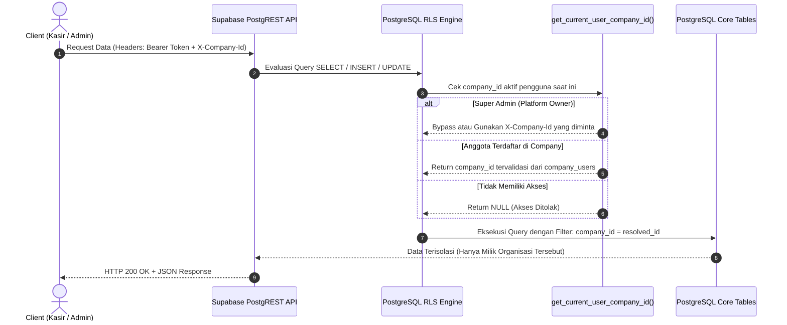
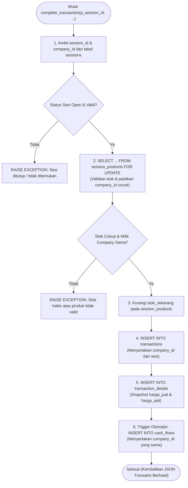

# Rencana Detail Fase 2 — RPC Functions, Views, & Row-Level Security (RLS)

> **Fitur:** Multi-Company / Multi-Organisasi (Multi-Tenancy)  
> **Fase:** 2 dari 4 (RPC Functions, Database Views, & RLS Security Policies)  
> **Lokasi File Dokumen:** `docs/plans/proposed/multi-company/02_rpc_views_and_rls.md`  
> **Status Dokumen:** `PROPOSED / READY FOR REVIEW`  
> **Prasyarat:** Fase 1 (`01_database_and_data_migration.md`) telah dieksekusi  
> **Target Database:** Supabase (PostgreSQL 15+)  

---

## 1. Latar Belakang & Tujuan Fase 2

Pada **Fase 1**, kolom `company_id` telah ditambahkan ke seluruh tabel inti dan data historis telah dimigrasikan ke *Default Company*. Namun, database belum memiliki mekanisme pengamanan otomatis (*security enforcement*) dan fungsi-fungsi komputasi (*RPC & Views*) masih berpotensi mencampuradukkan data antar organisasi.

Tujuan utama dari **Fase 2** adalah:
1. **Tenant Context Resolution:** Membuat fungsi resolver di PostgreSQL untuk menentukan organisasi aktif pemanggil (*caller*) secara otomatis dan aman.
2. **Row-Level Security (RLS) Isolation:** Mengunci seluruh akses tabel di level kernel PostgreSQL sehingga tidak ada kebocoran data (*data leakage*) antar organisasi, bahkan jika client salah mengirim parameter.
3. **Penyelarasan Views:** Memperbarui view publik/kasir (`products_cashier_view`, `session_history_summary`, `top_products_sales`, `umkm_profit_contribution`) agar terisolasi per `company_id`.
4. **Pembaruan Stored Procedures (RPC):** Menyesuaikan `complete_transaction`, triggers pencatatan kas otomatis, dan fungsi analitik (`get_weekly_trends`) dengan validasi `company_id`.

---

## 2. Diagram Alur & Arsitektur Keamanan (Mermaid)

### 2.1 Alur Resolusi Tenant & Penegakan RLS



### 2.2 Alur Transaksi Kasir Multi-Tenant (`complete_transaction`)



---

## 3. Resolver Identitas & Context Helper Functions

PostgreSQL memerlukan fungsi pembantu yang cepat (*STABLE*) untuk membaca organisasi pemanggil dari konteks HTTP header atau metadata JWT Supabase.

### 3.1 Fungsi `is_super_admin()`
Mengecek apakah pemanggil adalah platform super admin (`marcellinusyovian@gmail.com`).

```sql
CREATE OR REPLACE FUNCTION public.is_super_admin()
RETURNS BOOLEAN
LANGUAGE sql
STABLE
SECURITY DEFINER
AS $$
  SELECT (auth.jwt() ->> 'email') = 'marcellinusyovian@gmail.com';
$$;
```

### 3.2 Fungsi `get_current_user_company_id()`
Mengekstrak dan memvalidasi `company_id` aktif bagi pengguna yang sedang melakukan request.

```sql
CREATE OR REPLACE FUNCTION public.get_current_user_company_id()
RETURNS UUID
LANGUAGE plpgsql
STABLE
SECURITY DEFINER
AS $$
DECLARE
  v_req_company_id TEXT;
  v_company_uuid   UUID;
  v_user_id        UUID := auth.uid();
BEGIN
  -- 1. Coba baca dari HTTP header 'X-Company-Id' (disuntikkan oleh useApi / client)
  BEGIN
    v_req_company_id := current_setting('request.headers', true)::json->>'x-company-id';
  EXCEPTION WHEN OTHERS THEN
    v_req_company_id := NULL;
  END;

  -- 2. Jika ada header dan valid UUID
  IF v_req_company_id IS NOT NULL AND v_req_company_id ~* '^[0-9a-f]{8}-[0-9a-f]{4}-[0-9a-f]{4}-[0-9a-f]{4}-[0-9a-f]{12}$' THEN
    v_company_uuid := v_req_company_id::UUID;
    
    -- Super Admin bebas mengakses company manapun
    IF public.is_super_admin() THEN
      RETURN v_company_uuid;
    END IF;

    -- Pengguna reguler harus terdaftar aktif di company_users tersebut
    IF EXISTS (
      SELECT 1 FROM public.company_users
      WHERE user_id = v_user_id 
        AND company_id = v_company_uuid 
        AND is_active = TRUE
    ) THEN
      RETURN v_company_uuid;
    END IF;
  END IF;

  -- 3. Fallback: Ambil default company dari profil pengguna
  SELECT company_id INTO v_company_uuid
  FROM public.company_users
  WHERE user_id = v_user_id AND is_active = TRUE
  ORDER BY is_default DESC, created_at ASC
  LIMIT 1;

  RETURN v_company_uuid;
END;
$$;
```

---

## 4. Penyesuaian Database Views

### 4.1 View Kasir: `products_cashier_view`
Menambahkan kolom `company_id` dan menyaring item aktif agar kasir tidak dapat melihat jualan paroki lain.

```sql
CREATE OR REPLACE VIEW public.products_cashier_view AS
  SELECT
    sp.id,
    sp.company_id,
    sp.session_id,
    mp.umkm_id,
    mp.nama_produk,
    sp.harga_jual,
    sp.stok_awal,
    sp.stok_sekarang,
    sp.is_active,
    sp.created_at
  FROM public.session_products sp
  JOIN public.master_products mp ON mp.id = sp.master_product_id;

GRANT SELECT ON public.products_cashier_view TO authenticated;
```

### 4.2 View Ringkasan Sesi: `session_history_summary`
Menyertakan `company_id` untuk agregasi keuangan per paroki.

```sql
CREATE OR REPLACE VIEW public.session_history_summary AS
  SELECT 
    s.id AS session_id,
    s.company_id,
    s.session_date,
    s.status,
    s.opened_at,
    s.closed_at,
    COALESCE(SUM(t.total_harga_jual), 0)::BIGINT AS gross_revenue,
    COALESCE(SUM(td.subtotal_harga_asli), 0)::BIGINT AS total_remittance,
    (COALESCE(SUM(t.total_harga_jual), 0) - COALESCE(SUM(td.subtotal_harga_asli), 0))::BIGINT AS omk_net_profit,
    COUNT(DISTINCT t.id)::BIGINT AS total_transactions
  FROM public.sessions s
  LEFT JOIN public.transactions t ON t.session_id = s.id
  LEFT JOIN (
    SELECT 
      transaction_id, 
      SUM(qty * harga_asli_snapshot) AS subtotal_harga_asli
    FROM public.transaction_details
    GROUP BY transaction_id
  ) td ON td.transaction_id = t.id
  GROUP BY s.id, s.company_id, s.session_date, s.status, s.opened_at, s.closed_at;

GRANT SELECT ON public.session_history_summary TO authenticated;
```

### 4.3 View Analitik: `top_products_sales` & `umkm_profit_contribution`
Menyertakan `company_id` pada hasil agregasi:

```sql
CREATE OR REPLACE VIEW public.top_products_sales AS
  WITH product_sales AS (
    SELECT mp.company_id, mp.id AS master_product_id, mp.nama_produk,
           COALESCE(SUM(td.qty), 0)::BIGINT AS total_sold
    FROM public.master_products mp
    JOIN public.session_products sp ON sp.master_product_id = mp.id
    JOIN public.transaction_details td ON td.session_product_id = sp.id
    JOIN public.transactions t ON t.id = td.transaction_id
    JOIN public.sessions s ON s.id = t.session_id
    WHERE s.status = 'closed'
    GROUP BY mp.company_id, mp.id, mp.nama_produk
  ), product_stock AS (
    SELECT mp.company_id, mp.id AS master_product_id, SUM(sp.stok_awal) AS total_stok_awal
    FROM public.master_products mp
    JOIN public.session_products sp ON sp.master_product_id = mp.id
    JOIN public.sessions s ON s.id = sp.session_id
    WHERE s.status = 'closed'
    GROUP BY mp.company_id, mp.id
  )
  SELECT ps.company_id, ps.master_product_id, ps.nama_produk, ps.total_sold, pst.total_stok_awal,
         CASE WHEN pst.total_stok_awal > 0
           THEN ROUND((ps.total_sold::NUMERIC / pst.total_stok_awal::NUMERIC) * 100, 1)
           ELSE 0 END AS sell_through_rate
  FROM product_sales ps
  JOIN product_stock pst ON pst.master_product_id = ps.master_product_id AND pst.company_id = ps.company_id
  ORDER BY ps.total_sold DESC;

GRANT SELECT ON public.top_products_sales TO authenticated;
```

---

## 5. Pembaruan Stored Procedures (RPC) & Triggers

### 5.1 Penyesuaian `complete_transaction`
Menyalin `company_id` dari sesi ke transaksi, serta memvalidasi kepemilikan produk.

```sql
CREATE OR REPLACE FUNCTION public.complete_transaction(
  p_session_id        UUID,
  p_cashier_id        UUID,
  p_nominal_diterima  INTEGER,
  p_cart_items        JSONB,
  p_metode_pembayaran VARCHAR DEFAULT 'cash'
)
RETURNS JSONB
LANGUAGE plpgsql
SECURITY DEFINER
AS $$
DECLARE
  v_company_id         UUID;
  v_transaction_id     UUID;
  v_total_harga_jual   INTEGER := 0;
  v_item               JSONB;
  v_session_product_id UUID;
  v_qty                INTEGER;
  v_harga_jual         INTEGER;
  v_harga_asli         INTEGER;
  v_stok_sekarang      INTEGER;
  v_session_status     VARCHAR(20);
BEGIN
  -- 1. Ambil session status & company_id
  SELECT status, company_id INTO v_session_status, v_company_id 
  FROM public.sessions 
  WHERE id = p_session_id;

  IF v_session_status IS NULL THEN
    RAISE EXCEPTION 'Session not found: %', p_session_id;
  END IF;
  IF v_session_status != 'open' THEN
    RAISE EXCEPTION 'Session is closed. No transactions allowed.';
  END IF;

  -- 2. Hitung total belanja
  FOR v_item IN SELECT * FROM jsonb_array_elements(p_cart_items) LOOP
    v_qty        := (v_item->>'qty')::INTEGER;
    v_harga_jual := (v_item->>'harga_jual')::INTEGER;
    IF v_qty <= 0 THEN
      RAISE EXCEPTION 'Invalid qty for item';
    END IF;
    v_total_harga_jual := v_total_harga_jual + (v_qty * v_harga_jual);
  END LOOP;

  -- 3. Validasi nominal bayar jika tunai
  IF p_metode_pembayaran = 'cash' AND p_nominal_diterima < v_total_harga_jual THEN
    RAISE EXCEPTION 'Nominal diterima (%) kurang dari total (%).', p_nominal_diterima, v_total_harga_jual;
  END IF;

  -- 4. Insert ke transactions (dengan company_id terisolasi)
  INSERT INTO public.transactions (
    company_id, session_id, cashier_id, total_harga_jual, nominal_diterima, metode_pembayaran
  ) VALUES (
    v_company_id, p_session_id, p_cashier_id, v_total_harga_jual, p_nominal_diterima, p_metode_pembayaran
  ) RETURNING id INTO v_transaction_id;

  -- 5. Kunci baris stok dan potong stok secara atomik
  FOR v_item IN SELECT * FROM jsonb_array_elements(p_cart_items) LOOP
    v_session_product_id := (v_item->>'product_id')::UUID;
    v_qty                := (v_item->>'qty')::INTEGER;
    v_harga_jual         := (v_item->>'harga_jual')::INTEGER;

    SELECT sp.stok_sekarang, mp.harga_asli
    INTO v_stok_sekarang, v_harga_asli
    FROM public.session_products sp
    JOIN public.master_products mp ON mp.id = sp.master_product_id
    WHERE sp.id = v_session_product_id 
      AND sp.session_id = p_session_id 
      AND sp.company_id = v_company_id
    FOR UPDATE OF sp;

    IF v_stok_sekarang IS NULL THEN
      RAISE EXCEPTION 'Produk sesi % tidak ditemukan pada organisasi ini.', v_session_product_id;
    END IF;

    IF v_stok_sekarang < v_qty THEN
      RAISE EXCEPTION 'Stok tidak mencukupi untuk produk %. Tersedia: %, Diminta: %',
        v_session_product_id, v_stok_sekarang, v_qty;
    END IF;

    UPDATE public.session_products
    SET stok_sekarang = stok_sekarang - v_qty
    WHERE id = v_session_product_id;

    INSERT INTO public.transaction_details (
      transaction_id, session_product_id, qty, harga_jual_snapshot, harga_asli_snapshot
    ) VALUES (
      v_transaction_id, v_session_product_id, v_qty, v_harga_jual, v_harga_asli
    );
  END LOOP;

  RETURN jsonb_build_object(
    'transaction_id', v_transaction_id,
    'total_harga_jual', v_total_harga_jual,
    'nominal_diterima', p_nominal_diterima,
    'kembalian', (p_nominal_diterima - v_total_harga_jual),
    'metode_pembayaran', p_metode_pembayaran
  );
END;
$$;
```

### 5.2 Penyesuaian Triggers Otomatis Arus Kas (`cash_flows`)

#### A. Trigger dari Transaksi Kasir
```sql
CREATE OR REPLACE FUNCTION public.trigger_add_cash_flow_from_transaction()
RETURNS TRIGGER
LANGUAGE plpgsql
SECURITY DEFINER
AS $$
BEGIN
  INSERT INTO public.cash_flows (
    company_id,
    type,
    source,
    amount,
    description,
    session_id,
    recorded_by
  ) VALUES (
    NEW.company_id,
    'income',
    'transaction',
    NEW.total_harga_jual,
    'Pemasukan otomatis dari transaksi ' || NEW.id,
    NEW.session_id,
    NEW.cashier_id
  );
  RETURN NEW;
END;
$$;
```

#### B. Trigger dari Pembayaran Setoran UMKM
```sql
CREATE OR REPLACE FUNCTION public.trigger_add_cash_flow_from_umkm_payment()
RETURNS TRIGGER
LANGUAGE plpgsql
SECURITY DEFINER
AS $$
BEGIN
  IF NEW.status = 'paid' THEN
    INSERT INTO public.cash_flows (
      company_id,
      type,
      source,
      amount,
      description,
      recorded_by
    ) VALUES (
      NEW.company_id,
      'expense',
      'payment',
      NEW.amount,
      'Pembayaran setoran UMKM ' || NEW.umkm_id,
      NEW.recorded_by
    );
  END IF;
  RETURN NEW;
END;
$$;
```

### 5.3 Penyesuaian RPC Tren Penjualan: `get_weekly_trends`
Menambahkan parameter `p_company_id` opsional (default ke resolved company saat ini):

```sql
CREATE OR REPLACE FUNCTION public.get_weekly_trends(
  p_limit INTEGER DEFAULT 10,
  p_company_id UUID DEFAULT NULL
)
RETURNS TABLE(session_id uuid, session_date date, gross_revenue bigint, total_remittance bigint, omk_net_profit bigint)
LANGUAGE plpgsql
SECURITY DEFINER
AS $$
DECLARE
  v_cid UUID := COALESCE(p_company_id, public.get_current_user_company_id());
BEGIN
  RETURN QUERY
  SELECT 
    shs.session_id,
    shs.session_date,
    shs.gross_revenue::BIGINT,
    shs.total_remittance::BIGINT,
    shs.omk_net_profit::BIGINT
  FROM public.session_history_summary shs
  WHERE shs.status = 'closed'
    AND shs.company_id = v_cid
  ORDER BY shs.session_date DESC
  LIMIT p_limit;
END;
$$;
```

### 5.4 Penyesuaian RPC Arus Kas Manual & Agregasi (`cash_flows`)
Wajib menyertakan `company_id` pada INSERT manual dan memfilter query agregasi per organisasi aktif:

```sql
-- A. Pencatatan Kas Manual
CREATE OR REPLACE FUNCTION public.add_cash_flow(
  p_type VARCHAR(20),
  p_amount INTEGER,
  p_description TEXT,
  p_session_id UUID DEFAULT NULL,
  p_recorded_by UUID DEFAULT NULL,
  p_company_id UUID DEFAULT NULL
)
RETURNS TABLE(id UUID, company_id UUID, type VARCHAR(20), source VARCHAR(20), amount INTEGER, description TEXT, session_id UUID, recorded_by UUID, created_at TIMESTAMPTZ)
AS $$
DECLARE
  v_source VARCHAR(20);
  v_recorded_by UUID;
  v_company_id UUID;
BEGIN
  IF p_session_id IS NOT NULL THEN
    v_source := 'transaction';
    SELECT s.company_id INTO v_company_id FROM public.sessions s WHERE s.id = p_session_id;
  ELSE
    v_source := 'manual';
    v_company_id := COALESCE(p_company_id, public.get_current_user_company_id());
  END IF;

  IF v_company_id IS NULL THEN
    RAISE EXCEPTION 'company_id wajib ditentukan untuk pencatatan arus kas';
  END IF;

  v_recorded_by := COALESCE(p_recorded_by, auth.uid());
  RETURN QUERY
  INSERT INTO public.cash_flows (company_id, type, source, amount, description, session_id, recorded_by)
  VALUES (v_company_id, p_type, v_source, p_amount, p_description, p_session_id, v_recorded_by)
  RETURNING cash_flows.id, cash_flows.company_id, cash_flows.type, cash_flows.source, cash_flows.amount, cash_flows.description, cash_flows.session_id, cash_flows.recorded_by, cash_flows.created_at;
END;
$$ LANGUAGE plpgsql SECURITY DEFINER;

-- B. Ringkasan Kas
CREATE OR REPLACE FUNCTION public.get_cash_flow_summary(
  p_start_date DATE DEFAULT NULL,
  p_end_date DATE DEFAULT NULL
)
RETURNS TABLE(total_income BIGINT, total_expense BIGINT, saldo BIGINT) AS $$
DECLARE
  v_cid UUID := public.get_current_user_company_id();
BEGIN
  RETURN QUERY
  SELECT
    COALESCE(SUM(CASE WHEN cf.type = 'income' THEN cf.amount ELSE 0 END), 0)::BIGINT AS total_income,
    COALESCE(SUM(CASE WHEN cf.type = 'expense' THEN cf.amount ELSE 0 END), 0)::BIGINT AS total_expense,
    COALESCE(SUM(CASE WHEN cf.type = 'income' THEN cf.amount ELSE -cf.amount END), 0)::BIGINT AS saldo
  FROM public.cash_flows cf
  WHERE cf.company_id = v_cid
    AND (p_start_date IS NULL OR cf.created_at::DATE >= p_start_date)
    AND (p_end_date IS NULL OR cf.created_at::DATE <= p_end_date);
END;
$$ LANGUAGE plpgsql SECURITY DEFINER;

-- C. Daftar Kas Paginated
CREATE OR REPLACE FUNCTION public.get_cash_flow_list(
  p_start_date DATE DEFAULT NULL,
  p_end_date DATE DEFAULT NULL,
  p_limit INTEGER DEFAULT 50,
  p_offset INTEGER DEFAULT 0
)
RETURNS TABLE(id UUID, type VARCHAR(20), source VARCHAR(20), amount INTEGER, description TEXT, session_id UUID, recorded_by UUID, created_at TIMESTAMPTZ, session_date DATE) AS $$
DECLARE
  v_cid UUID := public.get_current_user_company_id();
BEGIN
  RETURN QUERY
  SELECT
    cf.id, cf.type, cf.source, cf.amount, cf.description, cf.session_id, cf.recorded_by, cf.created_at, s.session_date
  FROM public.cash_flows cf
  LEFT JOIN public.sessions s ON cf.session_id = s.id
  WHERE cf.company_id = v_cid
    AND (p_start_date IS NULL OR cf.created_at::DATE >= p_start_date)
    AND (p_end_date IS NULL OR cf.created_at::DATE <= p_end_date)
  ORDER BY cf.created_at DESC
  LIMIT p_limit OFFSET p_offset;
END;
$$ LANGUAGE plpgsql SECURITY DEFINER;

-- D. Hitung Total Baris Kas
CREATE OR REPLACE FUNCTION public.get_cash_flow_count(
  p_start_date DATE DEFAULT NULL,
  p_end_date DATE DEFAULT NULL
)
RETURNS TABLE(total_count BIGINT) AS $$
DECLARE
  v_cid UUID := public.get_current_user_company_id();
BEGIN
  RETURN QUERY
  SELECT COUNT(*)::BIGINT
  FROM public.cash_flows cf
  WHERE cf.company_id = v_cid
    AND (p_start_date IS NULL OR cf.created_at::DATE >= p_start_date)
    AND (p_end_date IS NULL OR cf.created_at::DATE <= p_end_date);
END;
$$ LANGUAGE plpgsql SECURITY DEFINER;
```

### 5.5 Penyesuaian RPC Pembayaran Mitra UMKM (`umkm_payments`)

```sql
-- A. Pelunasan Mitra dengan company_id
CREATE OR REPLACE FUNCTION public.mark_umkm_as_paid(
  p_umkm_id UUID,
  p_amount INTEGER,
  p_notes TEXT DEFAULT NULL,
  p_recorded_by UUID DEFAULT NULL
)
RETURNS TABLE(id UUID, company_id UUID, umkm_id UUID, amount INTEGER, status VARCHAR(20), paid_at TIMESTAMPTZ, recorded_by UUID, notes TEXT, created_at TIMESTAMPTZ) AS $$
DECLARE
  v_recorded_by UUID;
  v_company_id UUID;
BEGIN
  SELECT u.company_id INTO v_company_id FROM public.umkm u WHERE u.id = p_umkm_id;
  IF v_company_id IS NULL THEN
    RAISE EXCEPTION 'UMKM % tidak ditemukan', p_umkm_id;
  END IF;

  v_recorded_by := COALESCE(p_recorded_by, auth.uid());
  RETURN QUERY
  INSERT INTO public.umkm_payments (company_id, umkm_id, amount, status, paid_at, recorded_by, notes)
  VALUES (v_company_id, p_umkm_id, p_amount, 'paid', NOW(), v_recorded_by, p_notes)
  RETURNING
    umkm_payments.id, umkm_payments.company_id, umkm_payments.umkm_id, umkm_payments.amount, umkm_payments.status,
    umkm_payments.paid_at, umkm_payments.recorded_by, umkm_payments.notes, umkm_payments.created_at;
END;
$$ LANGUAGE plpgsql SECURITY DEFINER;

-- B. Ringkasan Hutang Konsinyasi per Organisasi
CREATE OR REPLACE FUNCTION public.get_umkm_payment_summary()
RETURNS TABLE(umkm_id UUID, nama_umkm VARCHAR(100), total_terutang BIGINT) AS $$
DECLARE
  v_cid UUID := public.get_current_user_company_id();
BEGIN
  RETURN QUERY
  SELECT
    u.id AS umkm_id,
    u.nama_umkm,
    COALESCE(SUM(td.subtotal_harga_asli), 0)::BIGINT AS total_terutang
  FROM public.umkm u
  LEFT JOIN public.master_products mp ON mp.umkm_id = u.id AND mp.company_id = v_cid
  LEFT JOIN public.session_products sp ON sp.master_product_id = mp.id AND sp.company_id = v_cid
  LEFT JOIN public.transaction_details td ON td.session_product_id = sp.id
  WHERE u.is_active = true
    AND u.company_id = v_cid
  GROUP BY u.id, u.nama_umkm
  ORDER BY u.nama_umkm;
END;
$$ LANGUAGE plpgsql SECURITY DEFINER;
```

### 5.6 Strategi Akses Publik Dashboard UMKM (F-13)
Halaman `/umkm/performance/[umkm_id]` diakses publik oleh mitra tanpa login (`anon`). Karena RLS mengunci `umkm` dan `session_products` `TO authenticated`, strategi yang digunakan adalah:
1. **Endpoint Nitro Publik (Rekomendasi Utama):** Endpoint backend `GET /api/public/umkm-performance/:id` yang menggunakan service role untuk mengambil ringkasan performa dan nama UMKM secara aman tanpa mengekspos data paroki lain.
2. **RPC `SECURITY DEFINER`:** RPC `get_umkm_product_performance` dan `get_umkm_session_history` tetap berstatus `SECURITY DEFINER` dan diberikan hak eksekusi ke peran `anon` (`GRANT EXECUTE ON FUNCTION ... TO anon;`).
3. View atau detail sesi dikirimkan melalui endpoint Nitro publik sehingga kebijakan RLS tabel inti tetap terkunci 100% ketat `TO authenticated`.

---

## 6. Penegakan Row-Level Security (RLS) Komprehensif

Seluruh 10 tabel inti dan 2 tabel baru dikunci menggunakan RLS kebijakan tenant.

### 6.1 Matriks Kebijakan RLS

| Tabel | Hak Akses | Kondisi Policy PostgreSQL |
|---|---|---|
| **`companies`** | SELECT | `id = public.get_current_user_company_id() OR public.is_super_admin()` |
| **`companies`** | UPDATE / INSERT | `public.is_super_admin() OR (id = public.get_current_user_company_id() AND public.get_user_role() = 'admin')` |
| **`company_users`** | SELECT | `user_id = auth.uid() OR company_id = public.get_current_user_company_id() OR public.is_super_admin()` |
| **`company_users`** | ALL | `public.is_super_admin() OR (company_id = public.get_current_user_company_id() AND public.get_user_role() = 'admin')` |
| **`umkm`** | SELECT | `company_id = public.get_current_user_company_id()` |
| **`umkm`** | ALL (Write) | `company_id = public.get_current_user_company_id() AND (public.get_user_role() = 'admin' OR public.is_super_admin())` |
| **`master_products`** | SELECT | `company_id = public.get_current_user_company_id()` |
| **`master_products`** | ALL (Write) | `company_id = public.get_current_user_company_id() AND (public.get_user_role() = 'admin' OR public.is_super_admin())` |
| **`sessions`** | SELECT | `company_id = public.get_current_user_company_id()` |
| **`sessions`** | ALL (Write) | `company_id = public.get_current_user_company_id() AND (public.get_user_role() = 'admin' OR public.is_super_admin())` |
| **`session_products`** | SELECT | `company_id = public.get_current_user_company_id()` |
| **`session_products`** | ALL (Write) | `company_id = public.get_current_user_company_id() AND (public.get_user_role() = 'admin' OR public.is_super_admin())` |
| **`transactions`** | SELECT | `company_id = public.get_current_user_company_id() AND (public.get_user_role() = 'admin' OR public.is_super_admin())` |
| **`transaction_details`**| SELECT | `EXISTS (SELECT 1 FROM public.transactions t WHERE t.id = transaction_id AND t.company_id = public.get_current_user_company_id()) AND (public.get_user_role() = 'admin' OR public.is_super_admin())` |
| **`cash_flows`** | SELECT / INSERT | `company_id = public.get_current_user_company_id()` |
| **`umkm_payments`** | SELECT / ALL | `company_id = public.get_current_user_company_id()` |
| **`reconciliation`** | SELECT / ALL | `company_id = public.get_current_user_company_id() AND (public.get_user_role() = 'admin' OR public.is_super_admin())` |
| **`user_permissions`** | SELECT | `company_id = public.get_current_user_company_id() OR public.is_super_admin()` |
| **`user_permissions`** | ALL (Write) | `(company_id = public.get_current_user_company_id() AND public.get_user_role() = 'admin') OR public.is_super_admin()` |

### 6.2 Script SQL Penerapan RLS Lengkap

```sql
BEGIN;

-- Aktifkan RLS
ALTER TABLE public.companies ENABLE ROW LEVEL SECURITY;
ALTER TABLE public.company_users ENABLE ROW LEVEL SECURITY;
ALTER TABLE public.umkm ENABLE ROW LEVEL SECURITY;
ALTER TABLE public.master_products ENABLE ROW LEVEL SECURITY;
ALTER TABLE public.sessions ENABLE ROW LEVEL SECURITY;
ALTER TABLE public.session_products ENABLE ROW LEVEL SECURITY;
ALTER TABLE public.transactions ENABLE ROW LEVEL SECURITY;
ALTER TABLE public.transaction_details ENABLE ROW LEVEL SECURITY;
ALTER TABLE public.cash_flows ENABLE ROW LEVEL SECURITY;
ALTER TABLE public.umkm_payments ENABLE ROW LEVEL SECURITY;
ALTER TABLE public.reconciliation ENABLE ROW LEVEL SECURITY;
ALTER TABLE public.user_permissions ENABLE ROW LEVEL SECURITY;

-- 1. Companies Policies
DROP POLICY IF EXISTS "tenant_companies_select" ON public.companies;
CREATE POLICY "tenant_companies_select" ON public.companies
  FOR SELECT TO authenticated
  USING (id = public.get_current_user_company_id() OR public.is_super_admin());

DROP POLICY IF EXISTS "tenant_companies_update" ON public.companies;
CREATE POLICY "tenant_companies_update" ON public.companies
  FOR UPDATE TO authenticated
  USING (id = public.get_current_user_company_id() OR public.is_super_admin())
  WITH CHECK (id = public.get_current_user_company_id() OR public.is_super_admin());

-- 2. UMKM Policies
DROP POLICY IF EXISTS "tenant_umkm_select" ON public.umkm;
CREATE POLICY "tenant_umkm_select" ON public.umkm
  FOR SELECT TO authenticated
  USING (company_id = public.get_current_user_company_id());

DROP POLICY IF EXISTS "tenant_umkm_all" ON public.umkm;
CREATE POLICY "tenant_umkm_all" ON public.umkm
  FOR ALL TO authenticated
  USING (company_id = public.get_current_user_company_id() AND (public.get_user_role() = 'admin' OR public.is_super_admin()))
  WITH CHECK (company_id = public.get_current_user_company_id() AND (public.get_user_role() = 'admin' OR public.is_super_admin()));

-- 3. Master Products Policies
DROP POLICY IF EXISTS "tenant_master_products_select" ON public.master_products;
CREATE POLICY "tenant_master_products_select" ON public.master_products
  FOR SELECT TO authenticated
  USING (company_id = public.get_current_user_company_id());

DROP POLICY IF EXISTS "tenant_master_products_all" ON public.master_products;
CREATE POLICY "tenant_master_products_all" ON public.master_products
  FOR ALL TO authenticated
  USING (company_id = public.get_current_user_company_id() AND (public.get_user_role() = 'admin' OR public.is_super_admin()))
  WITH CHECK (company_id = public.get_current_user_company_id() AND (public.get_user_role() = 'admin' OR public.is_super_admin()));

-- 4. Sessions Policies
DROP POLICY IF EXISTS "tenant_sessions_select" ON public.sessions;
CREATE POLICY "tenant_sessions_select" ON public.sessions
  FOR SELECT TO authenticated
  USING (company_id = public.get_current_user_company_id());

DROP POLICY IF EXISTS "tenant_sessions_all" ON public.sessions;
CREATE POLICY "tenant_sessions_all" ON public.sessions
  FOR ALL TO authenticated
  USING (company_id = public.get_current_user_company_id() AND (public.get_user_role() = 'admin' OR public.is_super_admin()))
  WITH CHECK (company_id = public.get_current_user_company_id() AND (public.get_user_role() = 'admin' OR public.is_super_admin()));

-- 5. Session Products Policies
DROP POLICY IF EXISTS "tenant_session_products_select" ON public.session_products;
CREATE POLICY "tenant_session_products_select" ON public.session_products
  FOR SELECT TO authenticated
  USING (company_id = public.get_current_user_company_id());

DROP POLICY IF EXISTS "tenant_session_products_all" ON public.session_products;
CREATE POLICY "tenant_session_products_all" ON public.session_products
  FOR ALL TO authenticated
  USING (company_id = public.get_current_user_company_id() AND (public.get_user_role() = 'admin' OR public.is_super_admin()))
  WITH CHECK (company_id = public.get_current_user_company_id() AND (public.get_user_role() = 'admin' OR public.is_super_admin()));

-- 6. Cash Flows Policies
DROP POLICY IF EXISTS "tenant_cash_flows_select" ON public.cash_flows;
CREATE POLICY "tenant_cash_flows_select" ON public.cash_flows
  FOR SELECT TO authenticated
  USING (company_id = public.get_current_user_company_id());

DROP POLICY IF EXISTS "tenant_cash_flows_insert" ON public.cash_flows;
CREATE POLICY "tenant_cash_flows_insert" ON public.cash_flows
  FOR INSERT TO authenticated
  WITH CHECK (company_id = public.get_current_user_company_id());

-- 7. UMKM Payments Policies
DROP POLICY IF EXISTS "tenant_umkm_payments_all" ON public.umkm_payments;
CREATE POLICY "tenant_umkm_payments_all" ON public.umkm_payments
  FOR ALL TO authenticated
  USING (company_id = public.get_current_user_company_id())
  WITH CHECK (company_id = public.get_current_user_company_id());

-- 8. User Permissions Policies (Granular RBAC Tenant Scoped)
DROP POLICY IF EXISTS "tenant_user_permissions_select" ON public.user_permissions;
CREATE POLICY "tenant_user_permissions_select" ON public.user_permissions
  FOR SELECT TO authenticated
  USING (company_id = public.get_current_user_company_id() OR public.is_super_admin());

DROP POLICY IF EXISTS "tenant_user_permissions_all" ON public.user_permissions;
CREATE POLICY "tenant_user_permissions_all" ON public.user_permissions
  FOR ALL TO authenticated
  USING ((company_id = public.get_current_user_company_id() AND public.get_user_role() = 'admin') OR public.is_super_admin())
  WITH CHECK ((company_id = public.get_current_user_company_id() AND public.get_user_role() = 'admin') OR public.is_super_admin());

COMMIT;
```

### 6.3 Catatan Kritis: Supabase Realtime & WebSockets (CDC Limitation)
Supabase Realtime mempublikasikan event database melalui koneksi WebSocket berkesinambungan. Pada koneksi WebSocket ini, **HTTP request header `X-Company-Id` tidak tersedia di tingkat kernel PostgreSQL**, sehingga `current_setting('request.headers', true)` akan bernilai NULL.

**Mitigasi Wajib:**
1. Evaluasi RLS Realtime PostgreSQL akan otomatis menggunakan fallback resolver (`company_users.is_default`).
2. Agar kasir atau admin yang sedang beralih ke organisasi non-default tetap menerima data yang tepat dan tidak menerima data paroki lain, **setiap subscription Realtime di client (Nuxt) wajib menggunakan filter kolom**:
   ```typescript
   supabase.channel(`admin-tx-${companyId}`)
     .on('postgres_changes', {
       event: 'INSERT',
       schema: 'public',
       table: 'transactions',
       filter: `company_id=eq.${companyId}`
     }, payload => { ... })
     .subscribe()
   ```

---

## 7. Rencana Pengujian & Verifikasi Validasi Fase 2

| Kasus Uji | Skenario Pengujian | Hasil yang Diharapkan |
|---|---|---|
| **Isolasi Query SELECT** | User di Paroki A melakukan `SELECT * FROM umkm;` | Hanya menampilkan UMKM dengan `company_id` Paroki A |
| **Isolasi View Kasir** | Kasir di Paroki A membuka `/pos` | Hanya menampilkan `session_products` dari sesi aktif Paroki A |
| **Pencegahan Cross-Tenant Insert** | User Paroki A mencoba INSERT produk dengan `company_id` Paroki B | Gagal ditolak RLS (*new row violates row-level security policy*) |
| **Checkout Atomik Multi-Tenant** | Kasir melakukan checkout via `complete_transaction` | `transactions` dan `cash_flows` terisi dengan `company_id` yang sesuai dengan sesi |
| **Header Switching Super Admin** | Super admin mengirim header `X-Company-Id: <id_paroki_B>` | Data langsung beralih menampilkan konten Paroki B |

---

## 8. Langkah Selanjutnya (Transisi ke Fase 3)

Setelah Fase 2 selesai dieksekusi di database Supabase:
- **Fase 3 (Backend & Cache):** Menyesuaikan server Nitro (`server/api/*`) agar menyaring daftar user berdasarkan `company_id`, serta memperbarui cache in-memory `rbacCache.ts` dengan *tenant namespace*.
