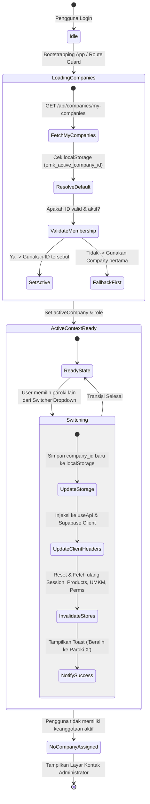
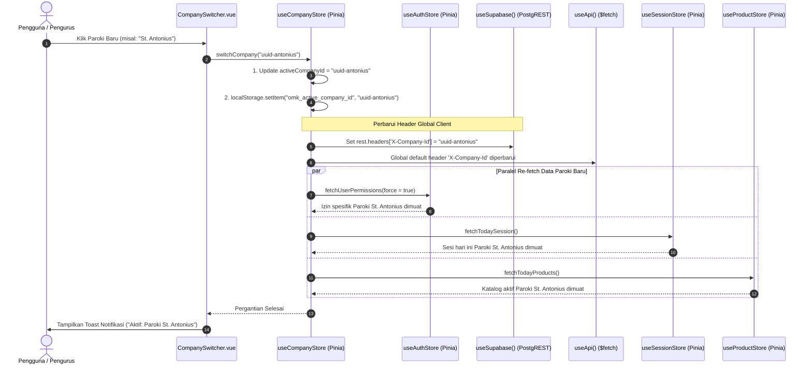
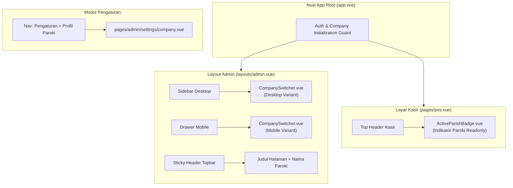

# Rencana Detail Fase 4 — Frontend Nuxt 4 Client, Pinia useCompanyStore, Header Injection, & UI Switcher

> **Fitur:** Multi-Company / Multi-Organisasi (Multi-Tenancy)  
> **Fase:** 4 dari 4 (Frontend Nuxt 4 Client State, Header Injection, Offline Queue Isolation, & UI Organization Switcher)  
> **Lokasi File Dokumen:** `docs/plans/proposed/multi-company/04_frontend_ui_and_switcher.md`  
> **Status Dokumen:** `PROPOSED / READY FOR REVIEW`  
> **Prasyarat:** Fase 1 (`01_database_and_data_migration.md`), Fase 2 (`02_rpc_views_and_rls.md`), dan Fase 3 (`03_backend_nitro_and_caching.md`) telah disetujui  
> **Target Runtime:** Nuxt 4 (Vue 3 Composition API `<script setup lang="ts">`) + Pinia + Tailwind CSS + IndexedDB (`idb`)  

---

## 1. Latar Belakang & Tujuan Fase 4

Setelah pondasi database (Fase 1), logika RLS & RPC (Fase 2), serta Nitro server & cache backend (Fase 3) siap, layer frontend Nuxt 4 (`app/`) harus mengintegrasikan konteks multi-organisasi secara mulus (*seamless*) bagi pengguna:

1. **State Management Terpusat (`useCompanyStore`):** Menyediakan single-source-of-truth di level client untuk menyimpan daftar organisasi yang dapat diakses pengguna (`availableCompanies`), organisasi yang sedang aktif dipilih (`activeCompany`), dan peran pengguna di organisasi tersebut.
2. **Injeksi Header Otomatis (`X-Company-Id`):** Menjamin setiap request HTTP ke server Nitro (`useApi`) maupun query langsung via PostgREST (`useSupabaseClient`) menyertakan identitas organisasi aktif tanpa perlu passing parameter manual di setiap komponen.
3. **Komponen UI Organization Switcher (`CompanySwitcher.vue`):** Komponen pemilih paroki/organisasi yang intuitif, elegan, dan mobile-friendly, terpasang di header layout admin maupun drawer mobile.
4. **Isolasi Layar Kasir (`/pos`):** Menampilkan badge paroki aktif secara visual di POS, mengunci transaksi hanya pada katalog sesi paroki terkait, dan mencegah kasir salah bertransaksi di paroki yang berbeda.
5. **Multi-Tenant Offline Queue (`idb`):** Menjamin transaksi offline di IndexedDB menyimpan `company_id` asal, sehingga antrean transaksi sinkronisasi tidak tertukar atau bocor ke organisasi lain saat kasir terhubung kembali ke internet.
6. **Halaman Pengaturan Profil Organisasi (`/admin/settings/company`):** Panel bagi pengurus paroki untuk menyesuaikan nama paroki, kode, nomor kontak, logo, serta catatan kaki (*receipt footer*) pada nota belanja.

---

## 2. Diagram Arsitektur Frontend & State Flow (Mermaid)

### 2.1 Alur State Machine Pergantian Organisasi (Company Switcher)



### 2.2 Diagram Urutan (Sequence) Injeksi Header & Re-fetch Data saat Beralih Organisasi



### 2.3 Hirarki Komponen UI & Layout Integration



---

## 3. Desain Pinia Store: `useCompanyStore` (`app/stores/company.ts`)

Store ini bertanggung jawab atas seluruh lifecycle identitas tenant di browser:

```typescript
// app/stores/company.ts
import { defineStore } from 'pinia'
import { ref, computed } from 'vue'
import type { Company, UserCompanyMembership } from '~/types/app'

const STORAGE_KEY = 'omk_active_company_id'

export const useCompanyStore = defineStore('company', () => {
  const supabase = useSupabase()
  const { apiFetch } = useApi()

  // State
  const activeCompanyId = ref<string | null>(null)
  const availableCompanies = ref<UserCompanyMembership[]>([])
  const activeCompanyDetail = ref<Company | null>(null)
  const isLoading = ref<boolean>(false)
  const error = ref<string | null>(null)

  // Getters
  const activeCompany = computed<UserCompanyMembership | null>(() => {
    if (!activeCompanyId.value) return null
    return availableCompanies.value.find(c => c.company_id === activeCompanyId.value) || null
  })

  const currentRole = computed<string>(() => {
    return activeCompany.value?.role || 'cashier'
  })

  const hasMultipleCompanies = computed<boolean>(() => {
    return availableCompanies.value.length > 1
  })

  const isSuperAdminTenant = computed<boolean>(() => {
    return activeCompany.value?.role === 'super_admin'
  })

  // Actions
  /**
   * Mengambil daftar organisasi yang dapat diakses pengguna
   */
  const fetchMyCompanies = async (): Promise<UserCompanyMembership[]> => {
    isLoading.value = true
    error.value = null
    try {
      const data = await apiFetch<UserCompanyMembership[]>('/api/companies/my-companies')
      availableCompanies.value = data || []
      return availableCompanies.value
    } catch (e: any) {
      error.value = e.message || 'Gagal memuat daftar organisasi'
      availableCompanies.value = []
      return []
    } finally {
      isLoading.value = false
    }
  }

  /**
   * Mengambil detail profil paroki aktif (logo, alamat, kontak, receipt_footer)
   */
  const fetchActiveCompanyDetail = async (): Promise<void> => {
    if (!activeCompanyId.value) return
    try {
      const data = await apiFetch<Company>('/api/companies/active')
      activeCompanyDetail.value = data
    } catch (e: any) {
      console.warn('Gagal memuat detail profil organisasi aktif:', e)
    }
  }

  /**
   * Mengatur dan menyinkronkan organisasi aktif
   */
  const setActiveCompany = async (companyId: string, refreshStores: boolean = true): Promise<void> => {
    const target = availableCompanies.value.find(c => c.company_id === companyId)
    if (!target) {
      throw new Error('Anda tidak memiliki akses ke organisasi yang dipilih')
    }

    activeCompanyId.value = companyId
    if (import.meta.client) {
      localStorage.setItem(STORAGE_KEY, companyId)
      // Suntikkan header PostgREST client secara reaktif (Web Standard Headers)
      if ((supabase as any)?.rest?.headers) {
        if (typeof (supabase as any).rest.headers.set === 'function') {
          (supabase as any).rest.headers.set('X-Company-Id', companyId)
        } else {
          (supabase as any).rest.headers['X-Company-Id'] = companyId
        }
      }
    }

    await fetchActiveCompanyDetail()

    // Refresh store terkait jika diminta
    if (refreshStores) {
      const authStore = useAuthStore()
      const sessionStore = useSessionStore()
      const productStore = useProductStore()
      const umkmStore = useUmkmStore()

      await Promise.allSettled([
        authStore.fetchUserPermissions(true),
        sessionStore.fetchTodaySession(),
        productStore.fetchTodayProducts(),
        umkmStore.fetchAll()
      ])
    }
  }

  /**
   * Switcher Helper dengan UI Feedback
   */
  const switchCompany = async (companyId: string): Promise<void> => {
    if (companyId === activeCompanyId.value) return
    isLoading.value = true
    try {
      await setActiveCompany(companyId, true)
    } finally {
      isLoading.value = false
    }
  }

  /**
   * Inisialisasi awal saat login atau reload browser
   */
  const initialize = async (): Promise<void> => {
    await fetchMyCompanies()
    if (availableCompanies.value.length === 0) {
      activeCompanyId.value = null
      return
    }

    let targetId: string | null = null
    if (import.meta.client) {
      targetId = localStorage.getItem(STORAGE_KEY)
    }

    // Jika target tersimpan valid di keanggotaan pengguna
    if (targetId && availableCompanies.value.some(c => c.company_id === targetId)) {
      await setActiveCompany(targetId, false)
    } else {
      // Fallback ke company pertama
      const firstCompanyId = availableCompanies.value[0].company_id
      await setActiveCompany(firstCompanyId, false)
    }
  }

  const reset = () => {
    activeCompanyId.value = null
    availableCompanies.value = []
    activeCompanyDetail.value = null
    if (import.meta.client) {
      localStorage.removeItem(STORAGE_KEY)
    }
  }

  return {
    activeCompanyId,
    availableCompanies,
    activeCompanyDetail,
    isLoading,
    error,
    activeCompany,
    currentRole,
    hasMultipleCompanies,
    isSuperAdminTenant,
    fetchMyCompanies,
    fetchActiveCompanyDetail,
    setActiveCompany,
    switchCompany,
    initialize,
    reset
  }
})
```

---

## 4. Injeksi Header Otomatis (`X-Company-Id`)

### 4.1 Modifikasi `app/composables/useApi.ts`
Setiap request yang dilakukan via `useApi()` akan menyertakan header `X-Company-Id` secara konsisten:

```typescript
// app/composables/useApi.ts
import { useAuthStore } from '~/stores/auth'
import { useCompanyStore } from '~/stores/company'

export const useApi = () => {
  const supabase = useSupabase()

  const apiFetch = async <T>(url: string, opts: any = {}): Promise<T> => {
    const headers: Record<string, string> = {
      ...(opts.headers || {})
    }

    try {
      // 1. Injeksi Token Autentikasi
      const { data } = await supabase.auth.getSession()
      if (data?.session?.access_token) {
        headers['Authorization'] = `Bearer ${data.session.access_token}`
      }

      // 2. Injeksi Tenant Context Header
      const companyStore = useCompanyStore()
      if (companyStore.activeCompanyId) {
        headers['X-Company-Id'] = companyStore.activeCompanyId
      }
    } catch {
      // Abaikan error pembacaan context
    }

    return $fetch<T>(url, {
      ...opts,
      headers
    })
  }

  return {
    apiFetch
  }
}
```

### 4.2 Modifikasi `app/composables/useSupabase.ts`
PostgREST klien Supabase di Nuxt 4 perlu dikonfigurasikan agar header default `X-Company-Id` terbaca oleh database:

```typescript
// app/composables/useSupabase.ts
import type { Database } from '~/types/database.types'
import { useCompanyStore } from '~/stores/company'

export const useSupabase = () => {
  const client = useSupabaseClient<Database>()
  
  // Sinkronkan header x-company-id bila store telah aktif
  try {
    const companyStore = useCompanyStore()
    if (companyStore.activeCompanyId && (client as any)?.rest?.headers) {
      if (typeof (client as any).rest.headers.set === 'function') {
        (client as any).rest.headers.set('X-Company-Id', companyStore.activeCompanyId)
      } else {
        (client as any).rest.headers['X-Company-Id'] = companyStore.activeCompanyId
      }
    }
  } catch {
    // Pada saat bootstrap awal store mungkin belum ter-register
  }

  return client
}
```

---

## 5. Desain Komponen UI `CompanySwitcher.vue`

File komponen baru: `app/components/ui/CompanySwitcher.vue`

```vue
<!-- app/components/ui/CompanySwitcher.vue -->
<script setup lang="ts">
import { ref, computed, onMounted, onUnmounted } from 'vue'
import { useCompanyStore } from '~/stores/company'
import { useToast } from '~/composables/useToast'

const props = withDefaults(defineProps<{
  variant?: 'sidebar' | 'topbar' | 'mobile'
}>(), {
  variant: 'sidebar'
})

const companyStore = useCompanyStore()
const { addToast } = useToast()
const isOpen = ref(false)

const currentCompany = computed(() => companyStore.activeCompany)
const companies = computed(() => companyStore.availableCompanies)

const toggleDropdown = () => {
  if (!companyStore.hasMultipleCompanies) return
  isOpen.value = !isOpen.value
}

const selectCompany = async (companyId: string) => {
  if (companyId === companyStore.activeCompanyId) {
    isOpen.value = false
    return
  }

  try {
    await companyStore.switchCompany(companyId)
    addToast({
      type: 'success',
      message: `Beralih ke ${companyStore.activeCompany?.company_name}`
    })
  } catch (err: any) {
    addToast({
      type: 'danger',
      message: err.message || 'Gagal beralih organisasi'
    })
  } finally {
    isOpen.value = false
  }
}

const handleClickOutside = (e: MouseEvent) => {
  const target = e.target as HTMLElement
  if (isOpen.value && !target.closest('[data-company-switcher]')) {
    isOpen.value = false
  }
}

onMounted(() => {
  document.addEventListener('click', handleClickOutside)
})

onUnmounted(() => {
  document.removeEventListener('click', handleClickOutside)
})
</script>

<template>
  <div data-company-switcher class="relative w-full">
    <!-- Single Company Badge (Jika hanya punya akses 1 paroki) -->
    <div
      v-if="!companyStore.hasMultipleCompanies"
      class="flex items-center gap-2.5 px-3 py-2 rounded-xl bg-slate-800/60 border border-slate-700/60 text-slate-200"
    >
      <div class="h-7 w-7 rounded-lg bg-brand-600/30 text-brand-400 border border-brand-500/30 flex items-center justify-center shrink-0">
        <Icon name="heroicons:building-library" class="w-4 h-4" />
      </div>
      <div class="min-w-0 flex-1">
        <p class="text-xs font-bold text-white truncate">{{ currentCompany?.company_name || 'Memuat...' }}</p>
        <p class="text-[9px] font-mono text-slate-400 uppercase tracking-wider">{{ currentCompany?.company_code || 'OMK' }}</p>
      </div>
    </div>

    <!-- Multi-Company Switcher Trigger Button -->
    <button
      v-else
      type="button"
      @click.stop="toggleDropdown"
      class="w-full flex items-center justify-between gap-2 px-3 py-2 rounded-xl text-left transition-all duration-150 group border"
      :class="[
        isOpen
          ? 'bg-slate-800 border-brand-500 ring-2 ring-brand-500/20 text-white'
          : 'bg-slate-800/50 hover:bg-slate-800 border-slate-700/70 text-slate-200'
      ]"
      :title="`Klik untuk beralih organisasi (Aktif: ${currentCompany?.company_name})`"
    >
      <div class="flex items-center gap-2.5 min-w-0 flex-1">
        <div class="h-7 w-7 rounded-lg bg-brand-600 text-white flex items-center justify-center shrink-0 shadow-sm">
          <Icon name="heroicons:building-library" class="w-4 h-4" />
        </div>
        <div class="min-w-0 flex-1">
          <p class="text-xs font-bold text-white truncate group-hover:text-brand-300 transition-colors">
            {{ currentCompany?.company_name || 'Pilih Organisasi' }}
          </p>
          <div class="flex items-center gap-1.5">
            <span class="text-[9px] font-mono text-brand-400 uppercase font-semibold">
              {{ currentCompany?.company_code }}
            </span>
            <span class="text-[9px] text-slate-500">•</span>
            <span class="text-[9px] text-slate-400 uppercase">
              {{ currentCompany?.role }}
            </span>
          </div>
        </div>
      </div>

      <Icon
        name="heroicons:chevron-up-down"
        class="w-4 h-4 text-slate-400 group-hover:text-white shrink-0 transition-transform duration-200"
        :class="{ 'rotate-180 text-brand-400': isOpen }"
      />
    </button>

    <!-- Dropdown Menu -->
    <div
      v-if="isOpen"
      class="absolute left-0 right-0 mt-2 z-50 rounded-2xl bg-slate-900 border border-slate-700 shadow-2xl py-2 max-h-72 overflow-y-auto divide-y divide-slate-800/80 backdrop-blur-md"
      @click.stop
    >
      <div class="px-3 py-1.5 text-[9px] font-mono font-bold text-slate-400 uppercase tracking-wider">
        PILIH PAROKI / ORGANISASI
      </div>

      <div class="py-1">
        <button
          v-for="item in companies"
          :key="item.company_id"
          type="button"
          @click="selectCompany(item.company_id)"
          class="w-full flex items-center justify-between gap-3 px-3 py-2 text-left transition-colors duration-150 group"
          :class="[
            item.company_id === companyStore.activeCompanyId
              ? 'bg-brand-600/15 text-white'
              : 'text-slate-300 hover:bg-slate-800/70 hover:text-white'
          ]"
        >
          <div class="min-w-0 flex-1">
            <div class="flex items-center gap-2">
              <span class="text-xs font-bold truncate">{{ item.company_name }}</span>
              <span
                v-if="item.company_id === companyStore.activeCompanyId"
                class="h-1.5 w-1.5 rounded-full bg-emerald-400 shrink-0"
              />
            </div>
            <div class="flex items-center gap-1.5 mt-0.5">
              <span class="text-[9px] font-mono text-slate-400 uppercase">{{ item.company_code }}</span>
              <span class="text-[9px] text-slate-600">•</span>
              <span class="text-[9px] text-slate-400 capitalize font-medium">{{ item.role }}</span>
            </div>
          </div>

          <Icon
            v-if="item.company_id === companyStore.activeCompanyId"
            name="heroicons:check"
            class="w-4 h-4 text-emerald-400 shrink-0"
          />
        </button>
      </div>

      <!-- Super Admin Tag -->
      <div v-if="companyStore.isSuperAdminTenant" class="px-3 py-1.5 bg-slate-950/40">
        <p class="text-[8px] text-amber-400 font-mono flex items-center gap-1">
          <Icon name="heroicons:shield-check" class="w-3 h-3" />
          Platform Super Admin Mode
        </p>
      </div>
    </div>
  </div>
</template>
```

---

## 6. Adaptasi Layout Admin & Layar Kasir

### 6.1 Modifikasi `app/layouts/admin.vue`
Menempatkan `CompanySwitcher` pada Sidebar Desktop dan Drawer Mobile tepat di bawah Header Logo, serta menambahkan nama paroki pada sticky header:

```vue
<!-- Modifikasi pada app/layouts/admin.vue -->
<template>
  <div class="min-h-screen bg-slate-50 flex font-sans text-slate-800 antialiased">
    <!-- Sidebar Desktop -->
    <aside class="hidden lg:flex flex-col w-64 bg-slate-900 text-slate-200 border-r border-slate-800 shrink-0 h-screen sticky top-0">
      <!-- Logo / Header -->
      <div class="p-5 border-b border-slate-800 flex items-center gap-3 shrink-0">
        <div class="h-9 w-9 rounded-xl bg-brand-500 flex items-center justify-center shadow-md">
          <Icon name="heroicons:shield-check" class="w-5 h-5 text-white" />
        </div>
        <div>
          <h2 class="text-sm font-black text-white tracking-tight uppercase leading-none">OMK POS Admin</h2>
          <span class="text-[9px] text-slate-400 font-mono tracking-wider">PANEL PENGELOLA</span>
        </div>
      </div>

      <!-- Organization Switcher Widget (BARU) -->
      <div class="px-3 pt-3 shrink-0">
        <CompanySwitcher variant="sidebar" />
      </div>

      <!-- Session Status Widget -->
      <div class="p-3 mx-3 my-3 bg-slate-800/50 rounded-xl border border-slate-800 shrink-0">
        ...
      </div>
      ...
    </aside>

    <!-- Drawer Mobile -->
    <div v-if="isMobileMenuOpen" ...>
      ...
      <!-- Organization Switcher Mobile (BARU) -->
      <div class="px-3 pt-3 shrink-0">
        <CompanySwitcher variant="mobile" />
      </div>
      ...
    </div>

    <!-- Top Sticky Header -->
    <header class="sticky top-0 z-40 bg-white/95 backdrop-blur-md border-b border-slate-200/80 px-4 py-3 flex items-center justify-between shadow-sm">
      <div class="flex items-center gap-3">
        ...
        <div>
          <h1 class="text-md md:text-lg font-black text-slate-800 tracking-tight leading-tight">{{ pageTitle }}</h1>
          <!-- Subtitle Nama Paroki Aktif (BARU) -->
          <p class="text-[10px] text-slate-500 font-medium hidden sm:block">
            Organisasi: <span class="font-bold text-slate-700">{{ companyStore.activeCompany?.company_name }}</span>
          </p>
        </div>
      </div>
      ...
    </header>
    ...
  </div>
</template>
```

### 6.2 Modifikasi Layar Kasir (`app/pages/pos.vue`)
Di layar POS, kasir harus mengetahui secara jelas paroki mana yang sedang ia layani untuk mencegah kesalahan operasional:

```vue
<!-- Modifikasi pada app/pages/pos.vue header -->
<template>
  <div class="min-h-screen bg-slate-100 flex flex-col font-sans select-none">
    <!-- POS Header Topbar -->
    <header class="bg-slate-900 text-white px-4 py-3 flex items-center justify-between shadow-md shrink-0">
      <div class="flex items-center gap-3">
        <!-- Logo & Nama Aplikasi -->
        <div class="h-8 w-8 rounded-lg bg-brand-500 flex items-center justify-center font-bold text-sm">
          POS
        </div>
        <div>
          <h1 class="text-sm font-black tracking-tight leading-none">OMK Cashier</h1>
          <!-- Indikator Paroki Aktif Kasir (BARU) -->
          <div class="flex items-center gap-1.5 mt-1">
            <span class="inline-flex items-center gap-1 text-[9px] font-bold text-brand-300 bg-brand-900/60 px-2 py-0.5 rounded-full border border-brand-700">
              <Icon name="heroicons:building-library" class="w-2.5 h-2.5 text-brand-400" />
              {{ companyStore.activeCompany?.company_name || 'Memuat Paroki...' }}
            </span>
          </div>
        </div>
      </div>

      <div class="flex items-center gap-2.5">
        <OfflineBanner />
        <ProfileDropdown variant="dark" />
      </div>
    </header>
    ...
  </div>
</template>
```

---

## 7. Adaptasi Offline Queue Multi-Tenant (`app/composables/useOfflineQueue.ts`)

Saat koneksi internet gereja mati, kasir tetap mencatat transaksi di IndexedDB. Kita wajib menambahkan `company_id` pada payload transaksi offline untuk menjamin transaksi tidak di-upload ke organisasi lain saat reconnect:

```typescript
// app/composables/useOfflineQueue.ts
import { openDB } from 'idb'
import type { CartItem } from '~/types/pos'

const DB_NAME = 'omk-pos-offline'
const STORE_NAME = 'pending-transactions'

export interface PendingTransaction {
  id:                string          // Local UUID
  company_id:        string          // UUID Organisasi Asal (BARU)
  timestamp:         string          // ISO string
  session_id:        string
  cashier_id:        string
  nominal_diterima:  number
  cart_items:        CartItem[]
  metode_pembayaran: 'cash' | 'qris'
  status:            'pending' | 'synced' | 'failed'
  error_message?:    string
}

export const useOfflineQueue = () => {
  const getDb = () => openDB(DB_NAME, 2, {
    upgrade(db, oldVersion) {
      if (oldVersion < 1) {
        db.createObjectStore(STORE_NAME, { keyPath: 'id' })
      }
      if (oldVersion < 2) {
        // Tambahkan indeks company_id untuk filtering antrean
        const store = db.transaction(STORE_NAME, 'versionchange').objectStore(STORE_NAME)
        if (!store.indexNames.contains('by_company')) {
          store.createIndex('by_company', 'company_id', { unique: false })
        }
      }
    }
  })

  const enqueue = async (transaction: Omit<PendingTransaction, 'status'>) => {
    const db = await getDb()
    await db.put(STORE_NAME, { ...transaction, status: 'pending' })
  }

  /**
   * Mengambil antrean pending khusus untuk company yang sedang aktif
   */
  const getPending = async (companyId?: string): Promise<PendingTransaction[]> => {
    const db = await getDb()
    const all: PendingTransaction[] = await db.getAll(STORE_NAME)
    
    let filtered = all.filter(t => t.status === 'pending')
    if (companyId) {
      filtered = filtered.filter(t => t.company_id === companyId)
    }

    return filtered.sort(
      (a, b) => new Date(a.timestamp).getTime() - new Date(b.timestamp).getTime()
    )
  }

  const markSynced = async (id: string) => {
    const db = await getDb()
    const record = await db.get(STORE_NAME, id)
    if (record) await db.put(STORE_NAME, { ...record, status: 'synced' })
  }

  const markFailed = async (id: string, errorMessage: string) => {
    const db = await getDb()
    const record = await db.get(STORE_NAME, id)
    if (record) await db.put(STORE_NAME, { ...record, status: 'failed', error_message: errorMessage })
  }

  return { enqueue, getPending, markSynced, markFailed }
}
```

### 7.2 Penyelarasan Realtime Subscription Channels (Supabase Realtime)
Karena WebSocket Realtime tidak meneruskan HTTP header `X-Company-Id`, seluruh subscription realtime di client **wajib diberi filter eksplisit `company_id`** agar tidak mencampur data antar-paroki:

```typescript
// 1. Pada app/pages/admin/dashboard.vue (Notifikasi Transaksi Realtime)
const companyStore = useCompanyStore()
const channel = supabase
  .channel(`admin-transactions-${companyStore.activeCompanyId}`)
  .on('postgres_changes', {
    event: 'INSERT',
    schema: 'public',
    table: 'transactions',
    filter: `company_id=eq.${companyStore.activeCompanyId}`
  }, (payload) => {
    // Tangani transaksi baru paroki aktif
    handleNewTransaction(payload.new)
  })
  .subscribe()

// 2. Pada app/stores/umkm.ts (Sinkronisasi Data Mitra UMKM)
const channel = supabase
  .channel(`umkm-changes-${companyStore.activeCompanyId}`)
  .on('postgres_changes', {
    event: '*',
    schema: 'public',
    table: 'umkm',
    filter: `company_id=eq.${companyStore.activeCompanyId}`
  }, () => {
    fetchAll()
  })
  .subscribe()
```

---

## 8. Halaman Pengaturan Organisasi & Adaptasi Halaman Publik

### 8.1 Halaman Pengaturan Profil Organisasi (`app/pages/admin/settings/company.vue`)

Menyediakan antarmuka bagi Admin Paroki untuk memodifikasi profil lembaganya:
1. **Identitas Utama:** Nama Lengkap Organisasi / Paroki, Singkatan / Kode Unik (misal: `BOSKO`, `TERESIA`).
2. **Kontak Resmi:** Nomor WhatsApp / Telepon Paroki, Alamat Lengkap Gereja.
3. **Konfigurasi Nota POS (`receipt_footer`):** Kalimat penutup pada struk kasir (misal: *"Terima kasih telah berbelanja & mendukung UMKM Paroki St. Yohanes Bosko. Berkah Dalem."*).
4. **Proteksi Hak Akses:** Menggunakan middleware `admin` dan validasi izin `company:manage`.

### 8.2 Penyesuaian Halaman Publik UMKM (`app/pages/umkm/performance/[umkm_id].vue`)
Untuk menjaga integritas **Fitur 13 (LOCKED)** agar dapat diakses oleh mitra tanpa login:
- Mengganti query langsung PostgREST client (yang terhalang RLS `TO authenticated`) dengan pemanggilan endpoint publik Nitro:
  ```typescript
  // app/pages/umkm/performance/[umkm_id].vue
  const { data, error } = await useFetch(`/api/public/umkm-performance/${umkmId}`)
  if (data.value) {
    umkmName.value = data.value.umkm.nama_umkm
    products.value = data.value.products
    sessions.value = data.value.sessions
  }
  ```
- Pendekatan ini menjamin halaman tetap dapat diakses publik via WhatsApp tanpa melonggarkan keamanan RLS database.

---

## 9. Penyesuaian Router Middleware & Navigation Guards

### 9.1 Modifikasi `app/middleware/auth.ts`
Menjamin store organisasi diinisialisasi sebelum navigasi ke route yang dilindungi:

```typescript
// app/middleware/auth.ts
import { useAuthStore } from '~/stores/auth'
import { useCompanyStore } from '~/stores/company'

export default defineNuxtRouteMiddleware(async (to, from) => {
  const user = useSupabaseUser()
  const authStore = useAuthStore()
  const companyStore = useCompanyStore()

  if (!user.value) {
    return navigateTo('/login')
  }

  if (user.value?.user_metadata?.is_active === false) {
    authStore.logout()
    return navigateTo('/login')
  }

  // Redirect to change-password if force_password_change flag is set
  if (authStore.needsPasswordChange && to.path !== '/change-password') {
    return navigateTo('/change-password')
  }

  // Inisialisasi Organisasi Pengguna
  if (companyStore.availableCompanies.length === 0) {
    await companyStore.initialize()
  }

  // Jika pengguna tidak terdaftar di organisasi manapun
  if (companyStore.availableCompanies.length === 0 && to.path !== '/no-company') {
    return navigateTo('/no-company')
  }
})
```

---

## 10. Matriks Pengujian Frontend (Vitest)

Pengujian unit dan integrasi untuk menjamin stabilitas fungsional:

| File Uji | Skenario Pengujian | Hasil yang Diharapkan |
|---|---|---|
| `app/stores/__tests__/company.spec.ts` | 1. Inisialisasi awal membaca `localStorage` | `activeCompanyId` terpasang sesuai storage atau fallback ke company[0]. |
| `app/stores/__tests__/company.spec.ts` | 2. Gagal switch ke organisasi tak berhak | Melemparkan error dan tidak mengubah `activeCompanyId`. |
| `app/stores/__tests__/company.spec.ts` | 3. Berhasil switch organisasi | Header `X-Company-Id` PostgREST ter-update, memicu re-fetch session & products. |
| `app/composables/__tests__/useApi.spec.ts` | 1. Injeksi header otomatis pada `$fetch` | Header `Authorization` dan `X-Company-Id` terkirim dalam opsi request. |
| `app/composables/__tests__/useOfflineQueue.spec.ts` | 1. Enqueue transaksi offline | Payload transaksi IndexedDB memiliki atribut `company_id`. |
| `app/composables/__tests__/useOfflineQueue.spec.ts` | 2. Filter `getPending(companyId)` | Hanya mengembalikan antrean milik organisasi terkait. |
| `app/components/ui/__tests__/CompanySwitcher.spec.ts` | 1. Render single vs multi company | Jika hanya 1 paroki: render badge statis; Jika > 1: render dropdown button. |

---

## 11. Checklist Verifikasi & Kriteria Penerimaan Fase 4

- [ ] **State Persistence:** Merefresh browser di sembarang halaman tetap mempertahankan paroki aktif yang terakhir dipilih.
- [ ] **Data Isolation:** Mengubah paroki dari Switcher langsung mengubah daftar produk di `/pos`, sesi aktif di `/admin/dashboard`, dan daftar UMKM di `/admin/umkm`.
- [ ] **Header Inspection:** Di tab Network DevTools, seluruh pemanggilan ke `/api/*` dan `/rest/v1/*` memiliki header HTTP `x-company-id: <active-uuid>`.
- [ ] **Responsive Design:** Dropdown Company Switcher dapat diakses dengan baik di layar HP (*mobile drawer*) maupun Desktop (*sidebar*).
- [ ] **Offline Safety:** Transaksi offline saat internet mati tersimpan dengan aman dengan tag `company_id` yang sesuai dan tersinkronisasi tanpa konflik.
- [ ] **Semua Unit Test Lolos:** `npm test` lulus 100% tanpa regresi pada 14 fitur *LOCKED* eksisting.
