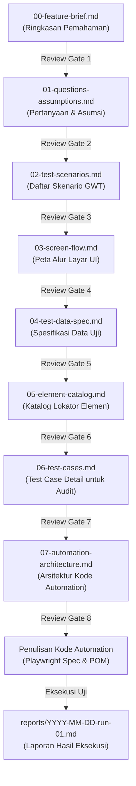

# Dokumentasi QA & Pengujian UI — OMK POS

Dokumen ini adalah **Panduan Induk & Standar Operasional Prosedur (SOP)** untuk pengujian kualitas antarmuka pengguna (UI QA) di seluruh fitur repositori **OMK POS**.

---

## 1. Filosofi & Alur Kerja Bertahap (Progressive Review Workflow)

Untuk mencegah kesalahan pemahaman dan penulisan test code yang sia-sia, seluruh dokumentasi QA disusun secara **bertahap (9 Tahap)**. Setiap dokumen **wajib direview dan disetujui** sebelum melangkah ke tahap berikutnya.



---

## 2. Urutan Dokumen & Status Wajib

| No | Nama Dokumen | Fungsi Utama | Kategori Wajib? | Review Gate |
|:---:|---|---|:---:|---|
| **1** | `00-feature-brief.md` | Ringkasan pemahaman fitur, batasan bisnis, konsinyasi, dan konfirmasi ruang lingkup | **Wajib** | Konfirmasi pemahaman tim |
| **2** | `01-questions-assumptions.md` | Mencatat hal ambigu, edge-case tak tertulis, dan asumsi kerja | **Wajib** | Konfirmasi stakeholder/user |
| **3** | `02-test-scenarios.md` | Daftar skenario uji format *Given-When-Then*, prioritas P0-P3, dan cakupan | **Wajib** | Persetujuan ruang lingkup skenario |
| **4** | `03-screen-flow.md` | Urutan halaman, modal dialog, elemen sentuh, dan kondisi navigasi | **Wajib** | Validasi ergonomi sentuh & alur |
| **5** | `04-test-data-spec.md` | Data awal, akun per role, kondisi database, cara setup dan cleanup | **Wajib** | Kesiapan lingkungan uji deterministik |
| **6** | `05-element-catalog.md` | Daftar elemen yang diuji beserta rekomendasi selektor `data-testid` | **Sangat Disarankan** | Kestabilan lokator anti-flaky |
| **7** | `06-test-cases.md` | Langkah lengkap per skenario, data uji, ekspektasi visual, API, dan database | **Wajib untuk Audit** | Dasar pengujian manual & E2E |
| **8** | `07-automation-architecture.md`| Struktur folder, pola POM, konvensi penamaan, dan standar asersi Playwright | **Wajib sebelum coding** | Standar baku kode automation |
| **9** | `reports/YYYY-MM-DD-run-01.md` | Hasil run eksekusi, metrik lulus/gagal, analisis kegagalan, dan rekomendasi rilis | **Setelah eksekusi** | Kelayakan rilis ke staging/prod |

---

## 3. Struktur Direktori Dokumentasi QA

```
pos-omk/
├── docs/
│   └── qa/
│       ├── README.md                      # (Dokumen ini) Panduan induk QA
│       ├── _template/                     # Template standar 9 dokumen QA
│       │   ├── 00-feature-brief.md
│       │   ├── 01-questions-assumptions.md
│       │   ├── 02-test-scenarios.md
│       │   ├── 03-screen-flow.md
│       │   ├── 04-test-data-spec.md
│       │   ├── 05-element-catalog.md
│       │   ├── 06-test-cases.md
│       │   ├── 07-automation-architecture.md
│       │   └── reports/
│       │       └── template-execution-report.md
│       │
│       ├── f01-auth-rbac/                 # Fitur F-01: Autentikasi & RBAC
│       ├── f02-pos-cashier/               # Fitur F-02: Kasir POS Real-time
│       ├── f03-pwa-offline/               # Fitur F-03: PWA & Offline Queue
│       ├── f04-umkm-master/               # Fitur F-04: Master Data UMKM
│       ├── f05-session-setup/             # Fitur F-05: Setup Sesi Mingguan
│       ├── f06-financial-dashboard/       # Fitur F-06: Dashboard Finansial Sesi
│       ├── f07-stock-reconciliation/      # Fitur F-07: Rekonsiliasi Stok Akhir
│       ├── f08-whatsapp-reports/          # Fitur F-08: Generator Laporan WA
│       ├── f09-session-history/           # Fitur F-09: Riwayat Sesi & Log Kasir
│       ├── f10-sales-analytics/           # Fitur F-10: Analitik Penjualan
│       ├── f11-cash-flow/                 # Fitur F-11: Buku Kas Operasional
│       ├── f12-umkm-settlements/          # Fitur F-12: Pembayaran Bagi Hasil UMKM
│       ├── f13-public-umkm-portal/        # Fitur F-13: Portal Publik UMKM
│       ├── f14-user-management/           # Fitur F-14: Manajemen Pengguna
│       ├── f15-multi-parish-tenancy/      # Fitur F-15: Multi-Parish Tenancy
│       └── f16-roles-permissions/         # Fitur F-16: Dynamic Roles & Permissions
```

---

## 4. Matriks Direktori Fitur (F-01 s/d F-16)

| Kode Fitur | Nama Direktori QA | Rute Halaman | Status Dokumen | Komponen / Endpoint Terkait |
|:---:|---|---|:---:|---|
| **F-01** | [`docs/qa/f01-auth-rbac/`](./f01-auth-rbac/) | `/login`, `/change-password`, `/reset-password` | ✅ **9/9 Complete** | Supabase Auth, middleware `auth.ts`, `admin.ts` |
| **F-02** | [`docs/qa/f02-pos-cashier/`](./f02-pos-cashier/) | `/pos` | ✅ **9/9 Complete** | `useCartStore`, RPC `complete_transaction` |
| **F-03** | `docs/qa/f03-pwa-offline/` | `/pos` (Offline Context) | ⏳ Ready | `useOfflineQueue.ts`, `OfflineBanner.vue`, `idb` |
| **F-04** | [`docs/qa/f04-umkm-master/`](./f04-umkm-master/) | `/admin/umkm`, `/admin/umkm/[umkm_id]` | ✅ **9/9 Complete** | `useUmkmStore`, tabel `umkm`, `master_products` |
| **F-05** | `docs/qa/f05-session-setup/` | `/admin/setup`, `/admin/setup/[umkm_id]` | ⏳ Ready | `useSessionStore`, RPC `get_product_stock_recommendation` |
| **F-06** | `docs/qa/f06-financial-dashboard/` | `/admin/dashboard` | ⏳ Ready | RPC `get_session_financial_summary`, `reopen_session` |
| **F-07** | `docs/qa/f07-stock-reconciliation/`| `/admin/reconciliation` | ⏳ Ready | RPC `close_session`, tabel `reconciliation` |
| **F-08** | `docs/qa/f08-whatsapp-reports/` | `/admin/reports` | ⏳ Ready | `app/utils/report.ts`, format WA clipboard |
| **F-09** | `docs/qa/f09-session-history/` | `/admin/history` | ⏳ Ready | `useHistoryStore`, view `session_history_summary` |
| **F-10** | `docs/qa/f10-sales-analytics/` | `/admin/analytics` | ⏳ Ready | `chart.js`, RPC `get_weekly_trends`, view doughnut |
| **F-11** | `docs/qa/f11-cash-flow/` | `/admin/cash-flow` | ⏳ Ready | `useCashFlowStore`, RPC `add_cash_flow` |
| **F-12** | `docs/qa/f12-umkm-settlements/` | `/admin/payments` | ⏳ Ready | `usePaymentStore`, RPC `mark_umkm_as_paid` |
| **F-13** | `docs/qa/f13-public-umkm-portal/` | `/umkm/performance/[umkm_id]` | ⏳ Ready | `server/api/public/umkm-performance/*` |
| **F-14** | `docs/qa/f14-user-management/` | `/admin/users` | ⏳ Ready | `server/api/users/*`, modal granular permissions |
| **F-15** | `docs/qa/f15-multi-parish-tenancy/`| `/admin/settings/company` | ⏳ Ready | `CompanySwitcher.vue`, `X-Company-Id` header |
| **F-16** | `docs/qa/f16-roles-permissions/` | `/admin/roles`, `/admin/permissions` | ⏳ Ready | `server/api/roles/*`, in-memory cache `rbacCache.ts` |

---

## 5. Konvensi Penamaan ID Pengujian

Untuk mempermudah rujukan silang (*cross-reference*) antar dokumen dan kode pengujian, gunakan format kode identifikasi baku:

| Format ID | Deskripsi | Contoh |
|---|---|---|
| `F-XX` | Kode Fitur Utama | `F-02`, `F-05` |
| `Q-XX` | Kode Pertanyaan Pengujian | `Q-01`, `Q-02` |
| `A-XX` | Kode Asumsi Kerja | `A-01`, `A-02` |
| `S-XX` | Kode Skenario Pengujian (*Given-When-Then*) | `S-01`, `S-02` |
| `TC-XX` | Kode Test Case Detail | `TC-01`, `TC-02` |
| `RUN-YYYY-MM-DD-XX` | Kode Run Eksekusi Laporan | `RUN-2026-10-10-01` |
| `FAIL-XX` | Kode Analisis Kegagalan Pengujian | `FAIL-01` |

---

## 6. Cara Memulai Fitur Baru dari Template

Ketika hendak menyusun dokumen QA untuk suatu fitur (contoh: `F-02 Real-time POS Cashier Screen`):

1. **Buat Direktori Fitur:**
   ```bash
   mkdir -p docs/qa/f02-pos-cashier/reports
   ```
2. **Salin Template:**
   ```bash
   cp docs/qa/_template/00-feature-brief.md docs/qa/f02-pos-cashier/
   cp docs/qa/_template/01-questions-assumptions.md docs/qa/f02-pos-cashier/
   cp docs/qa/_template/02-test-scenarios.md docs/qa/f02-pos-cashier/
   cp docs/qa/_template/03-screen-flow.md docs/qa/f02-pos-cashier/
   cp docs/qa/_template/04-test-data-spec.md docs/qa/f02-pos-cashier/
   cp docs/qa/_template/05-element-catalog.md docs/qa/f02-pos-cashier/
   cp docs/qa/_template/06-test-cases.md docs/qa/f02-pos-cashier/
   cp docs/qa/_template/07-automation-architecture.md docs/qa/f02-pos-cashier/
   ```
3. **Mulai dari Dokumen 1 (`00-feature-brief.md`):**
   Isi ringkasan fitur, minta review ke user/stakeholder. Setelah di-approve, lanjut bertahap ke dokumen 2 (`01-questions-assumptions.md`), dan seterusnya hingga tahap 8 sebelum menulis kode pengujian otomatis.
