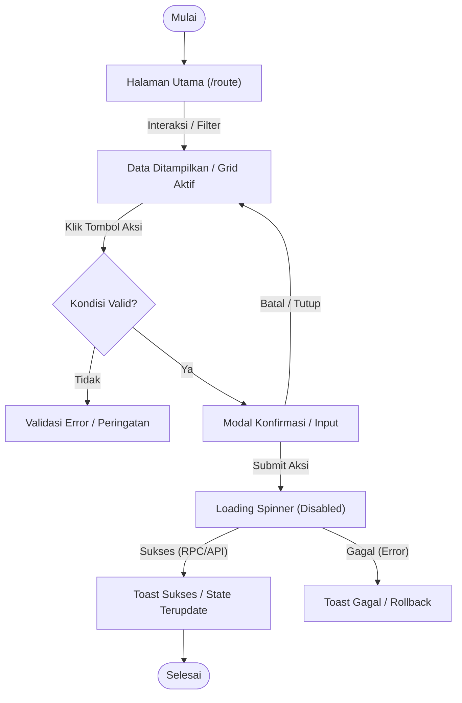

# Peta Alur UI (Screen Flow): [NAMA_FITUR] ([KODE_FITUR])

> **Dokumen Tahap 4/9 — Urutan Layar & Transisi Antarmuka Pengguna**  
> *Fungsi: Memetakan secara detail setiap halaman, modal dialog, elemen antarmuka, interaksi sentuh/klik, kondisi prasyarat, serta hasil yang diharapkan pada tiap langkah sebelum perumusan data uji dan lokator.*

---

## 1. Metadata Dokumen

| Atribut | Nilai |
|---|---|
| **ID Fitur** | `[F-XX / KODE_FITUR]` |
| **Nama Fitur** | `[Nama Fitur Lengkap]` |
| **Jumlah Layar / Modal** | `[Jumlah screen & dialog yang terlibat]` |
| **Viewport Target** | `Mobile (375×667 / PWA) & Desktop (1280×800 / Admin)` |
| **Status Dokumen** | `DRAFT / IN REVIEW / APPROVED` |
| **QA Engineer** | `[Nama QA / Agent]` |

---

## 2. Diagram Alur Transisi Layar (Screen State Diagram)



---

## 3. Rincian Alur Layar Per Halaman (Screen-by-Screen Breakdown)

### 3.1 Layar 1: [Nama Halaman / Rute Utama]
- **Rute URL:** `[/admin/... atau /pos]`
- **Kondisi Akses:** `[Wajib login sebagai role X, sesi hari ini harus aktif, dsb.]`
- **Tampilan Awal:** `[Tabel kosong / Skeleton loading / Data master terisi]`

#### Elemen & Aksi:
```
Halaman: [/route-url]
  Elemen: [Nama Elemen Input / Tombol] (data-testid="[feature-element-name]")
  Aksi: [User mengklik / mengetik / memilih opsi]
  Hasil yang diharapkan: [Perubahan visual / modal muncul / data tersaring]
  Kondisi: [Field tidak boleh kosong / minimal 3 karakter / dll.]
```

```
Halaman: [/route-url]
  Elemen: [Tombol Buka Modal / Tambah Data] (data-testid="[feature-add-btn]")
  Aksi: [Klik tombol]
  Hasil yang diharapkan: [Modal dialog muncul di atas overlay backdrop gelap]
  Kondisi: [Hanya aktif jika pengguna memiliki izin 'write']
```

---

### 3.2 Layar 2: [Modal Dialog / Sub-halaman Konfirmasi]
- **Nama Komponen:** `[AppModal / Sub-route]`
- **Kondisi Muncul:** `[Dipicu oleh aksi dari Layar 1]`
- **Backdrop & Focus Trap:** `[Backdrop blur/gelap, ESC untuk tutup, fokus otomatis pada input pertama]`

#### Elemen & Aksi:
```
Halaman: [Modal: Dialog Konfirmasi / Formulir]
  Elemen: [Field Input 1] (data-testid="[modal-input-field]")
  Aksi: [Ketik nilai formulir]
  Hasil yang diharapkan: [Format Rupiah otomatis muncul / teks tervalidasi]
  Kondisi: [Harus integer valid, tidak boleh minus]

Halaman: [Modal: Dialog Konfirmasi / Formulir]
  Elemen: [Tombol Submit Primer] (data-testid="[modal-submit-btn]")
  Aksi: [Klik submit]
  Hasil yang diharapkan: [Tombol berubah menjadi spinner loading, modal tertutup saat sukses, toast notifikasi muncul]
  Kondisi: [Semua field required terisi dengan benar]
```

---

### 3.3 Layar 3: [Layar Hasil / Feedback / Redirection]
- **Rute URL:** `[/route-tujuan atau tetap di halaman dengan state baru]`
- **Perubahan State:** `[Baris baru ditambahkan ke tabel, saldo berkurang, stok berkurang, dsb.]`

#### Elemen & Aksi:
```
Halaman: [/route-tujuan]
  Elemen: [Toast Notifikasi Sukses] (data-testid="[app-toast-success]")
  Aksi: [Otomatis muncul selama 3 detik]
  Hasil yang diharapkan: [Pesan sukses ditampilkan dengan teks yang jelas dan ramah pengguna]
  Kondisi: [RPC/API merespons status 200 OK]
```

---

## 4. Keadaan Tampilan Antarmuka (UI States Matrix)

| State UI | Pemicu (Trigger) | Visual Representation | Tindakan Pengguna |
|---|---|---|---|
| **Loading / Fetching** | Masuk halaman atau refresh data | Skeleton placeholder abu-abu atau spinner | Tunggu hingga data selesai diambil |
| **Empty State** | Belum ada data pada filter/tanggal aktif | Ilustrasi ikon kosong + pesan ramah + CTA buat data baru | Klik tombol CTA untuk membuat data pertama |
| **Success State** | Operasi CRUD / Checkout sukses | Toast hijau (`#16a34a`) + data ter-refresh | Lanjut ke transaksi/tindakan berikutnya |
| **Validation Error** | Input tidak valid (misal: nominal kurang) | Pesan merah di bawah input (`#dc2626`) + border merah | Perbaiki input sesuai pesan |
| **Network Error / Offline**| Jaringan putus saat operasi berlangsung | Banner offline kuning (`#d97706`) + peringatan antrean lokal | Lanjut transaksi lokal (PWA) / coba lagi saat online |

---

## 5. Pertimbangan Ergonomi & Viewport

- [ ] **Area Sentuh (Touch Target):** Seluruh tombol interaktif memiliki ukuran minimal **48×48px** (`min-h-touch min-w-touch`).
- [ ] **Ergonomi Ibu Jari (Thumb Zone):** Tombol aksi primer (seperti Bayar, Simpan, Konfirmasi) berada di area bawah layar pada mode mobile.
- [ ] **Pola Responsif Table-to-Card:** Pada lebar layar `< 640px`, tabel data otomatis beralih menjadi kartu vertikal (`block sm:hidden`).
- [ ] **Format Angka:** Nominal uang ditampilkan dengan font monospace (`font-mono`) tanpa pemotongan desimal.

---

## 6. Status Review & Persetujuan

- [ ] **Screen Flow Disetujui Pengguna / Lead:** (Tanggal: `________`, Reviewer: `________`)  
*Catatan: Pastikan urutan transisi layar telah disepakati sebelum menyusun spesifikasi data test.*
