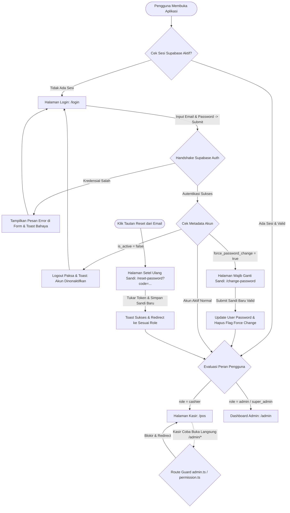

# Peta Alur UI (Screen Flow): Authentication & Role-Based Access Control (RBAC) (F-01)

> **Dokumen Tahap 4/9 — Urutan Layar & Transisi Antarmuka Pengguna**  
> *Fungsi: Memetakan secara detail setiap halaman, modal dialog, elemen antarmuka, interaksi sentuh/klik, kondisi prasyarat, serta hasil yang diharapkan pada tiap langkah sebelum perumusan data uji dan lokator.*

---

## 1. Metadata Dokumen

| Atribut | Nilai |
|---|---|
| **ID Fitur** | `F-01` |
| **Nama Fitur** | `Authentication & Role-Based Access Control (RBAC)` |
| **Rute Utama** | `/login`, `/change-password`, `/reset-password` |
| **File Sumber UI** | `app/pages/login.vue`, `app/pages/change-password.vue`, `app/pages/reset-password.vue` |
| **Route Guard & Middleware** | `app/middleware/auth.ts`, `app/middleware/admin.ts`, `app/middleware/permission.ts` |
| **Viewport Target** | `Mobile PWA (375×667) & Desktop Admin (1280×800)` |
| **Status Dokumen** | `IN REVIEW` |
| **QA Engineer** | `Senior QA Automation Team (qa-ui-cataloger-skill)` |

---

## 2. Diagram Alur Transisi Layar (Screen State Diagram)



---

## 3. Rincian Alur Layar Per Halaman (Screen-by-Screen Breakdown)

### 3.1 Layar 1: Halaman Login Utama
- **Rute URL:** `/login`
- **Kondisi Akses:** Pengguna publik (belum login). Jika pengguna telah login, otomatis di-redirect ke home perannya.
- **Tampilan Awal:** Kartu login vertikal terpusat, logo teks "OMK POS", deskripsi platform, field email, field kata sandi dengan toggle intip sandi, dan tombol "Masuk".

#### Elemen & Aksi:
```
Halaman: /login
  Elemen: Field Input Email (AppInput type="email")
  Aksi: Pengguna memasukkan alamat email terdaftar (misal: "kasir@paroki.test")
  Hasil yang diharapkan: Teks terisi tanpa autokoreksi huruf besar, validasi email HTML5 aktif
  Kondisi: Wajib diisi (required)

Halaman: /login
  Elemen: Field Input Kata Sandi (AppInput type="password")
  Aksi: Pengguna memasukkan kata sandi
  Hasil yang diharapkan: Karakter tersamarkan (bullet), tombol ikon mata dapat diklik untuk toggle teks sandi
  Kondisi: Wajib diisi (required)

Halaman: /login
  Elemen: Tombol Submit "Masuk" (AppButton type="submit")
  Aksi: Klik tombol "Masuk" atau tekan tombol Enter pada keyboard
  Hasil yang diharapkan: Tombol menampilkan animasi spinner, state tombol berubah disabled, memicu Supabase signInWithPassword
  Kondisi: Tombol tidak dapat diklik dua kali selama proses asinkron berjalan
```

---

### 3.2 Layar 2: Halaman Wajib / Mandiri Ganti Kata Sandi
- **Rute URL:** `/change-password`
- **Kondisi Akses:** Pengguna terautentikasi (wajib login). Jika akun memiliki flag `force_password_change: true`, seluruh navigasi ke rute lain diblokir oleh `auth.ts` dan dipaksa tetap berada di halaman ini.
- **Tampilan Awal:** Ikon kunci emas/navy, judul "Ganti Kata Sandi", instruksi pengisian sandi lama dan baru, field sandi saat ini, field sandi baru, field konfirmasi sandi, dan tombol "Perbarui Kata Sandi".

#### Elemen & Aksi:
```
Halaman: /change-password
  Elemen: Field Kata Sandi Saat Ini (AppInput type="password")
  Aksi: Memasukkan password lama / sementara
  Hasil yang diharapkan: Karakter tersamarkan, dapat diintip via toggle

Halaman: /change-password
  Elemen: Field Kata Sandi Baru (AppInput type="password")
  Aksi: Memasukkan password baru (minimal 6 karakter)
  Hasil yang diharapkan: Mencegah input yang sama dengan kata sandi saat ini

Halaman: /change-password
  Elemen: Field Konfirmasi Kata Sandi Baru (AppInput type="password")
  Aksi: Memasukkan ulang kata sandi baru
  Hasil yang diharapkan: Memastikan string identik dengan field kata sandi baru

Halaman: /change-password
  Elemen: Tombol "Perbarui Kata Sandi" (AppButton type="submit")
  Aksi: Klik tombol submit
  Hasil yang diharapkan: Jika validasi lolos -> memicu signIn verifikasi sandi lama -> memicu updateUser sandi baru -> menghapus flag force_password_change -> toast sukses -> redirect ke /pos atau /admin
```

---

### 3.3 Layar 3: Halaman Setel Ulang Sandi via Recovery Token
- **Rute URL:** `/reset-password`
- **Kondisi Akses:** Publik, diakses dengan parameter `?code=TOKEN_RECOVERY`.
- **Tampilan Awal:** Header kunci, judul "Setel Ulang Sandi", field sandi baru, field konfirmasi sandi, dan tombol "Perbarui Kata Sandi".

#### Elemen & Aksi:
```
Halaman: /reset-password
  Elemen: Lifecycle onMounted (Pertukaran Kode Token)
  Aksi: Halaman membaca query parameter ?code=... dan memanggil supabase.auth.exchangeCodeForSession(code)
  Hasil yang diharapkan: Sesi pemulihan aktif terbuat di browser. Jika kode kadaluwarsa, muncul toast peringatan bahaya

Halaman: /reset-password
  Elemen: Field Sandi Baru & Konfirmasi Sandi
  Aksi: Pengguna memasukkan sandi baru (minimal 6 karakter) yang identik
  Hasil yang diharapkan: Validasi client memastikan kecocokan sebelum memanggil updateUser

Halaman: /reset-password
  Elemen: Tombol Submit "Perbarui Kata Sandi"
  Aksi: Klik tombol submit
  Hasil yang diharapkan: Sandi baru disimpan di Supabase Auth, flag force password dibersihkan, toast sukses muncul, dan diarahkan ke halaman utama role
```

---

### 3.4 Layar 4: Intersep Pencegahan Akses Tak Berhak (Route Guard)
- **Rute URL Target:** `/admin/*` (misal: `/admin/dashboard`, `/admin/setup`, `/admin/umkm`)
- **Pemicu:** Pengguna login dengan role `cashier` mengetik URL rute admin secara langsung di address bar browser.

#### Elemen & Aksi:
```
Kondisi: Pengguna role 'cashier' membuka URL /admin/dashboard
  Elemen: Nuxt Route Middleware (admin.ts / permission.ts)
  Aksi: Evaluasi sebelum komponen admin dipasang (pre-navigation hook)
  Hasil yang diharapkan: Navigasi dibatalkan secara instan, tidak ada komponen admin yang sempat dirender, pengguna dikembalikan ke /pos
```

---

## 4. Keadaan Tampilan Antarmuka (UI States Matrix)

| State UI | Pemicu (Trigger) | Visual Representation | Tindakan Pengguna |
|---|---|---|---|
| **Form Kosong / Awal** | Pertama kali membuka `/login` | Input kosong, tombol "Masuk" aktif normal | Mengisi email dan kata sandi |
| **Loading / Autentikasi** | Tombol submit ditekan | Tombol menampilkan spinner, input terkunci, cursor `not-allowed` | Menunggu respon dari Supabase |
| **Kredensial Salah** | Email / password tidak cocok di Supabase | Label error merah di bawah input + toast merah melayang | Memeriksa kembali email dan sandi |
| **Akun Non-Aktif** | Akun memiliki `is_active: false` | Sesi ditutup, toast peringatan akun dinonaktifkan | Menghubungi admin paroki |
| **Force Password Intercept**| Login akun baru dengan `force_password_change: true` | URL otomatis berpindah ke `/change-password`, form terkunci pada ganti sandi | Mengisi sandi lama dan menetapkan sandi baru |
| **Validasi Form Gagal** | Sandi < 6 huruf atau konfirmasi tidak cocok | Toast kuning/peringatan: "Kata sandi baru minimal harus 6 karakter" | Memperbaiki input formulir |
| **Sukses Autentikasi** | Kredensial benar & role valid | Toast hijau "Login berhasil!", layar bertransisi halus ke home role | Memulai operasional sistem |

---

## 5. Pertimbangan Ergonomi Sentuh & Responsivitas

- [ ] **Area Sentuh (Touch Target):** Seluruh input field dan tombol submit memiliki tinggi minimal **48px** (`min-h-touch min-w-touch`).
- [ ] **Kemudahan Keyboard Mobile:** Field email disetel dengan `type="email"` (keyboard mobile memunculkan simbol `@` dan domain `.com`).
- [ ] **Toggle Intip Sandi:** Ikon mata untuk intip sandi memiliki area klik yang lapang dan tidak memicu submit formulir.
- [ ] **Pencegahan Zoom iOS:** Ukuran font input disetel minimal 16px (`text-base` atau `text-sm` dengan pembatasan viewport) untuk mencegah auto-zoom browser Safari iOS.
- [ ] **Layout Responsif Terpusat:** Kartu form beradaptasi dari lebar penuh dengan padding di layar mobile 375px (`w-full max-w-md`) hingga terpusat rapi di layar desktop 1280px.

---

## 6. Status Review & Persetujuan

- [ ] **Screen Flow Disetujui Pengguna / Lead:** (Tanggal: `________`, Reviewer: `________`)
