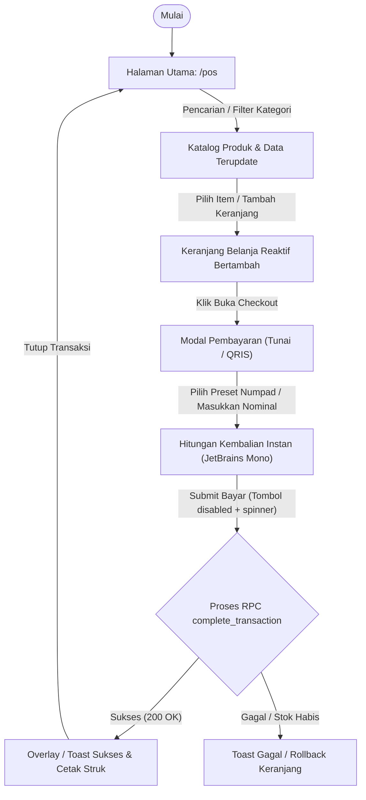

# Peta Alur UI (Screen Flow): Real-time POS Cashier Screen (F-02)

> **Dokumen Tahap 4/9 — Urutan Layar & Transisi Antarmuka Pengguna**  
> *Fungsi: Memetakan secara detail setiap halaman, modal dialog, elemen antarmuka, interaksi sentuh/klik, kondisi prasyarat, serta hasil yang diharapkan pada tiap langkah sebelum perumusan data uji dan lokator.*

---

## 1. Metadata Dokumen

| Atribut | Nilai |
|---|---|
| **ID Fitur** | `F-02` |
| **Nama Fitur** | `Real-time POS Cashier Screen` |
| **Rute Utama** | `/pos` |
| **File Sumber UI** | `app/pages/pos.vue` |
| **Viewport Target** | `Mobile PWA (375×667) & Desktop Admin (1280×800)` |
| **Status Dokumen** | `IN REVIEW` |
| **QA Engineer** | `Senior QA Automation Team (qa-ui-cataloger-skill)` |

---

## 2. Diagram Alur Transisi Layar (Screen State Diagram)



---

## 3. Rincian Alur Layar Per Halaman (Screen-by-Screen Breakdown)

### 3.1 Layar 1: Halaman Katalog & Input Kasir
- **Rute URL:** `/pos`
- **Kondisi Akses:** Pengguna terautentikasi, sesi hari ini berstatus `OPEN`, dan tenant paroki aktif.
- **Tampilan Awal:** Header status sesi, input pencarian cepat, filter pill mitra UMKM, dan grid kartu produk.

#### Elemen & Aksi:
```
Halaman: /pos
  Elemen: Input Pencarian Produk (data-testid="f02-searchQuery-input")
  Aksi: Ketik nama produk (misal: "Puding")
  Hasil yang diharapkan: Grid produk menyaring secara instan (<300ms) tanpa reload
  Kondisi: Input string tidak sensitif huruf besar/kecil (case-insensitive)

Halaman: /pos
  Elemen: Kartu Produk Aktif
  Aksi: Klik kartu produk dengan stok > 0
  Hasil yang diharapkan: Item masuk ke keranjang Pinia, counter kuantitas bertambah, subtotal terhitung
  Kondisi: Produk dengan stok 0 dinonaktifkan (disabled) dan berlabel "Habis"
```

---

### 3.2 Layar 2: Drawer / Modal Pembayaran (Checkout)
- **Nama Komponen:** Modal Checkout & Numpad Virtual
- **Kondisi Muncul:** Dipicu saat kasir menekan tombol bayar / FAB keranjang belanja saat `itemCount > 0`.

#### Elemen & Aksi:
```
Halaman: Modal Checkout
  Elemen: Tab Pilihan Metode Pembayaran (Cash / QRIS)
  Aksi: Klik tab metode bayar
  Hasil yang diharapkan: Tampilan berpindah antara Numpad Tunai atau QR Code QRIS statis
  Kondisi: Default metode adalah 'Cash'

Halaman: Modal Checkout
  Elemen: Numpad Virtual & Tombol Preset Cepat (Uang Pas, 5k, 10k, 20k, 50k, 100k)
  Aksi: Klik tombol preset atau ketik nominal
  Hasil yang diharapkan: Field nominal bayar terisi, kalkulasi kembalian muncul otomatis dengan tipografi tebal (text-pos-change)
  Kondisi: Tombol proses bayar hanya aktif jika nominal bayar >= total tagihan
```

---

### 3.3 Layar 3: Overlay Konfirmasi Sukses Transaksi
- **Perubahan State:** Transaksi tersimpan atomik, keranjang Pinia di-reset ke kosong, stok produk berkurang.

#### Elemen & Aksi:
```
Halaman: Overlay Sukses
  Elemen: Banner / Modal Notifikasi Sukses
  Aksi: Otomatis muncul menampilkan nomor transaksi, total bayar, dan nominal kembalian
  Hasil yang diharapkan: Kasir dapat langsung menekan tombol 'Tutup' atau tekan Enter untuk transaksi berikutnya
  Kondisi: Muncul hanya jika RPC database mengembalikan status sukses
```

---

## 4. Keadaan Tampilan Antarmuka (UI States Matrix)

| State UI | Pemicu (Trigger) | Visual Representation | Tindakan Pengguna |
|---|---|---|---|
| **Loading / Fetching** | Masuk ke halaman atau ganti paroki | Skeleton shimmer abu-abu pada grid kartu | Tunggu hingga data selesai dimuat |
| **Empty State** | Belum ada produk sesi dibuka | Banner informasi: "Belum ada produk aktif untuk sesi hari ini" | Hubungi Admin untuk setup sesi |
| **Keranjang Terisi** | Item produk ditambahkan | Counter badge bertambah, total harga terhitung instan | Lanjut memilih item atau klik Bayar |
| **Validation Error** | Nominal uang tunai kurang dari tagihan | Teks kembalian merah / tombol submit disabled | Tambah nominal hingga mencukupi |
| **Offline Mode (PWA)** | Jaringan terputus (`navigator.onLine = false`) | Banner offline kuning muncul di bagian paling atas | Transaksi tetap berjalan via IndexedDB |

---

## 5. Pertimbangan Ergonomi Sentuh & Responsivitas

- [ ] **Area Sentuh (Touch Target):** Seluruh tombol interaktif, numpad, dan kartu produk memiliki ukuran minimal **48×48px** (`min-h-touch min-w-touch`).
- [ ] **Ergonomi Ibu Jari (Thumb Zone):** Tombol checkout dan numpad berada di area bawah layar pada mode mobile.
- [ ] **Pola Responsif Table-to-Card:** Tampilan tabular beralih menjadi kartu vertikal pada lebar layar `< 640px` (`block sm:hidden`).
- [ ] **Tipografi Finansial Monospace:** Nominal harga dan kembalian menggunakan font monospace (`JetBrains Mono`) untuk kejelasan angka nol.

---

## 6. Status Review & Persetujuan

- [ ] **Screen Flow Disetujui Pengguna / Lead:** (Tanggal: `________`, Reviewer: `________`)
