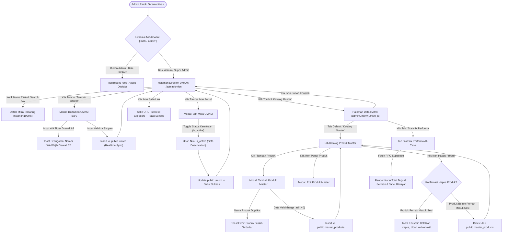

# Peta Alur UI (Screen Flow): UMKM Partner Master Data Management (F-04)

> **Dokumen Tahap 4/9 — Urutan Layar & Transisi Antarmuka Pengguna**  
> *Fungsi: Memetakan secara detail setiap halaman, modal dialog, elemen antarmuka, interaksi sentuh/klik, kondisi prasyarat, serta hasil yang diharapkan pada tiap langkah sebelum perumusan data uji dan lokator.*

---

## 1. Metadata Dokumen

| Atribut | Nilai |
|---|---|
| **ID Fitur** | `F-04` |
| **Nama Fitur** | `UMKM Partner Master Data Management` |
| **Rute Utama** | `/admin/umkm`, `/admin/umkm/[umkm_id]` |
| **File Sumber UI** | `app/pages/admin/umkm/index.vue`<br>`app/pages/admin/umkm/[umkm_id].vue` |
| **Route Guard & Middleware** | `app/middleware/auth.ts`, `app/middleware/admin.ts` |
| **Viewport Target** | `Mobile PWA (375×667) & Desktop Admin (1280×800)` |
| **Status Dokumen** | `IN REVIEW` |
| **QA Engineer** | `Senior QA Automation Team (qa-ui-cataloger-skill)` |

---

## 2. Diagram Alur Transisi Layar (Screen State Diagram)



---

## 3. Rincian Alur Layar Per Halaman (Screen-by-Screen Breakdown)

### 3.1 Layar 1: Direktori Utama Master Data UMKM
- **Rute URL:** `/admin/umkm`
- **Kondisi Akses:** Pengguna login dengan peran `admin` atau `super_admin` dengan tenant context aktif (`X-Company-Id`).
- **Tampilan Awal:** Top action bar berisi judul halaman, input pencarian instan, tombol primer "Tambah UMKM", dan grid kartu mitra.

#### Elemen & Aksi:
```
Halaman: /admin/umkm
  Elemen: Input Pencarian (placeholder="Cari nama mitra atau WA...")
  Aksi: Admin mengetikkan nama atau nomor WhatsApp
  Hasil yang diharapkan: Grid mitra menyaring secara reaktif instan (<100ms) tanpa reload halaman
  Kondisi: Pencarian bersifat case-insensitive dan mencakup nama serta nomor telepon

Halaman: /admin/umkm
  Elemen: Tombol "Tambah UMKM"
  Aksi: Klik tombol
  Hasil yang diharapkan: Modal "Daftarkan UMKM Baru" terbuka, input terfokus
  Kondisi: Hanya dapat diakses oleh Admin

Halaman: /admin/umkm
  Elemen: Tombol Ikon Salin (title="Salin Link Performa") pada Kartu Mitra
  Aksi: Klik tombol
  Hasil yang diharapkan: Tautan "{origin}/umkm/performance/{id}" disalin ke clipboard dan toast sukses muncul
  Kondisi: Browser mengizinkan akses navigator.clipboard

Halaman: /admin/umkm
  Elemen: Tombol Ikon Pensil (title="Edit UMKM") pada Kartu Mitra
  Aksi: Klik tombol
  Hasil yang diharapkan: Modal "Edit Mitra UMKM" terbuka terisi data mitra yang dipilih
  Kondisi: Membuka data nama, WA, dan switch status aktif saat ini

Halaman: /admin/umkm
  Elemen: Tombol "Katalog Master" pada Kartu Mitra
  Aksi: Klik tombol
  Hasil yang diharapkan: Navigasi berpindah ke halaman rute dinamis /admin/umkm/[umkm_id]
  Kondisi: Membawa parameter umkm_id yang sesuai
```

---

### 3.2 Layar 2: Modal Pendaftaran & Edit Mitra UMKM
- **Nama Komponen:** `AppModal` (Daftarkan UMKM Baru / Edit Mitra UMKM)
- **Kondisi Muncul:** Dipicu saat admin menekan tombol "Tambah UMKM" atau ikon edit pensil pada kartu mitra.

#### Elemen & Aksi:
```
Halaman: Modal Daftarkan UMKM Baru / Edit Mitra
  Elemen: Input "Nama UMKM / Pemilik"
  Aksi: Ketik nama mitra (misal: "Ibu Maria Snack")
  Hasil yang diharapkan: Teks terisi pada v-model, wajib diisi (required)
  Kondisi: Tidak boleh string kosong

Halaman: Modal Daftarkan UMKM Baru / Edit Mitra
  Elemen: Input "Nomor WhatsApp"
  Aksi: Ketik nomor WhatsApp
  Hasil yang diharapkan: Teks terisi, hint instruksi awalan '62' terlihat di bawah input
  Kondisi: Harus diawali kode negara 62 tanpa karakter plus (+) atau spasi

Halaman: Modal Edit Mitra UMKM
  Elemen: Switch Toggle "Status Kemitraan"
  Aksi: Klik toggle switch
  Hasil yang diharapkan: State editIsActive beralih antara true (hijau) dan false (abu-abu)
  Kondisi: Mengatur status keaktifan mitra untuk setup sesi mingguan

Halaman: Modal Daftarkan UMKM / Edit
  Elemen: Tombol "Simpan" / "Simpan Perubahan"
  Aksi: Klik tombol submit
  Hasil yang diharapkan: Tombol menampilkan spinner (:loading=true), request diproses ke Supabase, modal tertutup, toast sukses muncul
  Kondisi: Jika nomor WA salah format, request dibatalkan dan toast peringatan kuning muncul
```

---

### 3.3 Layar 3: Detail Katalog Master Produk & Statistik Performa
- **Rute URL:** `/admin/umkm/[umkm_id]`
- **Kondisi Akses:** Admin terautentikasi membuka salah satu mitra UMKM yang valid.
- **Tampilan Awal:** Header judul katalog dengan tombol panah kembali ke `/admin/umkm`, tab switcher ("Katalog Master" dan "Statistik Performa").

#### Elemen & Aksi:
```
Halaman: /admin/umkm/[umkm_id]
  Elemen: Tombol Navigasi Kembali (ikon arrow-left)
  Aksi: Klik tombol
  Hasil yang diharapkan: Peramban kembali ke direktori /admin/umkm
  Kondisi: State direktori ter-refresh

Halaman: /admin/umkm/[umkm_id]
  Elemen: Tab "Katalog Master" vs "Statistik Performa"
  Aksi: Klik salah satu tab
  Hasil yang diharapkan: Tampilan berganti antara daftar produk master vs dasbor agregat performa
  Kondisi: Membuka tab performa untuk pertama kali otomatis memicu RPC analitik Supabase

Halaman: /admin/umkm/[umkm_id] (Tab Katalog Master)
  Elemen: Tombol "Tambah Produk"
  Aksi: Klik tombol
  Hasil yang diharapkan: Modal "Tambah Produk Master" terbuka
  Kondisi: Memerlukan input nama produk dan harga_asli

Halaman: /admin/umkm/[umkm_id] (Tab Katalog Master)
  Elemen: Tombol Ikon Tempat Sampah (Hapus Produk)
  Aksi: Klik tombol dan klik OK pada browser confirm dialog
  Hasil yang diharapkan: 
    - Jika produk belum ada di sesi: Produk terhapus dari database, toast sukses muncul
    - Jika produk sudah pernah terikat di sesi: Database menolak (FK constraint), toast edukatif muncul meminta ubah ke nonaktif
  Kondisi: Integritas foreign key ON DELETE RESTRICT terjamin
```

---

### 3.4 Layar 4: Modal Tambah & Edit Produk Master
- **Nama Komponen:** `AppModal` (Tambah Produk Master / Edit Produk Master)
- **Kondisi Muncul:** Dipicu saat admin menekan tombol "Tambah Produk" atau ikon edit pensil pada kartu produk master.

#### Elemen & Aksi:
```
Halaman: Modal Tambah / Edit Produk Master
  Elemen: Input "Nama Produk"
  Aksi: Ketik nama produk master (misal: "Pastel Ayam Telur")
  Hasil yang diharapkan: Teks terisi, wajib diisi
  Kondisi: Wajib unik untuk mitra ini

Halaman: Modal Tambah / Edit Produk Master
  Elemen: Input "Harga Dasar UMKM (Rp)" (type="number", input-mode="numeric")
  Aksi: Masukkan angka harga modal (misal: 4000)
  Hasil yang diharapkan: Nilai numerik terisi tanpa format desimal
  Kondisi: Wajib bilangan bulat positif (> 0)

Halaman: Modal Edit Produk Master
  Elemen: Switch Toggle "Status Produk"
  Aksi: Klik switch toggle
  Hasil yang diharapkan: State beralih antara Aktif (hijau) dan Nonaktif (abu-abu)
  Kondisi: Mengontrol visibilitas produk saat admin membuka setup sesi baru (F-05)
```

---

## 4. Keadaan Tampilan Antarmuka (UI States Matrix)

| State UI | Pemicu (Trigger) | Representasi Visual | Tindakan Pengguna |
|---|---|---|---|
| **Loading Awal Direktori** | `umkmStore.isLoading = true` & list kosong | Teks abu-abu terpusat: *"Memuat data mitra UMKM..."* | Menunggu request selesai |
| **Direktori Kosong** | `umkmList.length === 0` | Kotak putih rounded: *"Belum ada mitra UMKM terdaftar di sistem."* | Klik tombol "Tambah UMKM" |
| **Hasil Pencarian Kosong** | Kueri pencarian tidak cocok | Kotak putih: *"Tidak ada mitra yang cocok dengan pencarian '{searchQuery}'."* | Hapus teks pencarian |
| **Grid Mitra Aktif** | Data mitra termuat | Grid responsif (1 s/d 4 kolom), kartu dengan badge hijau "Aktif", info WA, dan 3 tombol aksi | Klik edit, salin link, atau katalog |
| **Mitra Nonaktif** | `u.is_active = false` | Badge abu-abu uppercase "NONAKTIF", kartu tetap terlihat untuk audit | Klik edit untuk mengaktifkan kembali |
| **Loading Detail Produk** | `isLoading = true` | Teks terpusat: *"Memuat produk master..."* | Menunggu fetch selesai |
| **Katalog Produk Kosong** | Mitra belum memiliki produk | Kotak dashed border: *"Belum ada produk terdaftar untuk mitra ini..."* | Klik "Tambah Produk" |
| **Loading Tab Performa** | `isPerformanceLoading = true` | Teks terpusat: *"Memuat data statistik performa..."* | Menunggu eksekusi RPC |
| **Statistik Performa Tampil** | Data RPC berhasil dimuat | 2 kartu metrik (Total Terjual, Setoran Bersih) + Tabel Performa Produk + Tabel Riwayat Sesi | Memeriksa performa penjualan |
| **Toast Peringatan WA** | Input nomor WA tidak diawali `62` | Toast oranye/kuning melayang di sudut bawah: *"Nomor WhatsApp harus diawali dengan kode negara 62"* | Perbaiki input nomor telepon |
| **Toast Error Duplikasi** | Submit produk dengan nama sama | Toast merah: *"Gagal: Produk dengan nama tersebut sudah terdaftar untuk mitra ini"* | Gunakan nama varian yang berbeda |
| **Toast Edukasi Foreign Key** | Menghapus produk terikat sesi | Toast merah: *"Tidak dapat menghapus produk ini karena sudah terdaftar di suatu sesi penjualan. Silakan edit lalu ubah statusnya menjadi Nonaktif."* | Tutup toast dan buka modal edit |

---

## 5. Ergonomi Sentuh & Adaptasi Mobile (Touch Specifications)

- **Target Sentuh Minimum:** Seluruh tombol aksi pada kartu mitra (`min-h-[36px] min-w-[36px]` dengan margin klik) dan tombol aksi primer ("Tambah UMKM", "Katalog Master", "Tambah Produk") memiliki tinggi sentuh ergonomis $\ge 48\text{px}$ (`min-h-touch`).
- **Transformasi Tata Letak Mobile:**
  - Pada layar lebar desktop ($\ge 1280\text{px}$), grid merender 4 kolom (`xl:grid-cols-4`).
  - Pada layar tablet ($\ge 768\text{px}$), grid merender 2 kolom (`sm:grid-cols-2`).
  - Pada viewport mobile PWA ($375\text{px}$ iPhone SE), grid bertransformasi menjadi 1 kolom vertikal (`grid-cols-1`). Seluruh kartu memanfaatkan lebar layar penuh dengan padding ergonomis 16px.
- **Formulir & Numpad Mobile:**
  - Input harga modal menggunakan `input-mode="numeric"`, secara otomatis memunculkan keypad angka virtual pada perangkat ponsel kasir/admin tanpa memunculkan keyboard alfabet.
